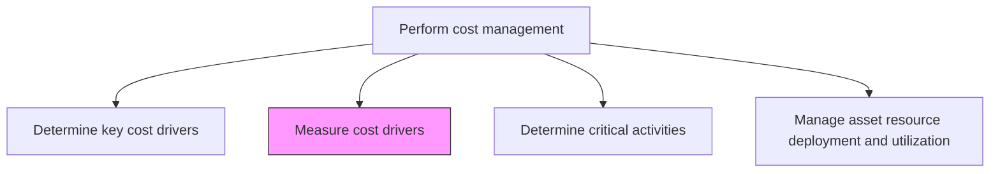
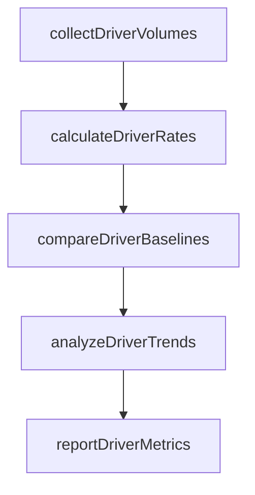

# Measure cost drivers

> Business-as-Code definition for cost driver measurement. Models the quantification, tracking, and reporting of cost driver volumes and rates to support activity-based costing and allocation decisions.

## Overview

Calculating cost driver volumes and per-unit rates for each measurement period. This process collects transaction counts, machine hours, labor hours, and other driver quantities from operational systems, then computes the cost per unit of each driver based on actual spending. Period-over-period trending reveals whether cost driver rates are stable, improving, or deteriorating, providing early signals for cost management intervention. Accurate driver measurement is the quantitative backbone of activity-based costing and supports reliable overhead allocation, product costing, and capacity planning.

## Process Hierarchy



## GraphDL

```yaml
measure:
  object: Cost Drivers
  actor: CostAnalyst
  result: CostDriverMeasurement
```

## Actions

| Action | Description |
|--------|-------------|
| collectDriverVolumes | Gather transaction counts, machine hours, and other driver quantities |
| calculateDriverRates | Compute cost per unit of each driver based on actual spending |
| compareDriverBaselines | Measure current driver volumes against budgeted or historical baselines |
| analyzeDriverTrends | Evaluate period-over-period changes in cost driver volumes and rates |
| reportDriverMetrics | Publish cost driver measurements for management review |

## Events

| Event | Description |
|-------|-------------|
| driverVolumesCollected | Cost driver transaction volumes gathered for the period |
| driverRatesCalculated | Per-unit cost rates computed for each driver |
| driverBaselinesCompared | Current driver volumes compared to budget and prior periods |
| driverTrendsAnalyzed | Period-over-period cost driver trends evaluated |
| driverMetricsReported | Cost driver measurement report published |

## Searches

| Search | Description |
|--------|-------------|
| getDriverVolumesByPeriod | Retrieve cost driver quantities for a given time range |
| getDriverRateTrends | Query cost-per-driver-unit trends over multiple periods |
| getDriverVariances | List cost drivers with significant deviations from baseline |

## Process Flow



## RACI Matrix

| Activity | Responsible | Accountable | Consulted | Informed |
|----------|-------------|-------------|-----------|----------|
| collectDriverVolumes | Cost Analyst | Controller | Operations Managers | FP&A |
| calculateDriverRates | Cost Analyst | Controller | Cost Accountant | Finance Director |
| reportDriverMetrics | Cost Analyst | Controller | CFO | Business Unit Heads |

## Related Processes

| Process | Relationship |
|---------|-------------|
| 9.1.3.1 Determine key cost drivers | Upstream - identified drivers are measured here |
| 9.1.3.3 Determine critical activities | Parallel - driver measurements inform activity prioritization |
| 9.1.2.5 Perform variance analysis | Downstream - driver measurements feed cost variance analysis |

## Related Departments

| Department | Role |
|-----------|------|
| Cost Accounting | Measures and reports on cost driver volumes and rates |
| Operations | Provides transactional data for driver measurement |
| IT | Supplies system data for automated driver collection |
| Finance | Reviews driver metrics for budgeting decisions |

## Related Occupations

| Occupation | Involvement |
|-----------|-------------|
| Cost Analyst | Collects and calculates cost driver measurements |
| Data Analyst | Extracts driver volume data from operational systems |
| Management Accountant | Incorporates driver metrics into management reports |

## KPIs

| KPI | Description | Unit |
|-----|-------------|------|
| Driver Measurement Timeliness | Days from period close to driver metrics availability | Days |
| Driver Rate Stability | Period-over-period change in cost-per-driver-unit rates | % |
| Data Collection Completeness | Percentage of cost drivers with automated data feeds | % |

## Usage

```typescript
import { measureCostDrivers } from '@headlessly/measure-cost-drivers'

const measurement = measureCostDrivers()

// Calculate driver rates for the period
const rates = await measurement.calculateDriverRates({
  period: '2025-12',
  costPool: 'Manufacturing Overhead'
})

// Get driver volume trends
const trends = await measurement.getDriverRateTrends({
  driver: 'machine-hours',
  periods: 12,
  granularity: 'monthly'
})
```
