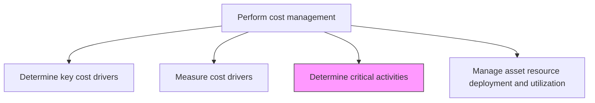
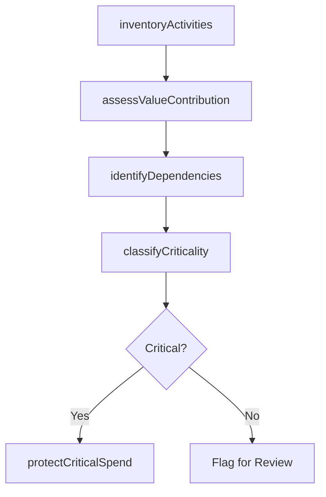

# Determine critical activities

> Business-as-Code definition for critical activity determination. Models the identification, evaluation, and prioritization of essential business activities to protect value-generating processes from cost reduction.

## Overview

Determine the activities that hinder the progress of finance activities. This requires the organization to determine those business activities carried out by the financial function of the organization and which are indispensable. This undertaking helps the organization triangulate those activities which are essential and where costs cannot be slashed.

## Process Hierarchy



## GraphDL

```yaml
determine:
  object: Critical Activities
  actor: CostManager
  result: CriticalActivityRegister
```

## Actions

| Action | Description |
|--------|-------------|
| inventoryActivities | Catalog all business activities within the financial function |
| assessValueContribution | Evaluate each activity's contribution to revenue generation and compliance |
| classifyCriticality | Categorize activities as critical, important, or discretionary |
| identifyDependencies | Map upstream and downstream dependencies between activities |
| protectCriticalSpend | Flag critical activity budgets as non-discretionary |

## Events

| Event | Description |
|-------|-------------|
| activitiesInventoried | Complete catalog of financial function activities compiled |
| valueContributionAssessed | Each activity scored for revenue generation impact, compliance necessity, and strategic importance |
| criticalityClassified | Activities categorized by criticality level |
| dependenciesMapped | Inter-activity dependency chain documented |
| criticalSpendProtected | Non-discretionary budget designations applied |

## Searches

| Search | Description |
|--------|-------------|
| getCriticalActivities | Retrieve activities classified as critical or essential |
| getActivityDependencies | Query dependency chain for a specific activity |
| getDiscretionaryActivities | List activities eligible for cost reduction |
| getActivityValueScores | Retrieve value contribution scores by activity |

## Process Flow



## RACI Matrix

| Activity | Responsible | Accountable | Consulted | Informed |
|----------|-------------|-------------|-----------|----------|
| inventoryActivities | Cost Manager | Controller | Process Owners | Finance Director |
| assessValueContribution | Cost Manager | Controller | Business Unit Heads | FP&A |
| classifyCriticality | Cost Manager | CFO | Operations Directors | Internal Audit |
| protectCriticalSpend | Cost Manager | CFO | Controller | Budget Owners |

## Related Processes

| Process | Relationship |
|---------|-------------|
| 9.1.3.1 Determine key cost drivers | Upstream - cost drivers inform activity cost analysis |
| 9.1.3.4 Manage asset resource deployment and utilization | Downstream - critical activity designations guide resource allocation |
| 9.1.1.2 Prepare periodic budgets and plans | Consumer - critical activity classifications protect budget lines |

## Related Departments

| Department | Role |
|-----------|------|
| Finance | Leads critical activity assessment and classification |
| Operations | Provides activity data and process dependencies |
| Internal Audit | Validates criticality assessments for control adequacy |
| Executive Leadership | Approves critical activity designations |

## Related Occupations

| Occupation | Involvement |
|-----------|-------------|
| Cost Manager | Leads activity evaluation and criticality classification |
| Business Analyst | Maps activity dependencies and value chains |
| Controller | Approves critical spend protection designations |

## KPIs

| KPI | Description | Unit |
|-----|-------------|------|
| Activity Coverage | Percentage of activities with completed criticality assessments | % |
| Critical Activity Ratio | Proportion of activities classified as critical | % |
| Protected Budget Percentage | Share of total budget designated as non-discretionary | % |

## Usage

```typescript
import { determineCriticalActivities } from '@headlessly/determine-critical-activities'

const activities = determineCriticalActivities()

// Classify activities by criticality
const classified = await activities.classifyCriticality({
  department: 'Finance',
  period: '2025'
})

// Get activities eligible for cost reduction
const discretionary = await activities.getDiscretionaryActivities({
  department: 'Finance',
  minAnnualCost: 50000
})
```
