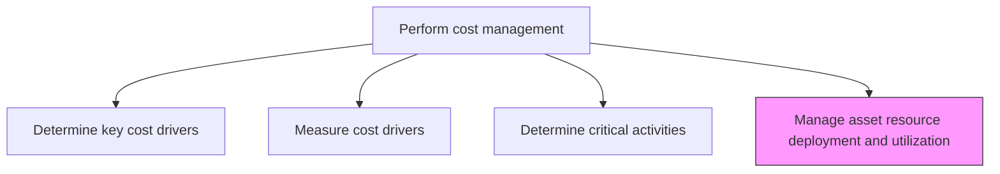
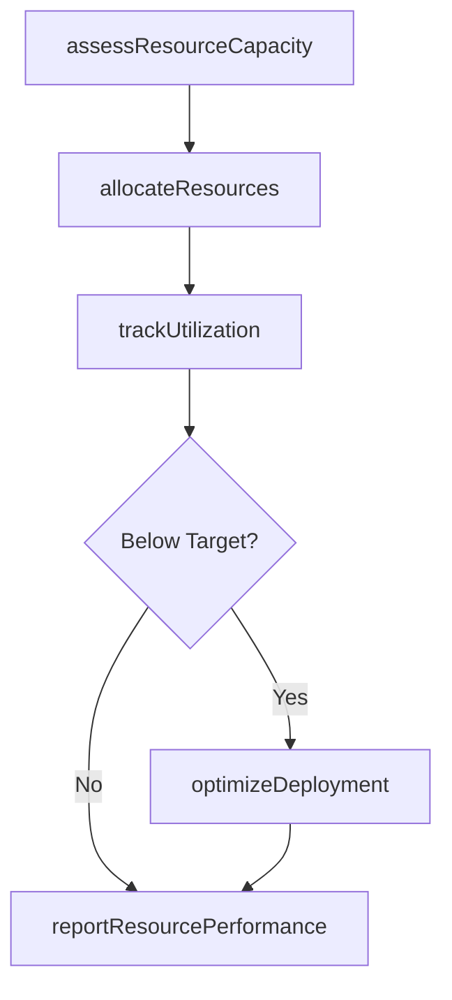

# Manage asset resource deployment and utilization

> Business-as-Code definition for asset resource deployment management. Models the allocation, tracking, and optimization of organizational assets across business processes to maximize utilization and return on investment.

## Overview

Distributing or allocating asset resources in different processes for optimal utilization. This process evaluates available capacity across equipment, facilities, technology, and human resources, then assigns those assets to business processes based on strategic priority and expected return. Continuous tracking of actual utilization against planned deployment reveals idle capacity and bottlenecks, enabling rebalancing before inefficiencies erode margins. Effective asset deployment management maximizes return on assets, reduces unnecessary capital expenditure, and ensures that critical business activities have the resources they need to meet performance targets.

## Process Hierarchy



## GraphDL

```yaml
manage:
  object: Asset Resource Deployment And Utilization
  actor: AssetManager
  result: ResourceDeploymentPlan
```

## Actions

| Action | Description |
|--------|-------------|
| assessResourceCapacity | Evaluate available capacity across asset pools and resource categories |
| allocateResources | Assign assets and resources to business processes based on priority |
| trackUtilization | Monitor actual resource consumption against planned deployment |
| optimizeDeployment | Rebalance resource allocation to improve utilization rates |
| reportResourcePerformance | Publish asset utilization and deployment efficiency metrics |

## Events

| Event | Description |
|-------|-------------|
| resourceCapacityAssessed | Available resource capacity evaluated across asset pools |
| resourcesAllocated | Assets and resources assigned to business processes |
| utilizationTracked | Actual resource consumption measured against plan |
| deploymentOptimized | Resource allocation rebalanced for improved efficiency |
| resourcePerformanceReported | Utilization and deployment metrics published |

## Searches

| Search | Description |
|--------|-------------|
| getResourceUtilization | Retrieve utilization rates by asset type or department |
| getUnderutilizedAssets | List assets operating below target utilization thresholds |
| getDeploymentPlan | Query current resource allocation plan by process or period |
| getCapacityForecast | Retrieve projected resource capacity and demand |

## Process Flow



## RACI Matrix

| Activity | Responsible | Accountable | Consulted | Informed |
|----------|-------------|-------------|-----------|----------|
| assessResourceCapacity | Asset Manager | Controller | Operations Directors | FP&A |
| allocateResources | Asset Manager | CFO | Business Unit Heads | Finance Director |
| trackUtilization | Asset Manager | Controller | Process Owners | Operations |
| optimizeDeployment | Asset Manager | CFO | Cost Manager | Executive Leadership |

## Related Processes

| Process | Relationship |
|---------|-------------|
| 9.1.3.3 Determine critical activities | Upstream - critical activity designations guide resource priority |
| 9.1.3.1 Determine key cost drivers | Upstream - cost drivers inform resource allocation decisions |
| 9.4.1 Perform capital planning and project approval | Parallel - capital plans determine new asset availability |

## Related Departments

| Department | Role |
|-----------|------|
| Finance | Manages resource allocation budgets and reporting |
| Operations | Provides utilization data and capacity requirements |
| Facilities | Manages physical asset deployment |
| IT | Tracks technology asset deployment and licensing |

## Related Occupations

| Occupation | Involvement |
|-----------|-------------|
| Asset Manager | Leads resource deployment and utilization optimization |
| Financial Analyst | Analyzes utilization metrics and ROI |
| Operations Manager | Provides capacity requirements and utilization feedback |

## KPIs

| KPI | Description | Unit |
|-----|-------------|------|
| Asset Utilization Rate | Actual usage as a percentage of available capacity | % |
| Return on Assets | Net income generated per dollar of deployed assets | Ratio |
| Idle Asset Percentage | Proportion of assets operating below minimum utilization threshold | % |
| Redeployment Cycle Time | Average days to reallocate underutilized assets | Days |

## Usage

```typescript
import { manageAssetResourceDeploymentAndUtilization } from '@headlessly/manage-asset-resource-deployment-and-utilization'

const resources = manageAssetResourceDeploymentAndUtilization()

// Track utilization for the period
const utilization = await resources.getResourceUtilization({
  assetType: 'equipment',
  department: 'Manufacturing',
  period: 'Q4-2025'
})

// Find underutilized assets for redeployment
const underutilized = await resources.getUnderutilizedAssets({
  threshold: 0.60,
  assetCategory: 'machinery'
})
```
