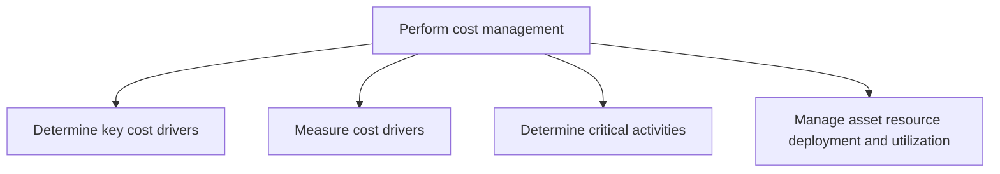
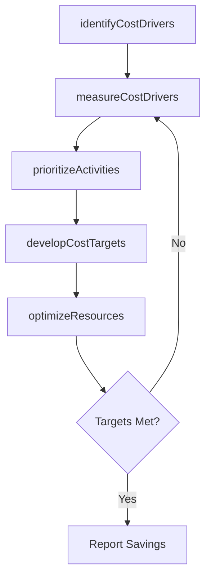

# Perform cost management

> Business-as-Code definition for cost management operations. Models cost driver identification, measurement, activity-based analysis, and asset resource optimization as programmable APIs.

## Overview

Deciding which expenses can be avoided to reduce some costs and increase revenues. Plan and control the organization's budget to forecast future expenditures.

## Process Hierarchy



## GraphDL

```yaml
perform:
  object: Cost Management
  actor: CostManager
  result: CostOptimizationPlan
```

## Actions

| Action | Description |
|--------|-------------|
| identifyCostDrivers | Analyze cost structures to determine primary expense drivers |
| measureCostDrivers | Quantify the volume and rate of identified cost drivers |
| prioritizeActivities | Rank business activities by cost impact and strategic value |
| optimizeResources | Reallocate asset resources to maximize utilization and reduce waste |
| developCostTargets | Set cost reduction targets for departments and processes |

## Events

| Event | Description |
|-------|-------------|
| costDriversIdentified | Key cost drivers catalogued and categorized |
| costDriversMeasured | Cost driver metrics calculated and baselined |
| activitiesPrioritized | Critical activities ranked by cost impact |
| resourcesOptimized | Asset deployment adjusted for improved utilization |
| costTargetsDeveloped | Cost reduction targets assigned to responsible parties |

## Searches

| Search | Description |
|--------|-------------|
| getCostDrivers | List cost drivers ranked by magnitude and controllability |
| getActivityCostMap | Retrieve activity-based cost allocation for a process or department |
| getResourceUtilization | Query asset utilization rates by category or location |
| getCostReductionProgress | Track progress against cost reduction targets |

## Process Flow



## RACI Matrix

| Activity | Responsible | Accountable | Consulted | Informed |
|----------|-------------|-------------|-----------|----------|
| identifyCostDrivers | Cost Analyst | Controller | Operations Manager | CFO |
| measureCostDrivers | Cost Analyst | Controller | Process Owners | FP&A Manager |
| prioritizeActivities | FP&A Manager | CFO | Business Unit Heads | Controller |
| optimizeResources | Operations Manager | CFO | Finance | Asset Manager |

## Sub-Processes

| ID | Name | Description |
|----|------|-------------|
| 9.1.3.1 | Determine key cost drivers | Defining cost drivers for a particular activity. |
| 9.1.3.2 | Measure cost drivers | Calculating cost drivers. |
| 9.1.3.3 | Determine critical activities | Determine the activities that hinder the progress of finance activities. This requires the organizat |
| 9.1.3.4 | Manage asset resource deployment and utilization | Distributing or allocating asset resources in different processes for optimal utilization. |

## Related Processes

| Process | Relationship |
|---------|-------------|
| 9.1.2 Perform cost accounting and control | Upstream - cost data informs cost driver analysis |
| 9.1.4 Evaluate and manage financial performance | Downstream - cost improvements enhance financial performance |
| 9.1.1 Perform planning/budgeting/forecasting | Parallel - cost targets feed budget development |

## Related Departments

| Department | Role |
|-----------|------|
| Finance | Leads cost analysis and target-setting activities |
| Operations | Implements resource optimization and process improvements |
| Procurement | Contributes supplier cost data and negotiation leverage |
| Facilities | Manages physical asset deployment and utilization |

## Related Occupations

| Occupation | Involvement |
|-----------|-------------|
| Cost Manager | Leads cost optimization initiatives and target-setting |
| Business Analyst | Maps activity costs and identifies improvement opportunities |
| Operations Analyst | Measures resource utilization and process efficiency |

## KPIs

| KPI | Description | Unit |
|-----|-------------|------|
| Cost Reduction Achievement | Percentage of targeted cost savings realized | % |
| Asset Utilization Rate | Actual usage versus available capacity of key assets | % |
| Activity Cost Efficiency | Cost per unit of output for critical business activities | USD |
| Cost Driver Volatility | Standard deviation of cost driver volumes over time | % |

## Usage

```typescript
import { performCostManagement } from '@headlessly/perform-cost-management'

const costMgmt = performCostManagement()

// Identify top cost drivers for a business unit
const drivers = await costMgmt.identifyCostDrivers({
  businessUnit: 'BU-Manufacturing',
  period: '2025',
  topN: 10
})

// Get resource utilization report
const utilization = await costMgmt.getResourceUtilization({
  assetCategory: 'production-equipment',
  location: 'Plant-A'
})
```
