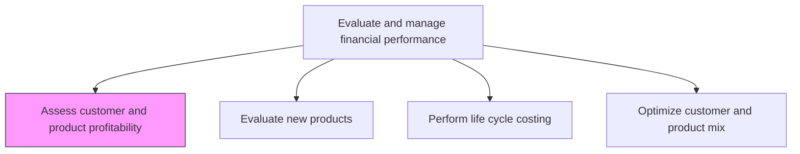
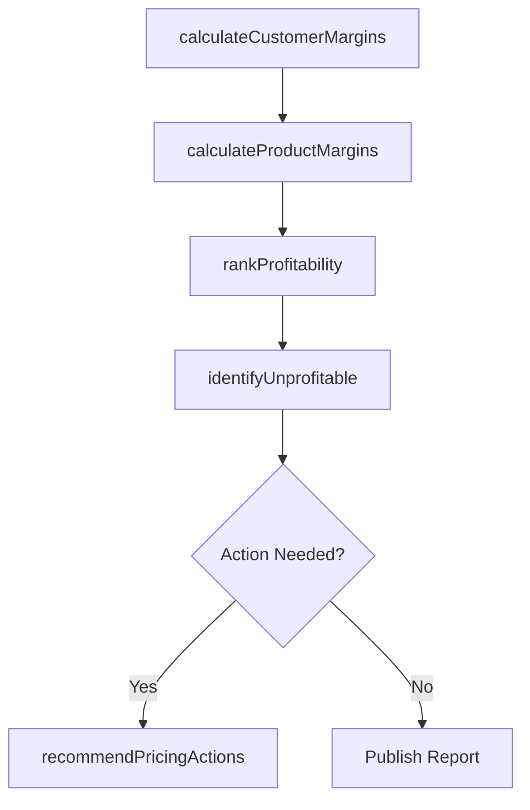

# Assess customer and product profitability

> Business-as-Code definition for customer and product profitability assessment. Models the analysis of revenue, cost-to-serve, and margin contribution by customer segment and product line.

## Overview

Studying product demand and targeted customer preferences. Study customers' demands or preferences after deducting the full cost of delivering the final product, including cost-to-serve components such as sales support, logistics, returns, and post-sale service. This process calculates contribution margins at the individual customer and product level, ranks segments from most to least profitable, and flags those operating below breakeven thresholds. The resulting insights drive strategic decisions around pricing adjustments, customer tiering, product rationalization, and targeted investment in high-margin growth opportunities.

## Process Hierarchy



## GraphDL

```yaml
assess:
  object: Customer And Product Profitability
  actor: FPAAnalyst
  result: ProfitabilityAssessment
```

## Actions

| Action | Description |
|--------|-------------|
| calculateCustomerMargins | Compute revenue minus cost-to-serve for each customer or segment |
| calculateProductMargins | Determine contribution margin by product line after direct and allocated costs |
| rankProfitability | Order customers and products from most to least profitable |
| identifyUnprofitable | Flag customers or products operating below breakeven thresholds |
| recommendPricingActions | Suggest pricing or cost adjustments for underperforming segments |

## Events

| Event | Description |
|-------|-------------|
| customerMarginsCalculated | Revenue minus full cost-to-serve computed for each customer and segment with margin rankings |
| productMarginsCalculated | Product-level contribution margins determined |
| profitabilityRanked | Customers and products ranked by margin contribution |
| unprofitableIdentified | Below-threshold customers or products flagged for review |
| pricingActionsRecommended | Pricing or cost adjustment proposals issued |

## Searches

| Search | Description |
|--------|-------------|
| getCustomerProfitability | Retrieve profitability metrics by customer or segment |
| getProductProfitability | Query contribution margins by product or product line |
| getUnprofitableSegments | List customers or products below breakeven threshold |
| getProfitabilityTrends | Query margin trends over multiple periods by segment |

## Process Flow



## RACI Matrix

| Activity | Responsible | Accountable | Consulted | Informed |
|----------|-------------|-------------|-----------|----------|
| calculateCustomerMargins | FP&A Analyst | Controller | Sales Director | CFO |
| calculateProductMargins | FP&A Analyst | Controller | Product Management | Manufacturing |
| rankProfitability | FP&A Analyst | Controller | Marketing | Business Unit Heads |
| recommendPricingActions | FP&A Analyst | CFO | Sales Director | Pricing Committee |

## Related Processes

| Process | Relationship |
|---------|-------------|
| 9.1.4.4 Optimize customer and product mix | Downstream - profitability data drives mix optimization |
| 9.1.2.6 Report on profitability | Upstream - profitability reports provide input data |
| 9.1.4.2 Evaluate new products | Parallel - new product evaluation uses profitability benchmarks |

## Related Departments

| Department | Role |
|-----------|------|
| FP&A | Performs profitability analysis and recommendations |
| Sales | Provides customer revenue data and relationship context |
| Product Management | Supplies product cost and pricing information |
| Marketing | Uses profitability insights for campaign targeting |

## Related Occupations

| Occupation | Involvement |
|-----------|-------------|
| Financial Analyst | Calculates and ranks customer and product profitability |
| Management Accountant | Provides cost allocation data for profitability models |
| Pricing Analyst | Translates profitability insights into pricing recommendations |

## KPIs

| KPI | Description | Unit |
|-----|-------------|------|
| Customer Profitability Rate | Percentage of customers generating positive margins | % |
| Product Contribution Margin | Average contribution margin across product portfolio | % |
| Unprofitable Segment Ratio | Proportion of revenue from below-threshold segments | % |
| Cost-to-Serve Ratio | Total cost-to-serve as a percentage of customer revenue | % |

## Usage

```typescript
import { assessCustomerAndProductProfitability } from '@headlessly/assess-customer-and-product-profitability'

const profitability = assessCustomerAndProductProfitability()

// Analyze customer profitability by segment
const customerMargins = await profitability.calculateCustomerMargins({
  segment: 'Enterprise',
  period: 'Q4-2025'
})

// Find unprofitable products
const unprofitable = await profitability.getUnprofitableSegments({
  dimension: 'product',
  threshold: 0,
  period: '2025'
})
```
