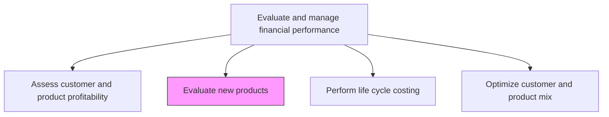
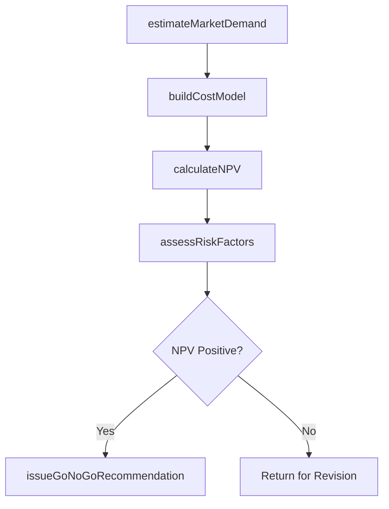

# Evaluate new products

> Business-as-Code definition for new product financial evaluation. Models the financial feasibility analysis of proposed products including market sizing, cost estimation, NPV calculation, and go/no-go investment decisions.

## Overview

Checking demand about a specific product by a customer segment. Conduct a detailed study or research of customer behavior and preferences for a product in order to determine its production feasibility and profitability in a specific market. This process builds financial models that project addressable market size, estimate development and production costs, compute net present value and internal rate of return, and assess market and technical risk factors. The resulting go/no-go recommendation enables the investment committee to allocate capital to products with the strongest risk-adjusted return potential while avoiding commitments that would dilute overall portfolio profitability.

## Process Hierarchy



## GraphDL

```yaml
evaluate:
  object: New Products
  actor: FPAAnalyst
  result: ProductFeasibilityReport
```

## Actions

| Action | Description |
|--------|-------------|
| estimateMarketDemand | Project addressable market size and expected sales volumes |
| buildCostModel | Estimate development, production, and distribution costs for the new product |
| calculateNPV | Compute net present value and internal rate of return for the product investment |
| assessRiskFactors | Evaluate market, technical, and financial risks associated with the product launch |
| issueGoNoGoRecommendation | Deliver financial feasibility verdict to product investment committee |

## Events

| Event | Description |
|-------|-------------|
| marketDemandEstimated | Addressable market sized and unit sales projections developed across target segments |
| costModelBuilt | Full development-through-distribution cost model assembled with overhead allocation and margin targets |
| npvCalculated | Net present value and IRR computed for the product business case |
| riskFactorsAssessed | Market, technical, and financial risks quantified with mitigation strategies documented |
| goNoGoRecommendationIssued | Product investment recommendation delivered |

## Searches

| Search | Description |
|--------|-------------|
| getProductEvaluations | Retrieve financial evaluations by product or evaluation status |
| getProductNPV | Query NPV and IRR for a specific product proposal |
| getPendingEvaluations | List product proposals awaiting financial evaluation |

## Process Flow



## RACI Matrix

| Activity | Responsible | Accountable | Consulted | Informed |
|----------|-------------|-------------|-----------|----------|
| estimateMarketDemand | FP&A Analyst | Controller | Marketing | Product Management |
| buildCostModel | FP&A Analyst | Controller | Manufacturing | Engineering |
| calculateNPV | FP&A Analyst | CFO | Treasury | Investment Committee |
| issueGoNoGoRecommendation | FP&A Analyst | CFO | Controller | Executive Leadership |

## Related Processes

| Process | Relationship |
|---------|-------------|
| 9.1.4.3 Perform life cycle costing | Downstream - life cycle costs feed total cost of ownership models |
| 9.1.4.1 Assess customer and product profitability | Upstream - existing product profitability benchmarks inform evaluation |
| 9.1.1.2 Prepare periodic budgets and plans | Consumer - approved products enter the budgeting process |

## Related Departments

| Department | Role |
|-----------|------|
| FP&A | Performs financial feasibility analysis and NPV calculation |
| Product Management | Proposes new products and provides market estimates |
| Engineering | Supplies development cost estimates and timelines |
| Marketing | Provides market research and demand projections |

## Related Occupations

| Occupation | Involvement |
|-----------|-------------|
| Financial Analyst | Builds financial models and calculates investment returns |
| Product Manager | Provides market sizing and competitive positioning data |
| Cost Accountant | Estimates production costs and overhead allocation |

## KPIs

| KPI | Description | Unit |
|-----|-------------|------|
| Evaluation Cycle Time | Average days from product proposal to financial recommendation | Days |
| NPV Accuracy | Variance between projected and actual NPV for launched products | % |
| Go-to-Market Success Rate | Percentage of approved products achieving projected revenue within 12 months | % |
| Average Hurdle Rate Clearance | Average NPV margin above the minimum acceptable rate of return | % |

## Usage

```typescript
import { evaluateNewProducts } from '@headlessly/evaluate-new-products'

const evaluation = evaluateNewProducts()

// Calculate NPV for a new product proposal
const npv = await evaluation.calculateNPV({
  productId: 'PROP-2025-042',
  discountRate: 0.10,
  projectionYears: 5
})

// Get all pending evaluations
const pending = await evaluation.getPendingEvaluations({
  status: 'awaiting-review'
})
```
