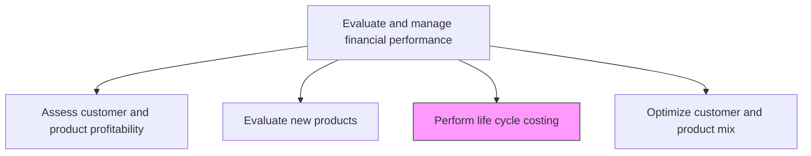
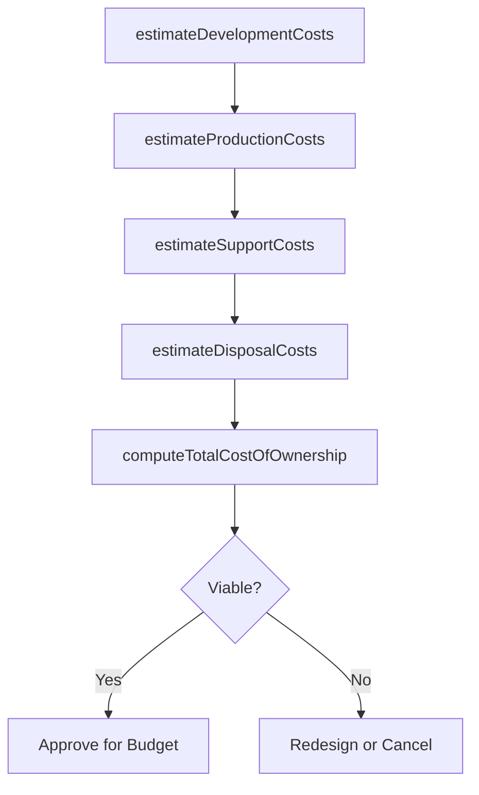

# Perform life cycle costing

> Business-as-Code definition for life cycle costing. Models the estimation and tracking of total cost of ownership across all product phases from development through disposal, supporting strategic pricing and investment decisions.

## Overview

Determining the cost of delivering an end product at different stages of production. Study the total life cycle of a product/process to determine how much revenue and production cost will be incurred at every stage in order to make strategic decisions.

## Process Hierarchy



## GraphDL

```yaml
perform:
  object: Life Cycle Costing
  actor: CostAnalyst
  result: LifeCycleCostModel
```

## Actions

| Action | Description |
|--------|-------------|
| estimateDevelopmentCosts | Project research, design, and engineering costs for the product introduction phase |
| estimateProductionCosts | Calculate manufacturing, materials, and labor costs across production volumes |
| estimateSupportCosts | Forecast warranty, maintenance, and customer support costs over the product life |
| estimateDisposalCosts | Project end-of-life costs including decommissioning, recycling, and environmental compliance |
| computeTotalCostOfOwnership | Aggregate all phase costs into a complete life cycle cost model |

## Events

| Event | Description |
|-------|-------------|
| developmentCostsEstimated | Product introduction phase costs projected |
| productionCostsEstimated | Manufacturing cost estimates completed across volume scenarios |
| supportCostsEstimated | Post-sale support and warranty cost forecasts prepared |
| disposalCostsEstimated | End-of-life costs projected |
| totalCostOfOwnershipComputed | Complete life cycle cost model assembled |

## Searches

| Search | Description |
|--------|-------------|
| getLifeCycleCostByProduct | Retrieve total cost of ownership model for a specific product |
| getCostsByPhase | Query costs broken down by life cycle phase |
| getLifeCycleComparisons | Compare life cycle costs across product alternatives |

## Process Flow



## RACI Matrix

| Activity | Responsible | Accountable | Consulted | Informed |
|----------|-------------|-------------|-----------|----------|
| estimateDevelopmentCosts | Cost Analyst | Controller | Engineering | Product Management |
| estimateProductionCosts | Cost Analyst | Controller | Manufacturing | Procurement |
| estimateSupportCosts | Cost Analyst | Controller | Service | Customer Success |
| estimateDisposalCosts | Cost Analyst | Controller | Environmental Compliance | Facilities |
| computeTotalCostOfOwnership | Cost Analyst | CFO | FP&A | Investment Committee |

## Related Processes

| Process | Relationship |
|---------|-------------|
| 9.1.4.2 Evaluate new products | Upstream - new product evaluations trigger life cycle costing |
| 9.1.2.4 Perform product costing | Parallel - standard product costs feed production phase estimates |
| 9.1.4.4 Optimize customer and product mix | Downstream - life cycle costs inform portfolio optimization |

## Related Departments

| Department | Role |
|-----------|------|
| FP&A | Builds and maintains life cycle cost models |
| Engineering | Provides development and design cost estimates |
| Manufacturing | Supplies production cost data across volume scenarios |
| Service | Estimates warranty and ongoing support costs |

## Related Occupations

| Occupation | Involvement |
|-----------|-------------|
| Cost Analyst | Builds life cycle cost models and total cost of ownership calculations |
| Industrial Engineer | Provides production cost estimates and volume scaling data |
| Financial Analyst | Incorporates life cycle costs into investment analysis |

## KPIs

| KPI | Description | Unit |
|-----|-------------|------|
| Life Cycle Cost Accuracy | Variance between estimated and actual total life cycle costs | % |
| Phase Cost Ratio | Proportion of total life cycle cost attributable to each phase | % |
| Total Cost of Ownership | Aggregate cost across all product life cycle phases | USD |
| Model Completion Rate | Percentage of active products with current life cycle cost models | % |

## Usage

```typescript
import { performLifeCycleCosting } from '@headlessly/perform-life-cycle-costing'

const lifecycle = performLifeCycleCosting()

// Compute total cost of ownership for a product
const tco = await lifecycle.computeTotalCostOfOwnership({
  productId: 'PRD-8200',
  lifespanYears: 10,
  productionVolume: 50000
})

// Compare life cycle costs across product alternatives
const comparison = await lifecycle.getLifeCycleComparisons({
  productIds: ['PRD-8200', 'PRD-8201', 'PRD-8202']
})
```
