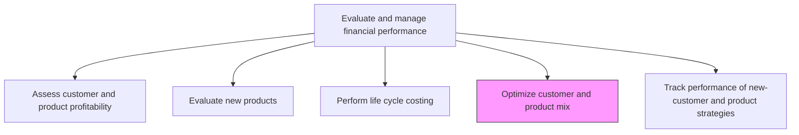
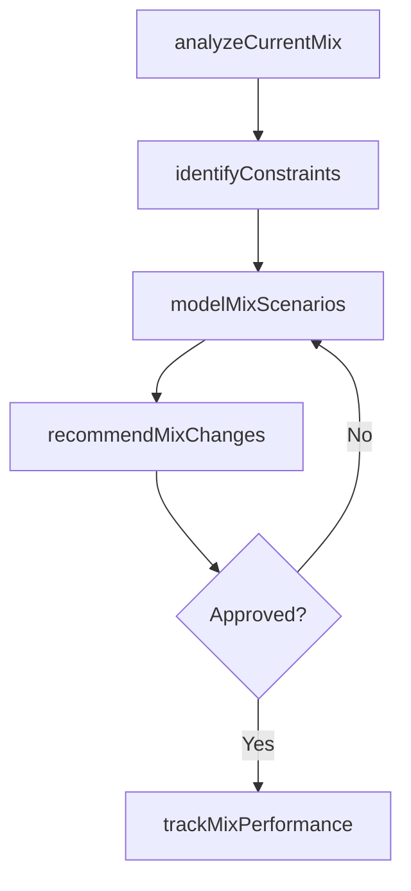

# Optimize customer and product mix

> Business-as-Code definition for customer and product mix optimization. Models the analysis of portfolio composition, margin contribution, and resource constraints to maximize overall profitability through strategic mix adjustments.

## Overview

Creating the best fit between a product and the end user. Maximize the customer base by providing different products in the market, while shifting portfolio emphasis toward higher-margin segments. This process analyzes the current composition of revenue by customer segment and product line, models what-if scenarios that adjust emphasis levels, and maps capacity and supply chain constraints that bound feasible mix changes. Effective mix optimization improves weighted-average contribution margins without requiring cost reductions, making it one of the highest-leverage activities in financial performance management.

## Process Hierarchy



## GraphDL

```yaml
optimize:
  object: Customer And Product Mix
  actor: FPAManager
  result: MixOptimizationPlan
```

## Actions

| Action | Description |
|--------|-------------|
| analyzeCurrentMix | Evaluate existing customer and product portfolio by revenue and margin contribution |
| modelMixScenarios | Run what-if scenarios adjusting product and customer emphasis to project margin impact |
| identifyConstraints | Map capacity, supply chain, and resource limitations that bound mix decisions |
| recommendMixChanges | Propose specific product and customer emphasis shifts to improve profitability |
| trackMixPerformance | Monitor actual results against the optimized mix plan |

## Events

| Event | Description |
|-------|-------------|
| currentMixAnalyzed | Existing portfolio composition and margin contribution evaluated |
| mixScenariosModeled | What-if mix scenarios computed with projected outcomes |
| constraintsIdentified | Capacity and resource limitations documented |
| mixChangesRecommended | Product and customer mix adjustment proposals issued |
| mixPerformanceTracked | Actual results compared against optimized mix targets |

## Searches

| Search | Description |
|--------|-------------|
| getCurrentMix | Retrieve current customer and product portfolio composition |
| getMixScenarios | Query modeled mix scenarios and projected outcomes |
| getMixPerformance | Compare actual versus planned mix composition and margins |

## Process Flow



## RACI Matrix

| Activity | Responsible | Accountable | Consulted | Informed |
|----------|-------------|-------------|-----------|----------|
| analyzeCurrentMix | FP&A Manager | Controller | Sales Director | Marketing |
| identifyConstraints | FP&A Manager | Controller | Operations | Supply Chain |
| modelMixScenarios | FP&A Manager | CFO | Operations | Product Management |
| recommendMixChanges | FP&A Manager | CFO | Sales Director | Executive Leadership |

## Related Processes

| Process | Relationship |
|---------|-------------|
| 9.1.4.1 Assess customer and product profitability | Upstream - profitability data drives mix optimization |
| 9.1.4.5 Track performance of new-customer and product strategies | Downstream - mix changes are tracked for effectiveness |
| 9.1.4.3 Perform life cycle costing | Upstream - life cycle costs inform long-term mix decisions |

## Related Departments

| Department | Role |
|-----------|------|
| FP&A | Leads mix analysis and scenario modeling |
| Sales | Provides customer demand and pipeline data |
| Product Management | Supplies product roadmap and capacity data |
| Operations | Identifies production and fulfillment constraints |

## Related Occupations

| Occupation | Involvement |
|-----------|-------------|
| FP&A Manager | Leads portfolio optimization analysis and recommendations |
| Financial Analyst | Builds mix scenarios and margin projections |
| Pricing Analyst | Models price sensitivity across portfolio segments |

## KPIs

| KPI | Description | Unit |
|-----|-------------|------|
| Portfolio Margin | Weighted average contribution margin across the product mix | % |
| High-Margin Revenue Share | Proportion of revenue from above-average margin products | % |
| Mix Optimization Impact | Incremental margin gain from mix changes versus prior period | USD |

## Usage

```typescript
import { optimizeCustomerAndProductMix } from '@headlessly/optimize-customer-and-product-mix'

const mix = optimizeCustomerAndProductMix()

// Analyze current portfolio composition
const current = await mix.analyzeCurrentMix({
  period: 'Q4-2025',
  dimensions: ['product-line', 'customer-segment']
})

// Model a what-if scenario
const scenario = await mix.modelMixScenarios({
  adjustments: [
    { segment: 'Enterprise', emphasis: 1.2 },
    { segment: 'SMB', emphasis: 0.8 }
  ],
  period: '2026'
})
```
