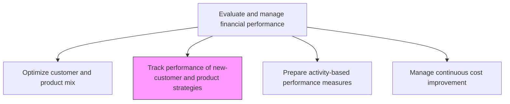
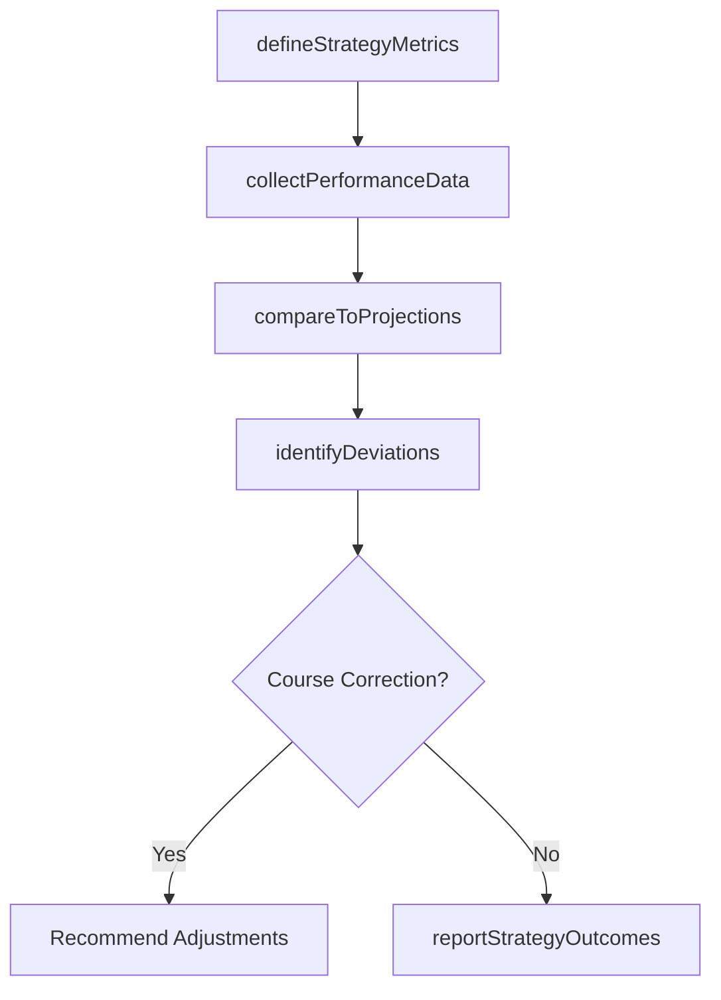

# Track performance of new-customer and product strategies

> Business-as-Code definition for tracking new customer and product strategy performance. Models the measurement, monitoring, and reporting of financial outcomes from newly launched customer acquisition and product introduction strategies.

## Overview

Observing the behavior of a new set of customers for different products. Prepare strategies to improve sales and profits by measuring actual financial outcomes from recently launched customer acquisition and product introduction initiatives against original business case projections. This process defines KPIs, collects revenue and cost data specific to each strategy, and identifies strategies that are significantly over- or under-performing expectations. Timely tracking enables course correction before sunk costs accumulate, ensures accountability for investment decisions, and feeds lessons learned back into the product evaluation and portfolio optimization processes.

## Process Hierarchy



## GraphDL

```yaml
track:
  object: Performance Of New-customer And Product Strategies
  actor: FPAAnalyst
  result: StrategyPerformanceReport
```

## Actions

| Action | Description |
|--------|-------------|
| defineStrategyMetrics | Establish KPIs and targets for new customer and product strategies |
| collectPerformanceData | Gather revenue, acquisition cost, and retention data for new strategies |
| compareToProjections | Measure actual strategy performance against original business case projections |
| identifyDeviations | Flag strategies performing significantly above or below expectations |
| reportStrategyOutcomes | Publish strategy performance analysis to leadership |

## Events

| Event | Description |
|-------|-------------|
| strategyMetricsDefined | Performance KPIs and targets established for new strategies |
| performanceDataCollected | Revenue and cost data gathered for strategy measurement |
| projectionsCompared | Actual results compared against business case projections |
| deviationsIdentified | Over- or under-performing strategies flagged for attention |
| strategyOutcomesReported | Strategy performance report published to leadership |

## Searches

| Search | Description |
|--------|-------------|
| getStrategyPerformance | Retrieve performance metrics for a specific strategy |
| getUnderperformingStrategies | List strategies missing their projected targets |
| getNewCustomerMetrics | Query acquisition cost, retention, and revenue metrics for new customers |

## Process Flow



## RACI Matrix

| Activity | Responsible | Accountable | Consulted | Informed |
|----------|-------------|-------------|-----------|----------|
| defineStrategyMetrics | FP&A Analyst | Controller | Sales Director | Product Management |
| collectPerformanceData | FP&A Analyst | FP&A Manager | Sales Ops | Marketing |
| compareToProjections | FP&A Analyst | Controller | Marketing | CFO |
| identifyDeviations | FP&A Analyst | Controller | Business Unit Heads | Operations |
| reportStrategyOutcomes | FP&A Analyst | CFO | Business Unit Heads | Executive Leadership |

## Related Processes

| Process | Relationship |
|---------|-------------|
| 9.1.4.4 Optimize customer and product mix | Upstream - mix changes generate strategies to track |
| 9.1.4.2 Evaluate new products | Upstream - approved products become tracked strategies |
| 9.1.4.7 Manage continuous cost improvement | Parallel - strategy performance informs cost improvement priorities |

## Related Departments

| Department | Role |
|-----------|------|
| FP&A | Tracks and reports on strategy financial performance |
| Sales | Provides new customer acquisition and retention data |
| Marketing | Supplies campaign effectiveness and lead generation metrics |
| Product Management | Reports on new product adoption and revenue traction |

## Related Occupations

| Occupation | Involvement |
|-----------|-------------|
| Financial Analyst | Measures strategy performance against projections |
| Business Analyst | Collects and synthesizes performance data across channels |
| Marketing Analyst | Tracks customer acquisition costs and conversion rates |

## KPIs

| KPI | Description | Unit |
|-----|-------------|------|
| Strategy ROI | Return on investment for new customer and product strategies | % |
| Customer Acquisition Cost | Average cost to acquire new customers under each strategy | USD |
| Revenue Realization Rate | Actual revenue as a percentage of projected revenue | % |
| Strategy Review Cycle | Average days between strategy performance reviews | Days |

## Usage

```typescript
import { trackPerformanceOfNewCustomerAndProductStrategies } from '@headlessly/track-performance-of-new-customer-and-product-strategies'

const tracker = trackPerformanceOfNewCustomerAndProductStrategies()

// Compare strategy performance to projections
const comparison = await tracker.compareToProjections({
  strategyId: 'STRAT-2025-018',
  period: 'Q4-2025'
})

// Find underperforming strategies
const underperforming = await tracker.getUnderperformingStrategies({
  threshold: 0.80,
  period: '2025'
})
```
