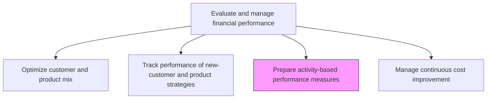
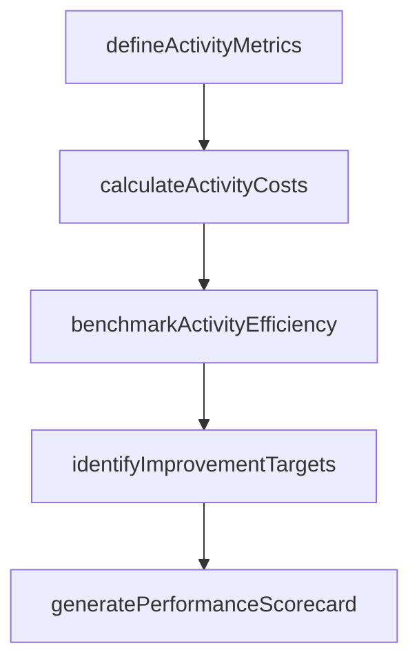

# Prepare activity-based performance measures

> Business-as-Code definition for activity-based performance measurement. Models the design, calculation, and reporting of performance metrics tied to specific business activities using activity-based costing principles.

## Overview

Evaluating performance based on different sets of activities created by management to measure performance. This process uses activity-based costing principles to compute cost per unit of output for each business activity, then benchmarks those results against internal targets and external peer data. Activity-based performance measures reveal process-level efficiency and highlight where operational improvements would yield the greatest cost savings. The resulting scorecards enable management to make data-driven resource allocation decisions, prioritize continuous improvement initiatives, and hold process owners accountable for activity-level cost and quality outcomes.

## Process Hierarchy



## GraphDL

```yaml
prepare:
  object: Activity-based Performance Measures
  actor: ManagementAccountant
  result: ABCPerformanceScorecard
```

## Actions

| Action | Description |
|--------|-------------|
| defineActivityMetrics | Establish performance measures for each business activity |
| calculateActivityCosts | Compute cost per unit of output for each measured activity |
| benchmarkActivityEfficiency | Compare activity performance against internal and external benchmarks |
| generatePerformanceScorecard | Assemble activity-based metrics into a management scorecard |
| identifyImprovementTargets | Flag activities with below-benchmark performance for improvement |

## Events

| Event | Description |
|-------|-------------|
| activityMetricsDefined | Performance measures established for business activities |
| activityCostsCalculated | Cost per unit of output computed for measured activities |
| activityEfficiencyBenchmarked | Activity performance compared to benchmarks |
| performanceScorecardGenerated | Activity-based performance scorecard published |
| improvementTargetsIdentified | Below-benchmark activities flagged for improvement |

## Searches

| Search | Description |
|--------|-------------|
| getActivityPerformance | Retrieve performance metrics for a specific activity |
| getBenchmarkComparisons | Query activity performance versus internal and external benchmarks |
| getImprovementTargets | List activities flagged for performance improvement |

## Process Flow



## RACI Matrix

| Activity | Responsible | Accountable | Consulted | Informed |
|----------|-------------|-------------|-----------|----------|
| defineActivityMetrics | Management Accountant | Controller | Process Owners | FP&A |
| calculateActivityCosts | Management Accountant | Controller | Cost Accountant | Operations |
| benchmarkActivityEfficiency | Management Accountant | Controller | Process Improvement | Operations Directors |
| identifyImprovementTargets | Management Accountant | Controller | FP&A Manager | Cost Manager |
| generatePerformanceScorecard | Management Accountant | CFO | FP&A | Executive Leadership |

## Related Processes

| Process | Relationship |
|---------|-------------|
| 9.1.3.1 Determine key cost drivers | Upstream - cost drivers inform activity measurement design |
| 9.1.3.2 Measure cost drivers | Upstream - driver measurements feed activity cost calculations |
| 9.1.4.7 Manage continuous cost improvement | Downstream - performance measures identify improvement opportunities |

## Related Departments

| Department | Role |
|-----------|------|
| Management Accounting | Designs and calculates activity-based performance measures |
| Operations | Provides activity volume and efficiency data |
| Finance | Reviews and distributes performance scorecards |
| Process Improvement | Uses activity measures to target improvement initiatives |

## Related Occupations

| Occupation | Involvement |
|-----------|-------------|
| Management Accountant | Designs activity metrics and produces scorecards |
| Cost Accountant | Calculates activity-level costs and allocations |
| Process Analyst | Provides activity volume and efficiency data |

## KPIs

| KPI | Description | Unit |
|-----|-------------|------|
| Activity Cost per Unit | Average cost to complete one unit of each business activity | USD |
| Benchmark Achievement Rate | Percentage of activities meeting or exceeding benchmark performance | % |
| Scorecard Delivery Timeliness | Days from period close to scorecard publication | Days |
| Activity Coverage | Percentage of total operating costs covered by activity-based measures | % |

## Usage

```typescript
import { prepareActivityBasedPerformanceMeasures } from '@headlessly/prepare-activity-based-performance-measures'

const abcMetrics = prepareActivityBasedPerformanceMeasures()

// Calculate activity costs for the period
const costs = await abcMetrics.calculateActivityCosts({
  department: 'Order Processing',
  period: 'Q4-2025'
})

// Get activities flagged for improvement
const targets = await abcMetrics.getImprovementTargets({
  thresholdPct: 0.90,
  period: '2025'
})
```
