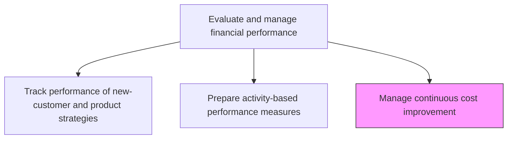
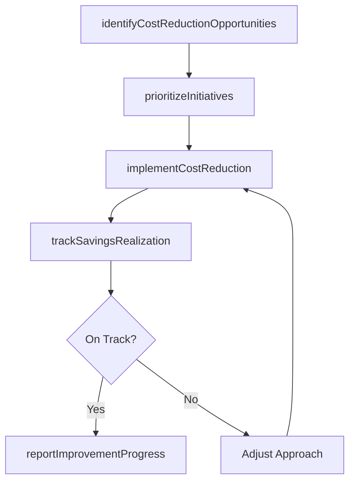

# Manage continuous cost improvement

> Business-as-Code definition for continuous cost improvement management. Models the identification, prioritization, execution, and tracking of cost reduction initiatives across the organization using kaizen and lean principles.

## Overview

Conducting activities to improve cost distribution regularly. Follow or adopt different ways of reducing costs using kaizen, lean, and six sigma methodologies to drive systematic waste elimination and process efficiency gains. This process identifies cost reduction opportunities by analyzing spending patterns, benchmarking against peers, and leveraging insights from activity-based performance measures. Approved initiatives are prioritized by projected savings and implementation effort, executed with defined milestones, and tracked against savings targets to ensure realized benefits match projections. A well-managed continuous improvement program compounds year-over-year savings that significantly improve long-term operating margins.

## Process Hierarchy



## GraphDL

```yaml
manage:
  object: Continuous Cost Improvement
  actor: CostManager
  result: CostImprovementPlan
```

## Actions

| Action | Description |
|--------|-------------|
| identifyCostReductionOpportunities | Analyze spending patterns and benchmarks to find savings targets |
| prioritizeInitiatives | Rank cost improvement initiatives by projected savings and implementation effort |
| implementCostReduction | Execute approved cost reduction actions and process changes |
| trackSavingsRealization | Monitor actual savings against projected targets for each initiative |
| reportImprovementProgress | Publish cost improvement program status and cumulative savings |

## Events

| Event | Description |
|-------|-------------|
| costReductionOpportunitiesIdentified | Potential savings targets discovered through analysis |
| initiativesPrioritized | Cost improvement initiatives ranked and approved for execution |
| costReductionImplemented | Cost reduction actions executed and process changes deployed |
| savingsRealizationTracked | Actual savings measured against projected targets |
| improvementProgressReported | Cost improvement program status published |

## Searches

| Search | Description |
|--------|-------------|
| getActiveInitiatives | Retrieve cost improvement initiatives currently in progress |
| getSavingsRealization | Query actual versus projected savings by initiative |
| getCostImprovementHistory | List completed cost improvement initiatives and cumulative savings |

## Process Flow



## RACI Matrix

| Activity | Responsible | Accountable | Consulted | Informed |
|----------|-------------|-------------|-----------|----------|
| identifyCostReductionOpportunities | Cost Manager | Controller | Process Owners | FP&A |
| prioritizeInitiatives | Cost Manager | CFO | Business Unit Heads | Finance Director |
| implementCostReduction | Cost Manager | CFO | Operations Directors | Procurement |
| reportImprovementProgress | Cost Manager | CFO | Controller | Executive Leadership |

## Related Processes

| Process | Relationship |
|---------|-------------|
| 9.1.4.6 Prepare activity-based performance measures | Upstream - performance measures identify improvement targets |
| 9.1.3.3 Determine critical activities | Upstream - critical activity analysis protects essential spend |
| 9.1.3.1 Determine key cost drivers | Upstream - cost driver data identifies highest-impact savings areas |

## Related Departments

| Department | Role |
|-----------|------|
| Finance | Leads cost improvement program management and tracking |
| Operations | Implements process changes and cost reduction actions |
| Procurement | Executes vendor renegotiation and sourcing improvements |
| Process Improvement | Provides lean and six sigma methodologies |

## Related Occupations

| Occupation | Involvement |
|-----------|-------------|
| Cost Manager | Leads continuous improvement program and tracks savings |
| Process Improvement Specialist | Applies lean methodologies to cost reduction initiatives |
| Financial Analyst | Quantifies savings opportunities and tracks realization |

## KPIs

| KPI | Description | Unit |
|-----|-------------|------|
| Annual Savings Achieved | Total realized cost savings from improvement initiatives | USD |
| Savings Realization Rate | Actual savings as a percentage of projected savings | % |
| Initiative Completion Rate | Percentage of approved initiatives completed on schedule | % |
| Cost Reduction Pipeline | Total projected savings from initiatives in progress | USD |

## Usage

```typescript
import { manageContinuousCostImprovement } from '@headlessly/manage-continuous-cost-improvement'

const improvement = manageContinuousCostImprovement()

// Get active cost improvement initiatives
const active = await improvement.getActiveInitiatives({
  department: 'Manufacturing',
  status: 'in-progress'
})

// Track savings realization for an initiative
const savings = await improvement.trackSavingsRealization({
  initiativeId: 'CI-2025-014',
  period: 'Q4-2025'
})
```
