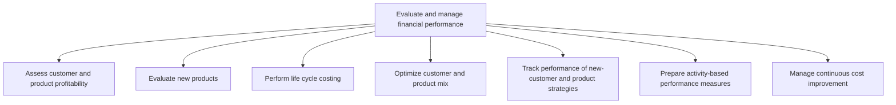
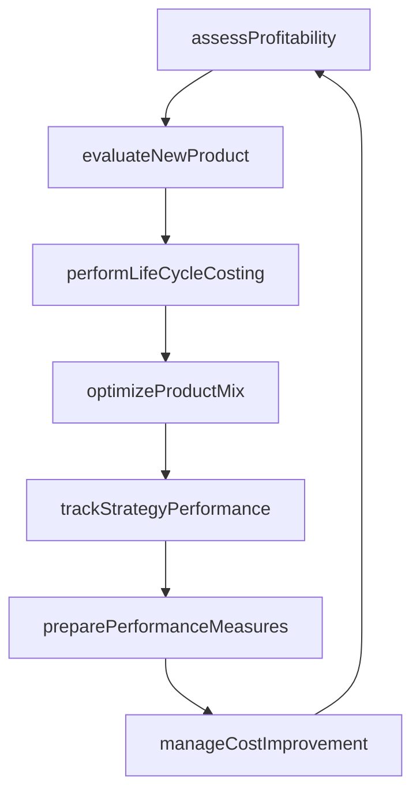

# Evaluate and manage financial performance

> Business-as-Code definition for financial performance evaluation and management. Models profitability assessment, new product evaluation, life cycle costing, product mix optimization, and continuous cost improvement as programmable APIs.

## Overview

Checking and achieving predetermined financial targets and timelines. Assess and manage the profitability, feasibility, and consistency of a business or project. Study the revenues generated.

## Process Hierarchy



## GraphDL

```yaml
evaluate:
  object: And Manage Financial Performance
  actor: FPAManager
  result: FinancialPerformanceScorecard
```

## Actions

| Action | Description |
|--------|-------------|
| assessProfitability | Analyze profit margins by customer segment and product line |
| evaluateNewProduct | Conduct financial feasibility analysis for proposed products |
| performLifeCycleCosting | Calculate total cost of ownership across a product lifecycle |
| optimizeProductMix | Model revenue and margin impact of different product-customer combinations |
| trackStrategyPerformance | Monitor financial outcomes of customer and product strategies |
| preparePerformanceMeasures | Define and calculate activity-based KPIs for business units |
| manageCostImprovement | Identify and track continuous cost reduction initiatives |

## Events

| Event | Description |
|-------|-------------|
| profitabilityAssessed | Customer and product profitability analysis completed |
| newProductEvaluated | Financial feasibility analysis for new product completed |
| lifeCycleCostPerformed | Total lifecycle cost projection delivered |
| productMixOptimized | Recommended product-customer mix published |
| strategyPerformanceTracked | Strategy performance metrics updated and reported |
| performanceMeasuresPrepared | Activity-based performance scorecards distributed |
| costImprovementManaged | Cost improvement initiatives reviewed and progress tracked |

## Searches

| Search | Description |
|--------|-------------|
| getProfitabilityBySegment | Retrieve profitability metrics by customer or product segment |
| getProductEvaluation | Query financial feasibility results for a proposed product |
| getLifeCycleCosts | Get lifecycle cost projections for a product or asset class |
| getCostImprovementPipeline | List active cost improvement initiatives with status |

## Process Flow



## RACI Matrix

| Activity | Responsible | Accountable | Consulted | Informed |
|----------|-------------|-------------|-----------|----------|
| assessProfitability | FP&A Analyst | FP&A Manager | Sales Director | CFO |
| evaluateNewProduct | Financial Analyst | FP&A Manager | Product Manager | Controller |
| optimizeProductMix | FP&A Analyst | CFO | Marketing Director | Business Unit Heads |
| manageCostImprovement | Cost Analyst | Controller | Operations Manager | CFO |

## Sub-Processes

| ID | Name | Description |
|----|------|-------------|
| 9.1.4.1 | Assess customer and product profitability | Studying product demand and targeted customer preferences. Study customers' demands or preferences a |
| 9.1.4.2 | Evaluate new products | Checking demand about a specific product by a customer segment. Conduct a detailed study--or researc |
| 9.1.4.3 | Perform life cycle costing | Determining the cost of delivering an end product at different stages of production. Study the total |
| 9.1.4.4 | Optimize customer and product mix | Creating the best fit between a product and the end user. Maximize the customer base by providing di |
| 9.1.4.5 | Track performance of new-customer and product strategies | Observing the behavior of a new set of customers for different products. Prepare strategies to impro |
| 9.1.4.6 | Prepare activity-based performance measures | Evaluating performance based on different sets of activities created by management to measure perfor |
| 9.1.4.7 | Manage continuous cost improvement | Conducting activities to improve cost distribution regularly. Follow or adopt different ways of redu |

## Related Processes

| Process | Relationship |
|---------|-------------|
| 9.1.2 Perform cost accounting and control | Upstream - cost data feeds profitability analysis |
| 9.1.3 Perform cost management | Parallel - cost improvements measured through performance metrics |
| 2.2 Manage product and service portfolio | Upstream - product strategy drives evaluation scope |

## Related Departments

| Department | Role |
|-----------|------|
| Financial Planning and Analysis | Primary owner of financial performance evaluation |
| Product Management | Provides product roadmap and lifecycle data |
| Sales | Supplies customer revenue and pipeline metrics |
| Marketing | Contributes market sizing and customer segmentation data |
| Operations | Provides cost and efficiency data for activity-based measures |

## Related Occupations

| Occupation | Involvement |
|-----------|-------------|
| FP&A Manager | Oversees profitability analysis and performance reporting |
| Financial Analyst | Builds financial models for product evaluation and mix optimization |
| Business Performance Analyst | Tracks strategy outcomes and prepares scorecards |

## KPIs

| KPI | Description | Unit |
|-----|-------------|------|
| Customer Lifetime Value | Net present value of future profit from a customer relationship | USD |
| Product Margin | Gross profit margin by product or product line | % |
| Cost Improvement Savings | Total cost savings from continuous improvement initiatives | USD |
| New Product ROI | Return on investment for recently launched products | % |

## Usage

```typescript
import { evaluateAndManageFinancialPerformance } from '@headlessly/evaluate-and-manage-financial-performance'

const performance = evaluateAndManageFinancialPerformance()

// Assess profitability by customer segment
const profitability = await performance.assessProfitability({
  segment: 'enterprise',
  period: '2025',
  metric: 'contribution-margin'
})

// Evaluate financial feasibility of a new product
const evaluation = await performance.evaluateNewProduct({
  productName: 'Cloud Analytics Platform',
  projectedRevenue: 5000000,
  developmentCost: 1200000,
  timeHorizon: 36
})
```
