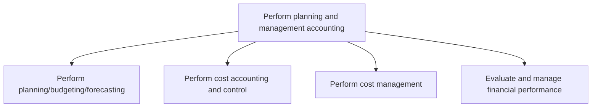
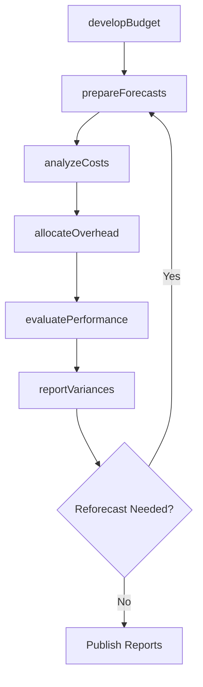

# Perform planning and management accounting

> Business-as-Code definition for financial planning and management accounting. Models budgeting, forecasting, cost accounting, and financial performance evaluation as programmable workflows.

## Overview

Determining different stages of the planning process and accounting. Classify, determine, analyze, interpret, and communicate information to make up-to-date business decisions for better management and control functions.

## Process Hierarchy



## GraphDL

```yaml
perform:
  object: Planning And Management Accounting
  actor: FPAManager
  result: ManagementAccountingReport
```

## Actions

| Action | Description |
|--------|-------------|
| developBudget | Create annual and periodic operating budgets by cost center |
| prepareForecasts | Generate rolling financial forecasts based on actuals and trends |
| analyzeCosts | Classify and evaluate cost behavior across products and departments |
| evaluatePerformance | Assess financial results against targets and benchmarks |
| allocateOverhead | Distribute indirect costs to products, services, or business units |
| reportVariances | Identify and explain deviations between budget and actual results |

## Events

| Event | Description |
|-------|-------------|
| budgetDeveloped | Annual operating budget completed and approved |
| forecastsPrepared | Rolling financial forecast updated with latest data |
| costsAnalyzed | Cost structure evaluation completed for the period |
| performanceEvaluated | Financial performance assessment published to stakeholders |
| overheadAllocated | Indirect cost allocation applied across cost objects |
| variancesReported | Budget-to-actual variance report distributed to management |

## Searches

| Search | Description |
|--------|-------------|
| getBudgetByCenter | Retrieve approved budget for a specific cost center and period |
| getForecastTrends | Query forecast revisions over time for trend analysis |
| getCostBreakdown | Get detailed cost breakdown by product, department, or activity |
| getVarianceReport | Retrieve variance analysis comparing actuals to budget or forecast |

## Process Flow



## RACI Matrix

| Activity | Responsible | Accountable | Consulted | Informed |
|----------|-------------|-------------|-----------|----------|
| developBudget | FP&A Analyst | FP&A Manager | Business Unit Heads | CFO |
| prepareForecasts | FP&A Analyst | FP&A Manager | Revenue Operations | Controller |
| analyzeCosts | Cost Accountant | Controller | Operations Manager | CFO |
| evaluatePerformance | FP&A Manager | CFO | Business Unit Heads | Board of Directors |

## Sub-Processes

| ID | Name | Description |
|----|------|-------------|
| 9.1.1 | Perform planning/budgeting/forecasting | Allocating funds to meet future and current financial goals. Led by the chief financial officer, hav |
| 9.1.2 | Perform cost accounting and control | Defining costs to be incurred and methods for optimum utilization. Determine the costs of products,  |
| 9.1.3 | Perform cost management | Deciding which expenses can be avoided to reduce some costs and increase revenues. Plan and control  |
| 9.1.4 | Evaluate and manage financial performance | Checking and achieving predetermined financial targets and timelines. Assess and manage the profitab |

## Related Processes

| Process | Relationship |
|---------|-------------|
| 9.2 Perform revenue accounting | Downstream - revenue actuals feed into financial performance analysis |
| 9.3 Perform general accounting and reporting | Parallel - management reports complement statutory reporting |
| 1.1 Define the business concept and long-term vision | Upstream - strategic plan drives budget priorities |

## Related Departments

| Department | Role |
|-----------|------|
| Financial Planning and Analysis | Primary owner of budgeting, forecasting, and variance analysis |
| Accounting | Provides cost data and general ledger actuals |
| Operations | Supplies operational metrics and volume assumptions |
| Executive Leadership | Approves budgets and reviews performance results |

## Related Occupations

| Occupation | Involvement |
|-----------|-------------|
| Financial Analyst | Budget preparation, forecast modeling, and variance analysis |
| Cost Accountant | Product costing, overhead allocation, and cost driver analysis |
| Management Accountant | Internal reporting and decision-support analytics |

## KPIs

| KPI | Description | Unit |
|-----|-------------|------|
| Forecast Accuracy | Percentage accuracy of financial forecasts versus actuals | % |
| Budget Cycle Time | Number of days to complete the annual budget process | Days |
| Cost Allocation Accuracy | Percentage of overhead correctly allocated to cost objects | % |
| Variance Reporting Timeliness | Days from period close to delivery of variance reports | Days |

## Usage

```typescript
import { performPlanningAndManagementAccounting } from '@headlessly/perform-planning-and-management-accounting'

const planning = performPlanningAndManagementAccounting()

// Develop operating budget for a cost center
const budget = await planning.developBudget({
  fiscalYear: 2026,
  costCenter: 'CC-4200',
  basedOn: 'prior-year-actuals'
})

// Run variance analysis for the quarter
const variances = await planning.reportVariances({
  period: 'Q3-2025',
  threshold: 0.05,
  groupBy: 'department'
})
```
