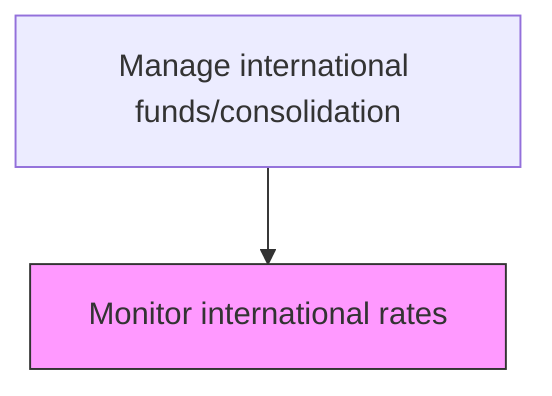
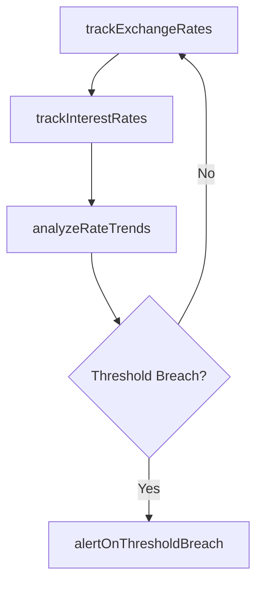

# Monitor international rates

> Business-as-Code definition for international rate monitoring. Models the tracking of foreign exchange rates, interest rates, and economic indicators across global markets to inform treasury and hedging decisions.

## Overview

Forecasting and monitoring changes in foreign currency value or interest rates around the world that play an important role in the organization. This process involves continuous surveillance of spot and forward exchange rates, central bank policy rate decisions, and benchmark interest rates such as SOFR, EURIBOR, and SONIA. The treasury team uses this intelligence to inform hedging strategies, optimize the timing of cross-border fund movements, and identify exposure thresholds that require immediate action.

## Process Hierarchy



## GraphDL

```yaml
monitor:
  object: International Rates
  actor: FxAnalyst
  result: RateMonitoringReport
```

## Actions

| Action | Description |
|--------|-------------|
| trackExchangeRates | Monitor real-time and daily foreign exchange rate movements |
| trackInterestRates | Monitor benchmark interest rate changes across markets |
| analyzeRateTrends | Identify patterns and forecast rate direction |
| alertOnThresholdBreach | Notify stakeholders when rates cross defined thresholds |

## Events

| Event | Description |
|-------|-------------|
| exchangeRatesTracked | FX rate data collected and updated |
| interestRatesTracked | Benchmark interest rate data refreshed |
| rateTrendsAnalyzed | Rate trend analysis completed |
| thresholdBreachAlerted | Rate threshold notification triggered |

## Searches

| Search | Description |
|--------|-------------|
| getCurrentRates | Retrieve current exchange and interest rates |
| getRateHistory | Query historical rate data for a currency pair or benchmark |

## Process Flow



## RACI Matrix

| Activity | Responsible | Accountable | Consulted | Informed |
|----------|-------------|-------------|-----------|----------|
| trackExchangeRates | FxAnalyst | TreasuryManager | RiskManager | Treasurer |
| trackInterestRates | FxAnalyst | TreasuryManager | DebtCapitalMarkets | CFO |
| analyzeRateTrends | FxAnalyst | TreasuryManager | Economist | CFO |
| alertOnThresholdBreach | FxAnalyst | TreasuryManager | FxRiskManager | SubsidiaryFinance |

## Related Processes

| Process | Relationship |
|---------|-------------|
| 9.10.2 Manage transactions | Downstream - rate data informs transaction timing |
| 9.10.3 Monitor currency exposure/hedge currency | Downstream - rate movements trigger hedging decisions |
| 9.10.4 Report results | Downstream - rate data used for translation gain/loss calculations |
| 9.7.6 Monitor and execute risk and hedging transactions | Parallel - rate monitoring feeds the broader risk and hedging program |

## Related Departments

| Department | Role |
|-----------|------|
| Treasury | Monitors and analyzes international rates |
| Risk Management | Uses rate data for exposure assessment |

## Related Occupations

| Occupation | Involvement |
|-----------|-------------|
| FX Analyst | Tracks and analyzes exchange rate movements |
| Treasury Analyst | Monitors interest rate benchmarks |

## KPIs

| KPI | Description | Unit |
|-----|-------------|------|
| Rate Data Timeliness | Freshness of rate data in the system | Minutes |
| Alert Response Time | Average time to act on rate threshold breaches | Minutes |
| Rate Forecast Accuracy | Variance between forecasted and actual rates over a 30-day horizon | Basis Points |
| Threshold Breach Frequency | Number of rate threshold breaches detected per month | Count |

## Usage

```typescript
import { monitorInternationalRates } from '@headlessly/monitor-international-rates'

const rates = monitorInternationalRates()

const current = await rates.trackExchangeRates({
  pairs: ['EUR/USD', 'GBP/USD', 'USD/JPY'],
  source: 'ECB',
  frequency: 'real-time'
})

// Analyze rate trends and identify threshold breaches
const trends = await rates.analyzeRateTrends({
  pair: 'EUR/USD',
  lookbackDays: 90,
  thresholdBps: 200,
  includeVolatilityMetrics: true
})
```
