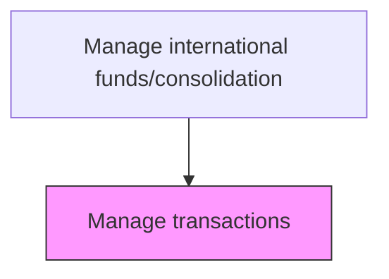
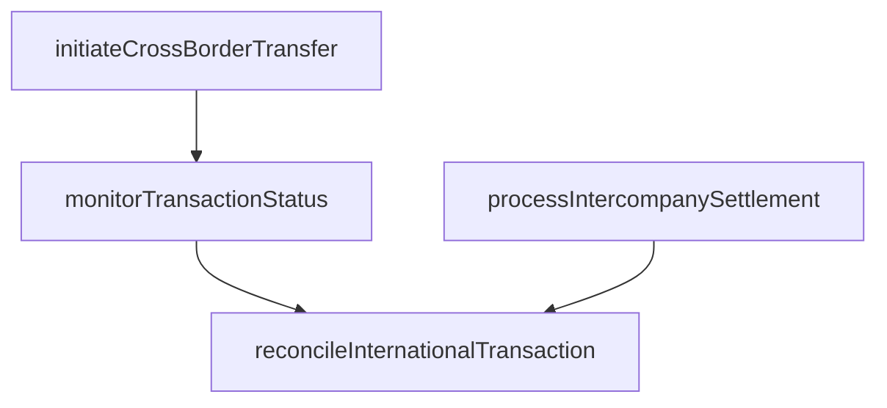

# Manage transactions

> Business-as-Code definition for international transaction management. Models the processing and monitoring of cross-border fund transfers, intercompany settlements, and foreign currency disbursements.

## Overview

Managing any transfer of funds in the course of conducting cross-border trades or investments, including conversion across currencies. Find the most suitable alternative for making payments, while saving taxes and avoiding any unwarranted regulation, with the objective of protecting capital.

## Process Hierarchy



## GraphDL

```yaml
manage:
  object: Transactions
  actor: TreasuryOperator
  result: TransactionConfirmation
```

## Actions

| Action | Description |
|--------|-------------|
| initiateCrossBorderTransfer | Execute international wire or SWIFT payment |
| processIntercompanySettlement | Settle intercompany receivables and payables |
| reconcileInternationalTransaction | Match transaction records with bank confirmations |
| monitorTransactionStatus | Track pending international transfers to completion |

## Events

| Event | Description |
|-------|-------------|
| crossBorderTransferInitiated | International payment submitted |
| intercompanySettlementProcessed | Intercompany balances settled |
| internationalTransactionReconciled | Transaction matched with bank confirmation |
| transactionStatusMonitored | Pending transfer status reviewed |

## Searches

| Search | Description |
|--------|-------------|
| getPendingTransfers | List international transfers in progress |
| getTransactionHistory | Retrieve cross-border transaction history by entity |

## Process Flow



## RACI Matrix

| Activity | Responsible | Accountable | Consulted | Informed |
|----------|-------------|-------------|-----------|----------|
| initiateCrossBorderTransfer | TreasuryOperator | TreasuryManager | BankRelationshipManager | SubsidiaryFinance |
| processIntercompanySettlement | TreasuryOperator | TreasuryManager | SubsidiaryFinance | Controller |
| reconcileInternationalTransaction | AccountingAnalyst | Controller | TreasuryOperator | TreasuryManager |
| monitorTransactionStatus | TreasuryOperator | TreasuryManager | BankRelationshipManager | CFO |

## Related Processes

| Process | Relationship |
|---------|-------------|
| 9.10.1 Monitor international rates | Upstream - rate data informs transaction timing |
| 9.10.3 Monitor currency exposure/hedge currency | Parallel - transaction volumes drive exposure calculations |
| 9.10.4 Report results | Downstream - transactions generate reportable results |
| 9.6.1 Process accounts payable (AP) | Upstream - cross-border vendor payments originate from AP |

## Related Departments

| Department | Role |
|-----------|------|
| Treasury | Initiates and monitors cross-border transfers |
| Accounting | Reconciles international transactions |

## Related Occupations

| Occupation | Involvement |
|-----------|-------------|
| Treasury Operator | Executes international fund transfers |

## KPIs

| KPI | Description | Unit |
|-----|-------------|------|
| Transaction Processing Time | Average hours to complete a cross-border transfer | Hours |
| Reconciliation Rate | Percentage of transactions reconciled within 24 hours | % |
| Failed Transfer Rate | Percentage of cross-border transfers requiring resubmission due to errors | % |
| Intercompany Settlement Cycle Time | Average days to settle intercompany balances across entities | Days |

## Usage

```typescript
import { manageTransactions } from '@headlessly/manage-transactions'

const txn = manageTransactions()

const transfer = await txn.initiateCrossBorderTransfer({
  from: 'US-HQ-Account',
  to: 'EU-Sub-Account',
  amount: 2000000,
  currency: 'EUR',
  valueDate: '2025-03-20'
})

// Reconcile a completed international transfer
const reconciliation = await txn.reconcileInternationalTransaction({
  transferId: transfer.id,
  bankConfirmation: 'SWIFT-REF-20250320-001',
  settledAmount: 2000000,
  settlementDate: '2025-03-20'
})
```
