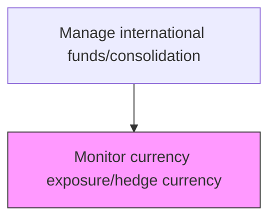
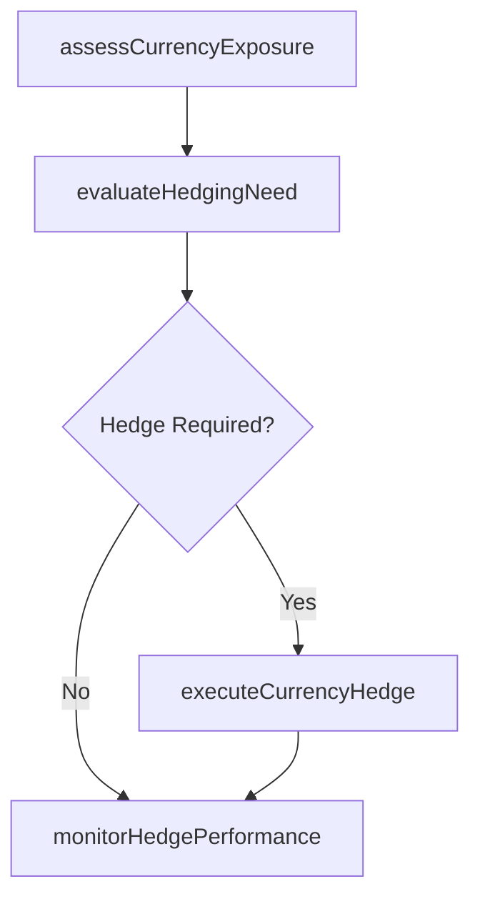

# Monitor currency exposure/hedge currency

> Business-as-Code definition for currency exposure monitoring and hedging. Models the assessment of net currency exposure across the enterprise and the execution of hedging instruments to mitigate foreign exchange risk.

## Overview

Assessing exposure to potential financial losses as a result of changes in the value of currencies. Forecast the impact of movements in foreign currency values. Enter into financial transactions designed to offset or limit potential exposure to loss.

## Process Hierarchy



## GraphDL

```yaml
monitor:
  object: Currency Exposure/hedge Currency
  actor: FxRiskManager
  result: CurrencyHedgePosition
```

## Actions

| Action | Description |
|--------|-------------|
| assessCurrencyExposure | Calculate net FX exposure by currency and entity |
| evaluateHedgingNeed | Determine which exposures require hedging |
| executeCurrencyHedge | Place forward contracts or options to offset exposure |
| monitorHedgePerformance | Track effectiveness of active currency hedges |

## Events

| Event | Description |
|-------|-------------|
| currencyExposureAssessed | Net FX exposure calculated |
| hedgingNeedEvaluated | Hedging requirements determined |
| currencyHedgeExecuted | FX hedging instrument placed |
| hedgePerformanceMonitored | Hedge effectiveness reviewed |

## Searches

| Search | Description |
|--------|-------------|
| getNetExposure | Retrieve net currency exposure by currency pair |
| getActiveHedges | List open FX hedging positions |

## Process Flow



## RACI Matrix

| Activity | Responsible | Accountable | Consulted | Informed |
|----------|-------------|-------------|-----------|----------|
| assessCurrencyExposure | FxRiskManager | Treasurer | SubsidiaryFinance | CFO |
| evaluateHedgingNeed | FxRiskManager | Treasurer | TreasuryAnalyst | Controller |
| executeCurrencyHedge | FxTrader | FxRiskManager | LegalCounsel | Controller |
| monitorHedgePerformance | FxRiskManager | Treasurer | ExternalAuditor | AuditCommittee |

## Related Processes

| Process | Relationship |
|---------|-------------|
| 9.10.1 Monitor international rates | Upstream - rate movements drive hedging decisions |
| 9.10.2 Manage transactions | Parallel - cross-border transactions create currency exposures |
| 9.10.4 Report results | Downstream - hedge positions affect consolidated financial reporting |
| 9.7.6 Monitor and execute risk and hedging transactions | Parallel - FX hedging is part of overall risk program |

## Related Departments

| Department | Role |
|-----------|------|
| Risk Management | Monitors currency exposure and hedging effectiveness |
| Treasury | Executes hedging transactions |

## Related Occupations

| Occupation | Involvement |
|-----------|-------------|
| FX Risk Manager | Assesses exposure and determines hedging strategy |
| FX Trader | Executes currency hedging instruments |

## KPIs

| KPI | Description | Unit |
|-----|-------------|------|
| Hedge Coverage Ratio | Percentage of material exposures with active hedges | % |
| Hedge Effectiveness | Degree to which hedges offset underlying exposure | % |
| Net Unhedged Exposure | Total value of currency exposures without active hedge coverage | Currency |
| Hedge Cost Ratio | Annual hedging costs as a percentage of total hedged notional value | Basis Points |

## Usage

```typescript
import { monitorCurrencyExposureHedgeCurrency } from '@headlessly/monitor-currency-exposure-hedge-currency'

const exposure = monitorCurrencyExposureHedgeCurrency()

const netExposure = await exposure.assessCurrencyExposure({
  baseCurrency: 'USD',
  entities: ['EU-Sub', 'UK-Sub', 'JP-Sub'],
  includeForecasted: true
})

// Execute a forward contract hedge for EUR exposure
const hedge = await exposure.executeCurrencyHedge({
  currencyPair: 'EUR/USD',
  notionalAmount: 5000000,
  instrumentType: 'forward',
  maturityDate: '2025-06-30',
  hedgedItem: 'EUR-revenue-forecast-Q2'
})
```
