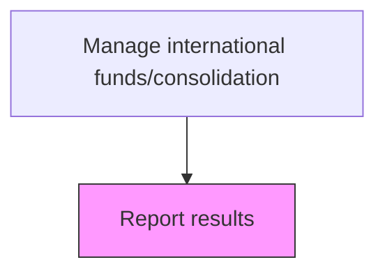
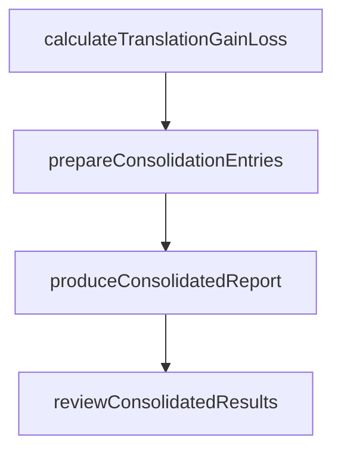

# Report results

> Business-as-Code definition for international funds results reporting. Models the calculation and reporting of foreign currency translation gains and losses, intercompany elimination entries, and consolidated financial results.

## Overview

Documenting and reporting accounting entries to formally report financial gains or losses experienced as a result of foreign exchange activity. This process encompasses the calculation of foreign currency translation adjustments under ASC 830, the preparation of intercompany elimination entries, and the consolidation of multi-currency subsidiary results into the reporting currency. Accurate and timely reporting ensures that stakeholders understand the impact of currency movements on the organization's financial position.

## Process Hierarchy



## GraphDL

```yaml
report:
  object: Results
  actor: ConsolidationAccountant
  result: ConsolidatedReport
```

## Actions

| Action | Description |
|--------|-------------|
| calculateTranslationGainLoss | Compute FX translation gains or losses for the period |
| prepareConsolidationEntries | Create journal entries for intercompany eliminations |
| produceConsolidatedReport | Generate consolidated financial statements |
| reviewConsolidatedResults | Validate consolidated figures for accuracy |

## Events

| Event | Description |
|-------|-------------|
| translationGainLossCalculated | FX translation impact computed |
| consolidationEntriesPrepared | Intercompany elimination entries created |
| consolidatedReportProduced | Consolidated financial report generated |
| consolidatedResultsReviewed | Consolidated figures validated |

## Searches

| Search | Description |
|--------|-------------|
| getTranslationImpact | Retrieve FX translation gains and losses by entity |
| getConsolidatedFinancials | Query consolidated financial statements by period |

## Process Flow



## RACI Matrix

| Activity | Responsible | Accountable | Consulted | Informed |
|----------|-------------|-------------|-----------|----------|
| calculateTranslationGainLoss | ConsolidationAccountant | Controller | TreasuryManager | CFO |
| prepareConsolidationEntries | ConsolidationAccountant | Controller | SubsidiaryFinance | TreasuryManager |
| produceConsolidatedReport | ConsolidationAccountant | Controller | ExternalAuditor | Board |
| reviewConsolidatedResults | Controller | CFO | ExternalAuditor | AuditCommittee |

## Related Processes

| Process | Relationship |
|---------|-------------|
| 9.10.2 Manage transactions | Upstream - international transactions feed reporting |
| 9.10.3 Monitor currency exposure/hedge currency | Upstream - hedge gains and losses reported in consolidated results |
| 9.3 Perform general accounting and reporting | Downstream - consolidated results feed financial statements |
| 9.3.4 Perform financial reporting | Downstream - translation adjustments disclosed in financial statements |

## Related Departments

| Department | Role |
|-----------|------|
| Accounting | Prepares consolidation entries and reports |
| Treasury | Provides FX rate data for translation |

## Related Occupations

| Occupation | Involvement |
|-----------|-------------|
| Consolidation Accountant | Translates and consolidates subsidiary results |

## KPIs

| KPI | Description | Unit |
|-----|-------------|------|
| Consolidation Cycle Time | Days from period close to consolidated report | Days |
| Consolidation Accuracy | Number of post-close adjustments required | Count |
| Translation Gain/Loss Impact | Net foreign currency translation gain or loss for the period | Currency |
| Intercompany Elimination Accuracy | Percentage of intercompany balances eliminated without residual differences | % |

## Usage

```typescript
import { reportResults } from '@headlessly/report-results'

const reporting = reportResults()

const consolidated = await reporting.produceConsolidatedReport({
  period: 'Q1-2025',
  reportingCurrency: 'USD',
  includeTranslationDetail: true
})

// Get FX translation impact by subsidiary
const translationImpact = await reporting.getTranslationImpact({
  period: 'Q1-2025',
  entities: ['UK-Sub', 'DE-Sub', 'JP-Sub'],
  reportingCurrency: 'USD'
})
```
