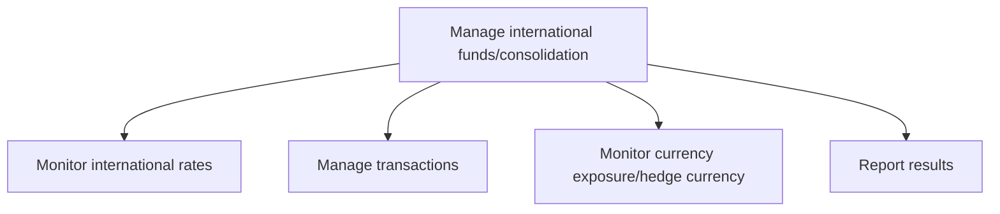
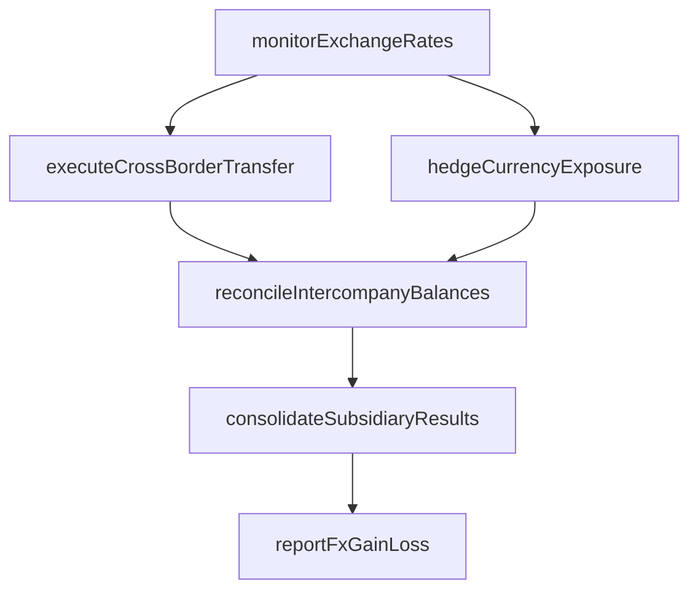

# Manage international funds/consolidation

> Business-as-Code definition for international funds and consolidation management. Models the processes of monitoring foreign exchange rates, managing cross-border transactions, hedging currency exposure, and consolidating multinational financial results.

## Overview

Managing cash collections and disbursements made by operating units across the enterprise. When appropriate, transfer cash from the operating units to parent-level bank accounts managed by the organization's treasury team.

## Process Hierarchy



## GraphDL

```yaml
manage:
  object: International Funds/consolidation
  actor: TreasuryManager
  result: ConsolidatedFundsReport
```

## Actions

| Action | Description |
|--------|-------------|
| monitorExchangeRates | Track real-time and historical foreign exchange and interest rates |
| executeCrossBorderTransfer | Process intercompany fund transfers across international entities |
| hedgeCurrencyExposure | Establish forward contracts or options to mitigate currency risk |
| consolidateSubsidiaryResults | Aggregate financial results from foreign subsidiaries into reporting currency |
| reconcileIntercompanyBalances | Match and eliminate intercompany transactions for consolidation |
| reportFxGainLoss | Calculate and report foreign currency translation gains or losses |

## Events

| Event | Description |
|-------|-------------|
| exchangeRatesMonitored | Foreign exchange rate data updated and reviewed |
| crossBorderTransferExecuted | International fund transfer completed and confirmed |
| currencyExposureHedged | Currency hedging position established or adjusted |
| subsidiaryResultsConsolidated | Foreign subsidiary financials translated and consolidated |
| intercompanyBalancesReconciled | Intercompany eliminations completed for the period |
| fxGainLossReported | Foreign currency translation results reported |

## Searches

| Search | Description |
|--------|-------------|
| getExchangeRates | Retrieve current and historical exchange rates by currency pair |
| getCurrencyExposure | Query net currency exposure by entity and currency |
| getConsolidationStatus | Check consolidation progress and outstanding eliminations |
| getIntercompanyBalances | List open intercompany receivables and payables by entity pair |

## Process Flow



## RACI Matrix

| Activity | Responsible | Accountable | Consulted | Informed |
|----------|-------------|-------------|-----------|----------|
| monitorExchangeRates | TreasuryAnalyst | TreasuryManager | RiskManager | CFO |
| executeCrossBorderTransfer | TreasuryOperator | TreasuryManager | BankRelationshipManager | Controller |
| hedgeCurrencyExposure | RiskManager | Treasurer | ExternalAdvisor | CFO |
| consolidateSubsidiaryResults | ConsolidationAccountant | Controller | TaxDirector | ExternalAuditor |

## Sub-Processes

| ID | Name | Description |
|----|------|-------------|
| 9.10.1 | Monitor international rates | Forecasting and monitoring changes in foreign currency value or interest rates around the world that |
| 9.10.2 | Manage transactions | Managing any transfer of funds in the course of conducting cross-border trades or investments, inclu |
| 9.10.3 | Monitor currency exposure/hedge currency | Assessing exposure to potential financial losses as a result of changes in the value of currencies.  |
| 9.10.4 | Report results | Documenting and reporting accounting entries to formally report financial gains or losses experience |

## Related Processes

| Process | Relationship |
|---------|-------------|
| 9.7 Manage treasury operations | Upstream - treasury provides cash and investment data |
| 9.7.6 Monitor and execute risk and hedging transactions | Parallel - hedging strategies apply to FX exposure |
| 9.3 Perform general accounting and reporting | Downstream - consolidated results feed financial reporting |
| 9.11 Perform global trade services | Parallel - trade transactions generate FX exposure |

## Related Departments

| Department | Role |
|-----------|------|
| Treasury | Manages cross-border fund flows and FX hedging |
| Accounting | Performs consolidation entries and eliminations |
| Finance | Provides subsidiary financial data and budgets |
| Tax | Advises on transfer pricing and withholding implications |
| Risk Management | Monitors currency exposure limits and hedging effectiveness |

## Related Occupations

| Occupation | Involvement |
|-----------|-------------|
| Treasury Manager | Oversees international cash pooling and fund transfers |
| FX Trader | Executes currency transactions and hedging contracts |
| Consolidation Accountant | Translates and consolidates subsidiary financial statements |

## KPIs

| KPI | Description | Unit |
|-----|-------------|------|
| FX Translation Gain/Loss | Net foreign currency translation impact on consolidated results | Currency |
| Intercompany Reconciliation Rate | Percentage of intercompany balances reconciled on time | % |
| Hedging Effectiveness Ratio | Degree to which hedges offset underlying FX exposure | % |
| Consolidation Cycle Time | Days from period close to consolidated financial statements | Days |

## Usage

```typescript
import { manageInternationalFundsConsolidation } from '@headlessly/manage-international-funds-consolidation'

const intlFunds = manageInternationalFundsConsolidation()

// Monitor current exchange rates for operational currencies
const rates = await intlFunds.monitorExchangeRates({
  baseCurrency: 'USD',
  targetCurrencies: ['EUR', 'GBP', 'JPY', 'CNY'],
  source: 'ECB'
})

// Consolidate Q1 results from all foreign subsidiaries
const consolidated = await intlFunds.consolidateSubsidiaryResults({
  period: 'Q1-2025',
  reportingCurrency: 'USD',
  eliminateIntercompany: true
})
```
