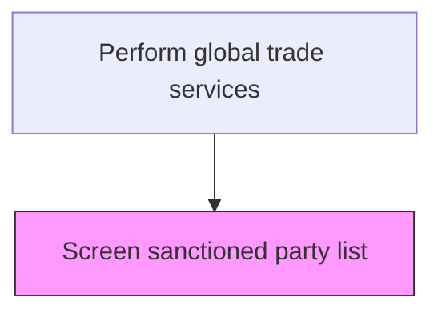
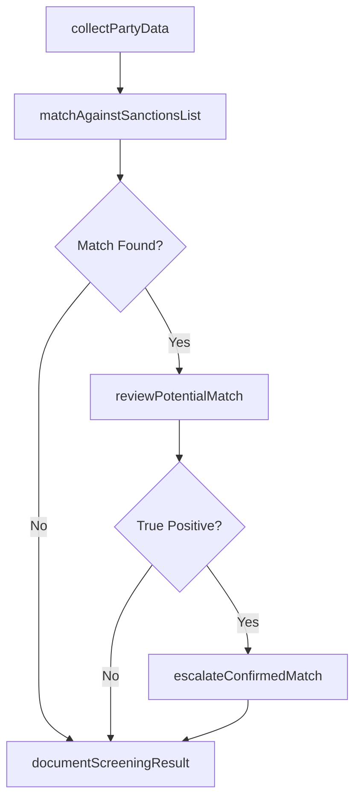

# Screen sanctioned party list

> Business-as-Code definition for sanctioned party list screening. Models the verification of trading partners, vendors, and customers against government-maintained denied-party and sanctions lists before engaging in international trade.

## Overview

Evaluating the approved list of parties for engaging in international trade in order to ensure the safety of the organization's business transactions. Examine agents that have been granted legal rights to engage in global trade and their credentials.

## Process Hierarchy



## GraphDL

```yaml
screen:
  object: Sanctioned Party List
  actor: TradeComplianceAnalyst
  result: ScreeningResult
```

## Actions

| Action | Description |
|--------|-------------|
| collectPartyData | Gather identifying information for the trading partner including name, aliases, addresses, and national IDs |
| matchAgainstSanctionsList | Compare party data against OFAC SDN, EU consolidated list, UN sanctions, and other government lists |
| reviewPotentialMatch | Manually evaluate fuzzy matches to determine if they represent true positives or false positives |
| escalateConfirmedMatch | Route confirmed sanctioned party matches to legal and compliance for action |
| documentScreeningResult | Record the screening outcome, rationale, and supporting evidence for audit trail |

## Events

| Event | Description |
|-------|-------------|
| partyDataCollected | Trading partner identifying data has been gathered for screening |
| sanctionsListMatched | Automated screening against sanctions databases completed |
| potentialMatchReviewed | Manual review of fuzzy match completed with determination |
| confirmedMatchEscalated | True positive match escalated to legal and compliance |
| screeningResultDocumented | Screening outcome recorded with full audit trail |

## Searches

| Search | Description |
|--------|-------------|
| getScreeningResults | Retrieve screening results by party, date range, or match status |
| getPendingReviews | List potential matches awaiting manual review |
| getSanctionedParties | Query confirmed sanctioned parties with active restrictions |
| getScreeningAuditTrail | Retrieve complete screening history for a specific trading partner |

## Process Flow



## RACI Matrix

| Activity | Responsible | Accountable | Consulted | Informed |
|----------|-------------|-------------|-----------|----------|
| matchAgainstSanctionsList | TradeComplianceAnalyst | TradeComplianceManager | ITSecurity | CFO |
| reviewPotentialMatch | TradeComplianceAnalyst | TradeComplianceManager | LegalCounsel | SalesTeam |
| escalateConfirmedMatch | TradeComplianceManager | GeneralCounsel | ExternalCounsel | CEO |
| documentScreeningResult | TradeComplianceAnalyst | TradeComplianceManager | InternalAudit | Procurement |

## Related Processes

| Process | Relationship |
|---------|-------------|
| 9.11.2 Control exports and imports | Downstream - screening must clear before export/import proceeds |
| 9.11.6 Communicate with customs | Parallel - sanctions screening data supports customs filings |
| 9.11.7 Document trade | Downstream - screening results become part of trade documentation |
| 9.11.10 Prepare letter of credit | Parallel - beneficiary screening required before LC issuance |

## Related Departments

| Department | Role |
|-----------|------|
| Trade Compliance | Performs screening and reviews potential matches |
| Legal | Advises on sanctions regulations and escalated matches |
| Sales | Submits new trading partners for screening |
| Procurement | Submits new vendors for pre-engagement screening |

## Related Occupations

| Occupation | Involvement |
|-----------|-------------|
| Trade Compliance Analyst | Executes daily screening and reviews potential matches |
| Trade Compliance Manager | Oversees screening program and escalates confirmed matches |
| Export Control Officer | Ensures screening covers dual-use and controlled goods scenarios |

## KPIs

| KPI | Description | Unit |
|-----|-------------|------|
| Screening Coverage Rate | Percentage of transactions screened before execution | % |
| False Positive Rate | Percentage of flagged matches determined to be false positives | % |
| Average Resolution Time | Mean time to resolve a potential match through manual review | Hours |
| Sanctions List Update Frequency | How often screening databases are refreshed | Per Week |

## Usage

```typescript
import { screenSanctionedPartyList } from '@headlessly/screen-sanctioned-party-list'

const screening = screenSanctionedPartyList()

// Screen a new trading partner
const result = await screening.matchAgainstSanctionsList({
  partyName: 'Acme International Trading Co.',
  country: 'AE',
  aliases: ['Acme Intl', 'AIT Co.'],
  lists: ['OFAC-SDN', 'EU-CONSOLIDATED', 'UN-SANCTIONS']
})

// Review a potential match
const review = await screening.reviewPotentialMatch({
  matchId: result.potentialMatches[0].id,
  determination: 'falsePositive',
  rationale: 'Different registered address and entity type'
})
```
