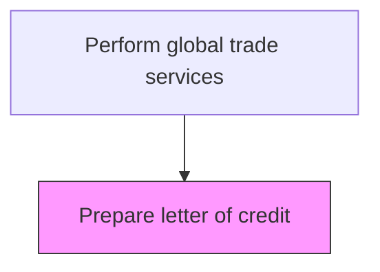
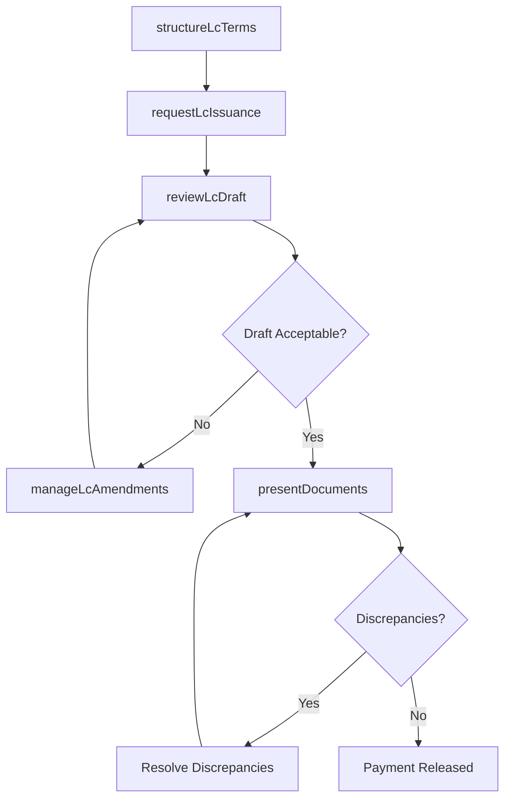

# Prepare letter of credit

> Business-as-Code definition for letter of credit preparation. Models the structuring, issuance, and management of documentary letters of credit as trade finance instruments to guarantee payment in international transactions.

## Overview

Creating a document assuring that a seller will receive payment when certain delivery conditions are met. (If the buyer is unable to make payment on the purchase, a bank covers the outstanding amount.)

## Process Hierarchy



## GraphDL

```yaml
prepare:
  object: Letter Of Credit
  actor: TradeFinanceAnalyst
  result: LetterOfCredit
```

## Actions

| Action | Description |
|--------|-------------|
| structureLcTerms | Define the LC type, amount, currency, expiry date, and documentary requirements based on the trade contract |
| requestLcIssuance | Submit the LC application to the issuing bank with all required terms and conditions |
| reviewLcDraft | Examine the bank's draft LC for accuracy against the purchase agreement and amend if necessary |
| presentDocuments | Submit compliant trade documents to the advising or negotiating bank for payment |
| manageLcAmendments | Process amendments to the LC terms when trade conditions change after issuance |

## Events

| Event | Description |
|-------|-------------|
| lcTermsStructured | Letter of credit terms, conditions, and documentary requirements defined |
| lcIssuanceRequested | LC application submitted to the issuing bank |
| lcDraftReviewed | Bank's draft LC reviewed for accuracy and conformity |
| documentsPresented | Trade documents submitted to the bank for negotiation and payment |
| lcAmendmentProcessed | Amendment to the LC terms processed and confirmed by all parties |

## Searches

| Search | Description |
|--------|-------------|
| getActiveLettersOfCredit | Retrieve open LCs by beneficiary, issuing bank, or expiry date |
| getLcDocumentStatus | Query document presentation status for a specific LC |
| getLcAmendments | List amendments made to a letter of credit |
| getLcPaymentHistory | Retrieve payment draws and settlements against a specific LC |

## Process Flow



## RACI Matrix

| Activity | Responsible | Accountable | Consulted | Informed |
|----------|-------------|-------------|-----------|----------|
| structureLcTerms | TradeFinanceAnalyst | TreasuryManager | SalesOperations | LegalCounsel |
| requestLcIssuance | TradeFinanceAnalyst | TreasuryManager | BankRelationshipManager | CFO |
| reviewLcDraft | TradeFinanceAnalyst | TreasuryManager | LegalCounsel | Procurement |
| presentDocuments | TradeDocumentSpecialist | TradeFinanceAnalyst | CustomsBroker | AccountsReceivable |

## Related Processes

| Process | Relationship |
|---------|-------------|
| 9.11.7 Document trade | Upstream - trade documents must comply with LC terms for presentation |
| 9.7.3 Manage cash | Downstream - LC payments affect cash flow forecasting |
| 9.7.5 Manage debt and investment | Parallel - LC commitments are contingent liabilities affecting credit capacity |

## Related Departments

| Department | Role |
|-----------|------|
| Treasury | Manages bank relationships and LC applications |
| Trade Compliance | Ensures documentary compliance with LC requirements |
| Sales | Negotiates trade contract terms that drive LC structure |
| Legal | Reviews LC terms for contractual alignment and risk |

## Related Occupations

| Occupation | Involvement |
|-----------|-------------|
| Trade Finance Analyst | Structures LC terms and manages the issuance and amendment process |
| Bank Relationship Manager | Coordinates with the issuing and advising banks |
| Trade Document Specialist | Prepares and presents compliant documents for LC negotiation |

## KPIs

| KPI | Description | Unit |
|-----|-------------|------|
| LC Issuance Cycle Time | Average days from LC application to bank issuance | Days |
| Document Discrepancy Rate | Percentage of document presentations with discrepancies under LCs | % |
| LC Utilization Rate | Percentage of issued LC value drawn before expiry | % |
| Bank Fee per LC | Average bank fees incurred per letter of credit issued | Currency |

## Usage

```typescript
import { prepareLetterOfCredit } from '@headlessly/prepare-letter-of-credit'

const lc = prepareLetterOfCredit()

// Structure and request LC issuance
const application = await lc.requestLcIssuance({
  type: 'irrevocable',
  beneficiary: 'Hamburg Industrial GmbH',
  amount: 125000,
  currency: 'EUR',
  expiryDate: '2025-06-30',
  issuingBank: 'Citibank NA',
  requiredDocuments: ['commercialInvoice', 'packingList', 'billOfLading', 'certificateOfOrigin']
})

// Present documents for payment
const presentation = await lc.presentDocuments({
  lcNumber: application.lcNumber,
  documents: ['INV-2025-08321', 'PL-2025-08321', 'BL-2025-08321', 'COO-2025-08321'],
  drawAmount: 125000
})
```
