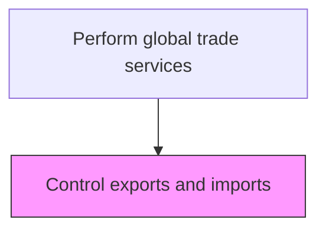
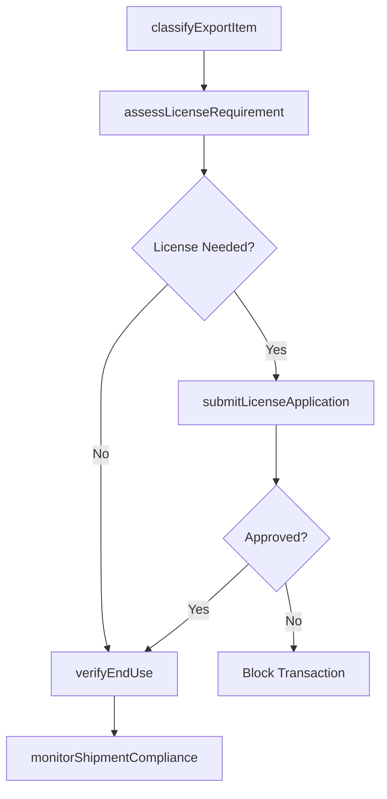

# Control exports and imports

> Business-as-Code definition for export and import controls. Models the oversight of trade flows including export license requirements, import restrictions, and end-use verification for controlled goods and technologies.

## Overview

Overseeing and directing the flow of controlled goods and technologies to and from the organization to ensure compliance with export control regulations such as the EAR and ITAR. This process involves classifying items by their Export Control Classification Number (ECCN), assessing whether government licenses or permits are required, and verifying the legitimacy of end-users and end-use statements. Effective export and import controls protect the organization from sanctions violations, penalties, and reputational risk.

## Process Hierarchy



## GraphDL

```yaml
control:
  object: Exports And Imports
  actor: ExportControlSpecialist
  result: TradeControlDecision
```

## Actions

| Action | Description |
|--------|-------------|
| classifyExportItem | Determine export control classification number (ECCN) or munitions category for goods and technology |
| assessLicenseRequirement | Evaluate whether an export license, permit, or authorization is required for the transaction |
| submitLicenseApplication | Prepare and file export or import license applications with relevant government agencies |
| verifyEndUse | Confirm the stated end-use, end-user, and destination of controlled goods are legitimate |
| monitorShipmentCompliance | Track in-transit shipments to ensure they comply with license terms and routing requirements |

## Events

| Event | Description |
|-------|-------------|
| exportItemClassified | Export control classification determined for product or technology |
| licenseRequirementAssessed | License or permit requirement evaluated for the transaction |
| licenseApplicationSubmitted | Export or import license application filed with government agency |
| endUseVerified | End-use, end-user, and destination confirmed as legitimate |
| shipmentComplianceMonitored | In-transit shipment compliance with license conditions verified |

## Searches

| Search | Description |
|--------|-------------|
| getExportClassifications | Retrieve ECCN or HTS classifications for products in the portfolio |
| getLicenseApplications | List pending and approved export/import license applications |
| getControlledShipments | Query shipments of controlled goods by status, destination, or license number |
| getEndUseVerifications | Retrieve end-use verification records by customer or transaction |

## Process Flow



## RACI Matrix

| Activity | Responsible | Accountable | Consulted | Informed |
|----------|-------------|-------------|-----------|----------|
| classifyExportItem | ExportControlSpecialist | TradeComplianceManager | ProductEngineering | Sales |
| assessLicenseRequirement | ExportControlSpecialist | TradeComplianceManager | LegalCounsel | Logistics |
| submitLicenseApplication | ExportControlSpecialist | TradeComplianceManager | GovernmentAffairs | CFO |
| verifyEndUse | TradeComplianceAnalyst | ExportControlSpecialist | SalesTeam | TradeComplianceManager |

## Related Processes

| Process | Relationship |
|---------|-------------|
| 9.11.1 Screen sanctioned party list | Upstream - party screening must clear before trade control review |
| 9.11.3 Classify products | Parallel - product classification informs export control determination |
| 9.11.5 Calculate duty | Downstream - controlled goods may have specific duty implications |

## Related Departments

| Department | Role |
|-----------|------|
| Trade Compliance | Manages export control classification and licensing |
| Legal | Advises on export control regulations (EAR, ITAR) |
| Logistics | Coordinates shipment routing per license conditions |
| Sales | Provides transaction and customer details for assessment |

## Related Occupations

| Occupation | Involvement |
|-----------|-------------|
| Export Control Specialist | Classifies items and manages license applications |
| Trade Compliance Manager | Oversees the export/import control program |
| Customs Broker | Facilitates regulatory filings for controlled goods |

## KPIs

| KPI | Description | Unit |
|-----|-------------|------|
| License Approval Rate | Percentage of license applications approved by authorities | % |
| Classification Accuracy | Percentage of export classifications confirmed correct on audit | % |
| License Processing Time | Average days from application submission to government decision | Days |
| End-Use Verification Coverage | Percentage of controlled-goods transactions with completed end-use checks | % |

## Usage

```typescript
import { controlExportsAndImports } from '@headlessly/control-exports-and-imports'

const exportControl = controlExportsAndImports()

// Classify a product for export control
const classification = await exportControl.classifyExportItem({
  productId: 'PROD-4521',
  description: 'High-frequency signal analyzer',
  destinationCountry: 'DE',
  endUser: 'Research University Munich'
})

// Submit an export license application
const license = await exportControl.submitLicenseApplication({
  eccn: classification.eccn,
  destinationCountry: 'IN',
  endUser: 'National Defence Research Lab',
  estimatedValue: 250000
})
```
