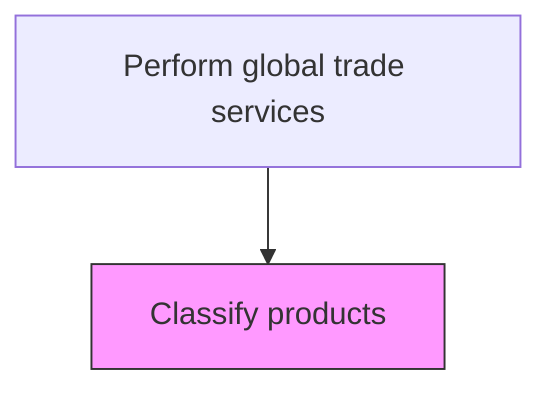
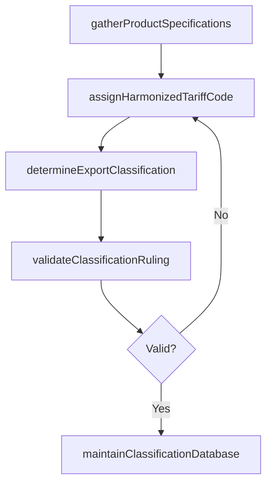

# Classify products

> Business-as-Code definition for trade product classification. Models the assignment of harmonized tariff codes, export control classification numbers, and trade commodity codes to products for customs and regulatory compliance.

## Overview

Systematically categorizing products/services for their suitability to international trade. Create classes and categories for demarcating the types of products suitable for international trade. Study requisite national and international standards and the adherence of the organization's portfolio of offerings to these.

## Process Hierarchy



## GraphDL

```yaml
classify:
  object: Products
  actor: CustomsClassifier
  result: ProductClassification
```

## Actions

| Action | Description |
|--------|-------------|
| gatherProductSpecifications | Collect technical data sheets, material composition, and functional descriptions for each product |
| assignHarmonizedTariffCode | Determine the correct Harmonized System (HS) or HTS code based on product characteristics |
| determineExportClassification | Map the product to export control classification numbers (ECCN) or Commerce Control List categories |
| validateClassificationRuling | Cross-reference the assigned codes against binding rulings and prior customs decisions |
| maintainClassificationDatabase | Update and manage the master product classification repository as products or regulations change |

## Events

| Event | Description |
|-------|-------------|
| productSpecificationsGathered | Technical data for the product has been collected for classification |
| harmonizedTariffCodeAssigned | HS or HTS tariff code assigned to the product |
| exportClassificationDetermined | ECCN or export control category assigned to the product |
| classificationRulingValidated | Classification confirmed against binding rulings or prior determinations |
| classificationDatabaseUpdated | Master classification repository updated with new or revised codes |

## Searches

| Search | Description |
|--------|-------------|
| getProductClassification | Retrieve current HS code and ECCN for a specific product |
| getClassificationsByTariffCode | List all products assigned to a given tariff code |
| getPendingClassifications | Query products awaiting initial or revised classification |
| getClassificationHistory | Retrieve classification change history for audit purposes |

## Process Flow



## RACI Matrix

| Activity | Responsible | Accountable | Consulted | Informed |
|----------|-------------|-------------|-----------|----------|
| gatherProductSpecifications | CustomsClassifier | TradeComplianceManager | ProductEngineering | Procurement |
| assignHarmonizedTariffCode | CustomsClassifier | TradeComplianceManager | CustomsBroker | Logistics |
| determineExportClassification | ExportControlSpecialist | TradeComplianceManager | LegalCounsel | Sales |
| validateClassificationRuling | TradeComplianceManager | GeneralCounsel | ExternalCustomsAdvisor | InternalAudit |

## Related Processes

| Process | Relationship |
|---------|-------------|
| 9.11.2 Control exports and imports | Downstream - classifications determine if export controls apply |
| 9.11.5 Calculate duty | Downstream - tariff codes drive duty rate calculations |
| 9.11.8 Process trade preferences | Parallel - classification determines preferential treatment eligibility |

## Related Departments

| Department | Role |
|-----------|------|
| Trade Compliance | Owns product classification and maintains the classification database |
| Product Engineering | Provides technical specifications and material composition data |
| Procurement | Supplies origin-of-goods and vendor information |
| Logistics | Uses classifications for customs documentation and filing |

## Related Occupations

| Occupation | Involvement |
|-----------|-------------|
| Customs Classifier | Assigns tariff codes and export classifications to products |
| Trade Compliance Manager | Oversees classification accuracy and regulatory alignment |
| Licensed Customs Broker | Validates classifications and advises on rulings |

## KPIs

| KPI | Description | Unit |
|-----|-------------|------|
| Classification Accuracy Rate | Percentage of products correctly classified on first assignment | % |
| Unclassified Product Backlog | Number of products awaiting initial classification | Count |
| Reclassification Frequency | Number of classification changes triggered by regulation updates per quarter | Count |
| Binding Ruling Compliance | Percentage of classifications validated against binding customs rulings | % |

## Usage

```typescript
import { classifyProducts } from '@headlessly/classify-products'

const classifier = classifyProducts()

// Assign a harmonized tariff code to a product
const classification = await classifier.assignHarmonizedTariffCode({
  productId: 'SKU-7892',
  description: 'Industrial stainless steel valve assembly',
  materialComposition: { steel: 85, rubber: 10, brass: 5 },
  countryOfOrigin: 'JP'
})

// Validate classification against prior rulings
const validation = await classifier.validateClassificationRuling({
  productId: 'SKU-7892',
  hsCode: classification.hsCode,
  referenceRulings: ['NY-N123456', 'HQ-H987654']
})
```
