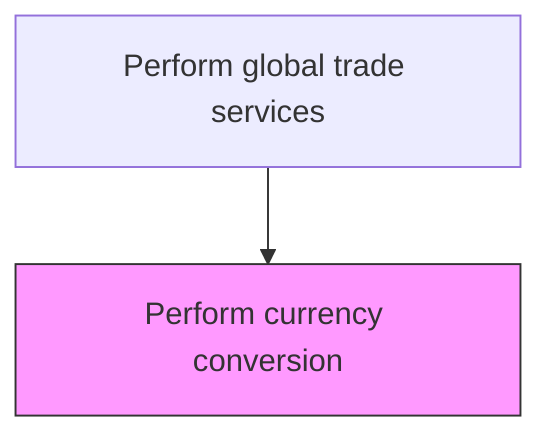
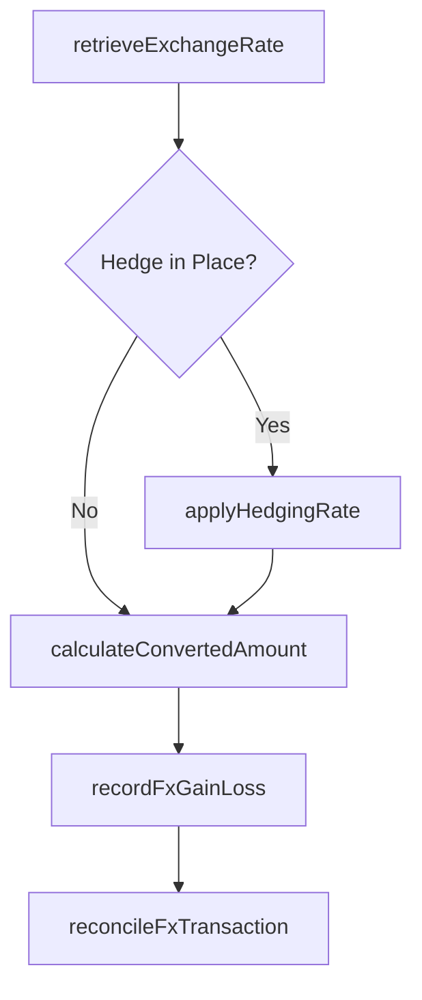

# Perform currency conversion

> Business-as-Code definition for trade currency conversion. Models the identification of applicable exchange rates and conversion of foreign currency amounts for cross-border trade settlement and reporting.

## Overview

Identifying current exchange rates between two currencies and converting the foreign currency to that of the local monetary unit. I.E., yen to US dollar.

## Process Hierarchy



## GraphDL

```yaml
perform:
  object: Currency Conversion
  actor: FxOperator
  result: ConvertedAmount
```

## Actions

| Action | Description |
|--------|-------------|
| retrieveExchangeRate | Obtain the current or contractual exchange rate from market feeds or bank quotes |
| calculateConvertedAmount | Apply the exchange rate to convert the transaction amount to the target currency |
| applyHedgingRate | Use the hedged or forward contract rate when a currency hedge is in place for the transaction |
| recordFxGainLoss | Calculate and post realized or unrealized foreign exchange gains and losses |
| reconcileFxTransaction | Match the converted amounts against bank settlement confirmations |

## Events

| Event | Description |
|-------|-------------|
| exchangeRateRetrieved | Exchange rate obtained from market feed or banking partner |
| convertedAmountCalculated | Foreign currency amount converted to the target currency |
| hedgingRateApplied | Hedged or forward contract rate applied to the transaction |
| fxGainLossRecorded | Foreign exchange gain or loss posted to the general ledger |
| fxTransactionReconciled | Converted transaction matched with bank settlement confirmation |

## Searches

| Search | Description |
|--------|-------------|
| getExchangeRates | Retrieve current and historical exchange rates by currency pair and date |
| getFxTransactions | List currency conversion transactions by period, currency pair, or entity |
| getFxGainLossReport | Query realized and unrealized FX gains and losses by period |
| getHedgedExposures | Retrieve open hedged positions by currency pair and maturity date |

## Process Flow



## RACI Matrix

| Activity | Responsible | Accountable | Consulted | Informed |
|----------|-------------|-------------|-----------|----------|
| retrieveExchangeRate | FxOperator | TreasuryManager | BankRelationshipManager | Controller |
| calculateConvertedAmount | FxOperator | TreasuryManager | AccountingTeam | SubsidiaryFinance |
| applyHedgingRate | TreasuryAnalyst | TreasuryManager | RiskManager | CFO |
| recordFxGainLoss | AccountingAnalyst | Controller | TreasuryManager | ExternalAuditors |

## Related Processes

| Process | Relationship |
|---------|-------------|
| 9.11.5 Calculate duty | Downstream - converted amounts used to calculate duties in local currency |
| 9.10.2 Manage transactions | Parallel - currency conversion integral to cross-border transactions |
| 9.7.6 Monitor and execute risk and hedging transactions | Upstream - hedging policies determine which rate applies |

## Related Departments

| Department | Role |
|-----------|------|
| Treasury | Manages FX operations, hedging, and bank relationships |
| Accounting | Records FX gains/losses and reconciles converted amounts |
| Trade Compliance | Provides transaction values requiring conversion |
| Risk Management | Sets hedging policies and monitors currency exposure |

## Related Occupations

| Occupation | Involvement |
|-----------|-------------|
| FX Operator | Executes daily currency conversions and rate lookups |
| Treasury Analyst | Manages hedging instruments and forward contracts |
| Financial Accountant | Posts FX gain/loss entries and reconciles bank statements |

## KPIs

| KPI | Description | Unit |
|-----|-------------|------|
| FX Rate Accuracy | Percentage of conversions using rates within acceptable tolerance of market | % |
| Conversion Processing Time | Average time to complete a currency conversion transaction | Minutes |
| Net FX Gain/Loss | Total realized and unrealized FX gains or losses per period | Currency |
| Hedge Effectiveness Ratio | Percentage of FX exposure effectively hedged per policy | % |

## Usage

```typescript
import { performCurrencyConversion } from '@headlessly/perform-currency-conversion'

const fx = performCurrencyConversion()

// Convert a trade invoice from EUR to USD
const conversion = await fx.calculateConvertedAmount({
  sourceCurrency: 'EUR',
  targetCurrency: 'USD',
  amount: 150000,
  rateSource: 'ECB',
  valueDate: '2025-03-15'
})

// Record FX gain/loss at period end
const fxImpact = await fx.recordFxGainLoss({
  transactionId: conversion.transactionId,
  closingRate: 1.0842,
  period: '2025-Q1'
})
```
