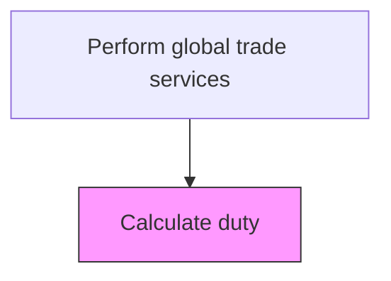
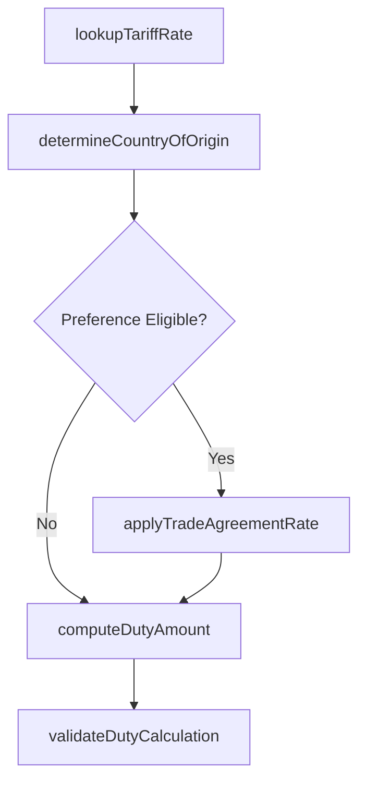

# Calculate duty

> Business-as-Code definition for customs duty calculation. Models the computation of applicable customs duties, tariffs, and excise taxes based on product classification, country of origin, and trade agreements.

## Overview

Computing the customs duties, tariffs, and excise taxes payable on imported goods based on product classification, country of origin, customs value, and applicable trade agreements. This process retrieves the correct tariff rate from the Harmonized Tariff Schedule, applies preferential rates when free trade agreement eligibility is confirmed, and validates the final duty calculation against customs authority schedules. Accurate duty computation prevents penalties from underpayments and ensures the organization captures available duty savings.

## Process Hierarchy



## GraphDL

```yaml
calculate:
  object: Duty
  actor: DutyCalculator
  result: DutyAssessment
```

## Actions

| Action | Description |
|--------|-------------|
| lookupTariffRate | Retrieve the applicable duty rate based on the product's HS code and destination country |
| determineCountryOfOrigin | Establish the country of origin using rules of origin criteria for the shipped goods |
| applyTradeAgreementRate | Apply preferential duty rates from applicable free trade agreements or GSP programs |
| computeDutyAmount | Calculate the total duty liability based on tariff rate, customs value, and quantity |
| validateDutyCalculation | Cross-check calculated duties against customs authority schedules and prior entries |

## Events

| Event | Description |
|-------|-------------|
| tariffRateRetrieved | Applicable duty rate identified from tariff schedule |
| countryOfOriginDetermined | Country of origin established for the shipped goods |
| tradeAgreementRateApplied | Preferential rate from trade agreement applied to the shipment |
| dutyAmountComputed | Total customs duty liability calculated |
| dutyCalculationValidated | Calculated duty verified against customs schedules |

## Searches

| Search | Description |
|--------|-------------|
| getTariffRates | Retrieve tariff rates by HS code, country of origin, and destination |
| getDutyCalculations | List duty calculations by shipment, period, or import entry number |
| getPreferentialRates | Query preferential duty rates available under active trade agreements |
| getDutyPaymentHistory | Retrieve duty payment records by customs broker, port, or period |

## Process Flow



## RACI Matrix

| Activity | Responsible | Accountable | Consulted | Informed |
|----------|-------------|-------------|-----------|----------|
| lookupTariffRate | DutyCalculator | TradeComplianceManager | CustomsBroker | Procurement |
| determineCountryOfOrigin | TradeComplianceAnalyst | TradeComplianceManager | SupplyChainManager | Logistics |
| computeDutyAmount | DutyCalculator | TradeComplianceManager | TaxDirector | CFO |
| validateDutyCalculation | CustomsBroker | TradeComplianceManager | ExternalCustomsAdvisor | InternalAudit |

## Related Processes

| Process | Relationship |
|---------|-------------|
| 9.11.3 Classify products | Upstream - product classification provides the HS codes for rate lookup |
| 9.11.4 Perform currency conversion | Upstream - duty amounts converted to local currency for payment |
| 9.11.8 Process trade preferences | Parallel - preference qualification determines reduced duty rates |
| 9.11.6 Communicate with customs | Downstream - calculated duties included in customs declarations |

## Related Departments

| Department | Role |
|-----------|------|
| Trade Compliance | Calculates duties and manages tariff schedules |
| Procurement | Provides landed cost inputs and vendor origin data |
| Logistics | Supplies shipment values, quantities, and routing details |
| Finance | Records duty liabilities and payments in the general ledger |

## Related Occupations

| Occupation | Involvement |
|-----------|-------------|
| Duty Calculator | Computes customs duties based on tariff codes and shipment values |
| Licensed Customs Broker | Validates duty calculations and files customs entries |
| Trade Compliance Analyst | Researches tariff rates and trade agreement eligibility |

## KPIs

| KPI | Description | Unit |
|-----|-------------|------|
| Duty Calculation Accuracy | Percentage of duty calculations confirmed correct by customs | % |
| Average Duty Rate | Weighted average duty rate across all imports | % |
| Duty Savings from Preferences | Total duty savings achieved through trade agreement preferential rates | Currency |
| Customs Penalty Incidents | Number of penalty assessments due to duty miscalculation per year | Count |

## Usage

```typescript
import { calculateDuty } from '@headlessly/calculate-duty'

const duty = calculateDuty()

// Calculate duty for an import shipment
const assessment = await duty.computeDutyAmount({
  hsCode: '8481.80.5090',
  countryOfOrigin: 'JP',
  destinationCountry: 'US',
  customsValue: 125000,
  quantity: 500,
  unitOfMeasure: 'pieces'
})

// Check for preferential rate eligibility
const preference = await duty.applyTradeAgreementRate({
  shipmentId: assessment.shipmentId,
  tradeAgreement: 'USJTA',
  certificateOfOrigin: 'COO-2025-04521'
})
```
