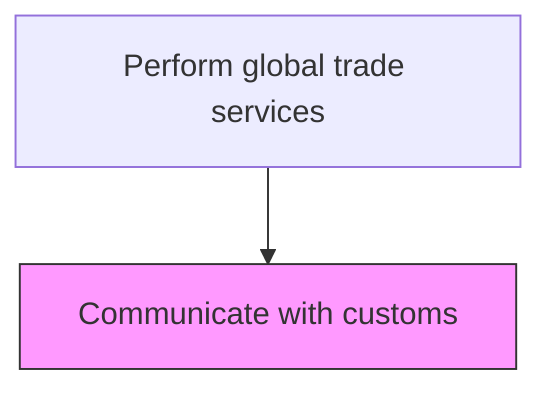
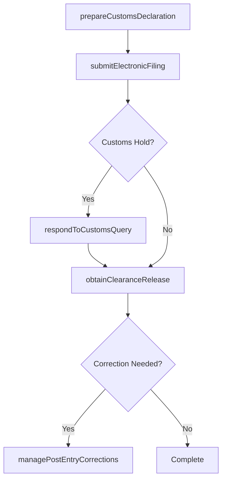

# Communicate with customs

> Business-as-Code definition for customs communication. Models the exchange of declarations, documentation, and correspondence with customs authorities for import and export clearance.

## Overview

Communicating with the customs department to ensure fluid compliance. Share pertinent information mandated by law with the government agency that controls and collects the duties levied for the international exchange of products/services.

## Process Hierarchy



## GraphDL

```yaml
communicate:
  object: With Customs
  actor: CustomsBroker
  result: CustomsClearance
```

## Actions

| Action | Description |
|--------|-------------|
| prepareCustomsDeclaration | Compile and format the import or export entry declaration with all required data fields |
| submitElectronicFiling | Transmit the customs declaration via EDI, ACE, or other government electronic filing systems |
| respondToCustomsQuery | Address information requests, holds, or examinations issued by customs authorities |
| obtainClearanceRelease | Secure release of goods from customs custody after all requirements are met |
| managePostEntryCorrections | File amendments, protests, or post-summary corrections for previously submitted entries |

## Events

| Event | Description |
|-------|-------------|
| customsDeclarationPrepared | Import or export customs declaration compiled and ready for submission |
| electronicFilingSubmitted | Declaration transmitted to customs authority via electronic filing system |
| customsQueryResponded | Response provided to customs authority information request or hold |
| clearanceReleaseObtained | Goods released from customs custody for delivery or export |
| postEntryCorrectionFiled | Amendment or protest filed for a previously submitted customs entry |

## Searches

| Search | Description |
|--------|-------------|
| getCustomsEntries | Retrieve filed customs entries by entry number, port, or date range |
| getPendingClearances | List shipments awaiting customs clearance or release |
| getCustomsCorrespondence | Query communications with customs authorities by shipment or issue type |
| getPostEntryCorrections | Retrieve post-summary corrections and protest filings by period |

## Process Flow



## RACI Matrix

| Activity | Responsible | Accountable | Consulted | Informed |
|----------|-------------|-------------|-----------|----------|
| prepareCustomsDeclaration | CustomsBroker | TradeComplianceManager | LogisticsCoordinator | Procurement |
| submitElectronicFiling | CustomsBroker | TradeComplianceManager | ITSystems | CFO |
| respondToCustomsQuery | TradeComplianceAnalyst | TradeComplianceManager | LegalCounsel | CustomsBroker |
| obtainClearanceRelease | CustomsBroker | TradeComplianceManager | WarehouseManager | SalesOperations |

## Related Processes

| Process | Relationship |
|---------|-------------|
| 9.11.5 Calculate duty | Upstream - calculated duties populate customs declarations |
| 9.11.3 Classify products | Upstream - product classifications determine tariff codes for filings |
| 9.11.7 Document trade | Parallel - trade documents accompany customs filings |

## Related Departments

| Department | Role |
|-----------|------|
| Trade Compliance | Manages customs declarations and filings |
| Logistics | Coordinates shipment timing with customs clearance |
| Legal | Advises on customs disputes and protests |
| Warehouse Operations | Holds goods pending customs release |

## Related Occupations

| Occupation | Involvement |
|-----------|-------------|
| Licensed Customs Broker | Prepares and submits customs declarations and manages clearance |
| Trade Compliance Analyst | Responds to customs queries and manages post-entry corrections |
| Import Coordinator | Tracks shipments through the customs clearance process |

## KPIs

| KPI | Description | Unit |
|-----|-------------|------|
| Customs Clearance Time | Average hours from filing to release of goods | Hours |
| First-Pass Clearance Rate | Percentage of entries cleared without customs holds or queries | % |
| Post-Entry Correction Rate | Percentage of entries requiring post-summary corrections | % |
| Electronic Filing Success Rate | Percentage of filings accepted by the system on first submission | % |

## Usage

```typescript
import { communicateWithCustoms } from '@headlessly/communicate-with-customs'

const customs = communicateWithCustoms()

// Prepare and submit a customs declaration
const declaration = await customs.prepareCustomsDeclaration({
  entryType: 'import',
  port: 'USLAX',
  shipmentId: 'SHIP-2025-08321',
  hsCode: '8481.80.5090',
  customsValue: 125000,
  countryOfOrigin: 'JP'
})

// Submit electronically via ACE
const filing = await customs.submitElectronicFiling({
  declarationId: declaration.id,
  filingSystem: 'ACE',
  brokerLicense: 'CHB-12345'
})
```
