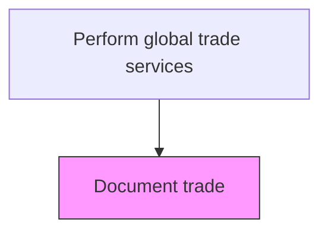
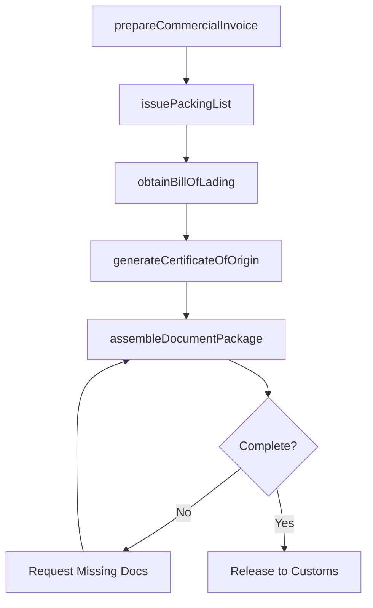

# Document trade

> Business-as-Code definition for trade documentation. Models the creation and management of commercial invoices, packing lists, bills of lading, certificates of origin, and other trade documents required for international shipments.

## Overview

Documenting and recording the trade processes while making transactions, noting the description, quality, number, transportation medium, indemnity, and inspection.

## Process Hierarchy



## GraphDL

```yaml
document:
  object: Trade
  actor: TradeDocumentSpecialist
  result: TradeDocumentPackage
```

## Actions

| Action | Description |
|--------|-------------|
| prepareCommercialInvoice | Generate the commercial invoice with buyer, seller, goods description, value, and Incoterms |
| issuePackingList | Create the detailed packing list with weights, dimensions, and packaging specifications |
| obtainBillOfLading | Secure the bill of lading or air waybill from the carrier for the shipment |
| generateCertificateOfOrigin | Produce the certificate of origin documenting where the goods were manufactured |
| assembleDocumentPackage | Compile all required trade documents into a complete shipment package for customs and the buyer |

## Events

| Event | Description |
|-------|-------------|
| commercialInvoicePrepared | Commercial invoice generated with all required transaction details |
| packingListIssued | Detailed packing list created for the shipment |
| billOfLadingObtained | Bill of lading or air waybill secured from the carrier |
| certificateOfOriginGenerated | Certificate of origin produced and certified |
| documentPackageAssembled | Complete trade document package compiled for the shipment |

## Searches

| Search | Description |
|--------|-------------|
| getTradeDocuments | Retrieve trade documents by shipment ID, document type, or date range |
| getDocumentPackage | Query the full document package for a specific shipment |
| getPendingDocuments | List shipments with incomplete documentation |
| getDocumentTemplates | Retrieve templates for different document types and destination countries |

## Process Flow



## RACI Matrix

| Activity | Responsible | Accountable | Consulted | Informed |
|----------|-------------|-------------|-----------|----------|
| prepareCommercialInvoice | TradeDocumentSpecialist | TradeComplianceManager | SalesOperations | AccountsReceivable |
| obtainBillOfLading | LogisticsCoordinator | LogisticsManager | FreightForwarder | TradeDocumentSpecialist |
| generateCertificateOfOrigin | TradeDocumentSpecialist | TradeComplianceManager | CustomsBroker | SupplyChainManager |
| assembleDocumentPackage | TradeDocumentSpecialist | TradeComplianceManager | LegalCounsel | BuyerRepresentative |

## Related Processes

| Process | Relationship |
|---------|-------------|
| 9.11.6 Communicate with customs | Downstream - trade documents accompany customs declarations |
| 9.11.3 Classify products | Upstream - product classifications populate trade documents |
| 9.11.10 Prepare letter of credit | Parallel - document package must conform to letter of credit terms |

## Related Departments

| Department | Role |
|-----------|------|
| Trade Compliance | Oversees document accuracy and regulatory requirements |
| Logistics | Provides carrier documents and shipment details |
| Sales | Supplies order details and buyer information |
| Finance | Ensures document values align with invoicing and payment terms |

## Related Occupations

| Occupation | Involvement |
|-----------|-------------|
| Trade Document Specialist | Prepares and assembles all trade documents |
| Freight Forwarder | Provides transport documents and carrier coordination |
| Customs Broker | Reviews document compliance before customs submission |

## KPIs

| KPI | Description | Unit |
|-----|-------------|------|
| Document Completeness Rate | Percentage of shipments with all required documents assembled on time | % |
| Document Error Rate | Percentage of trade documents requiring correction after initial preparation | % |
| Document Processing Time | Average hours to assemble a complete trade document package | Hours |
| Letter of Credit Discrepancy Rate | Percentage of document packages with discrepancies against LC terms | % |

## Usage

```typescript
import { documentTrade } from '@headlessly/document-trade'

const tradeDocs = documentTrade()

// Prepare a commercial invoice for an export shipment
const invoice = await tradeDocs.prepareCommercialInvoice({
  shipmentId: 'SHIP-2025-08321',
  buyer: 'Hamburg Industrial GmbH',
  seller: 'US Manufacturing Corp',
  incoterms: 'CIF Hamburg',
  lineItems: [
    { description: 'Steel valve assemblies', quantity: 500, unitPrice: 250, hsCode: '8481.80.5090' }
  ]
})

// Assemble the full document package
const pkg = await tradeDocs.assembleDocumentPackage({
  shipmentId: 'SHIP-2025-08321',
  documents: [invoice.id, 'PL-2025-08321', 'BL-2025-08321', 'COO-2025-08321']
})
```
