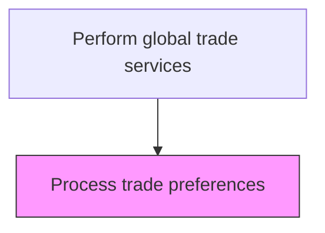
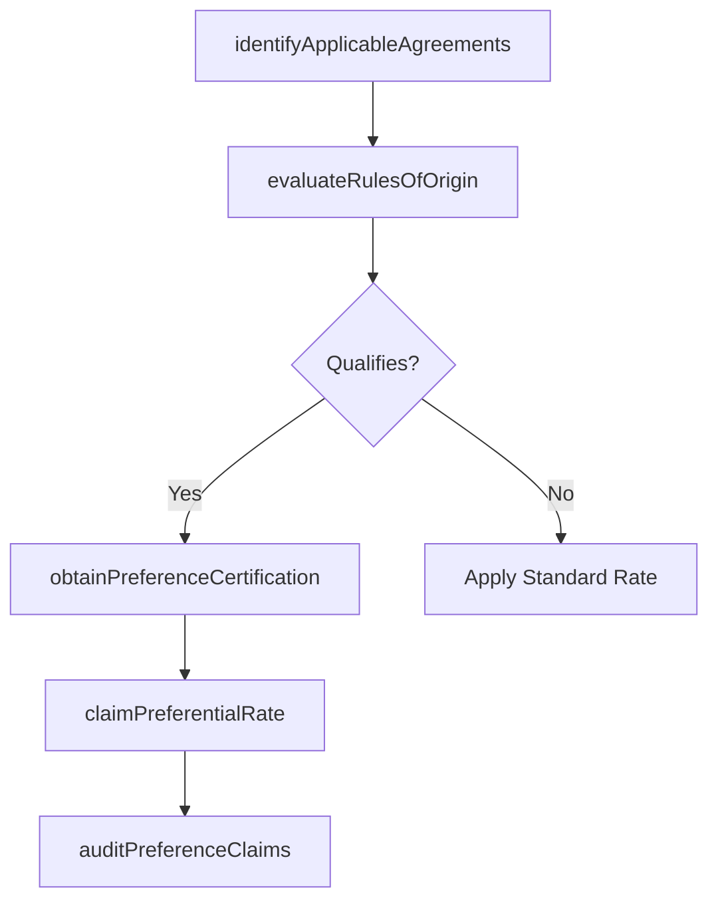

# Process trade preferences

> Business-as-Code definition for trade preference processing. Models the identification and application of preferential duty rates under free trade agreements, GSP programs, and bilateral trade arrangements.

## Overview

Preparing global trade under preference, which allows the organization to import/export products at a lower or nil rate of customs duty and/or levy charge.

## Process Hierarchy



## GraphDL

```yaml
process:
  object: Trade Preferences
  actor: TradePreferenceAnalyst
  result: PreferenceQualification
```

## Actions

| Action | Description |
|--------|-------------|
| identifyApplicableAgreements | Determine which free trade agreements or preference programs apply to the transaction |
| evaluateRulesOfOrigin | Assess whether the goods meet the specific rules of origin required by the trade agreement |
| obtainPreferenceCertification | Secure the supplier certificate, declaration of origin, or other qualifying documentation |
| claimPreferentialRate | Apply the reduced or zero duty rate on the customs entry based on trade agreement eligibility |
| auditPreferenceClaims | Periodically review and verify the accuracy of prior preference claims for compliance |

## Events

| Event | Description |
|-------|-------------|
| applicableAgreementsIdentified | Trade agreements and preference programs applicable to the transaction determined |
| rulesOfOriginEvaluated | Goods assessed against the rules of origin requirements |
| preferenceCertificationObtained | Supplier certificate or declaration of origin secured |
| preferentialRateClaimed | Reduced or zero duty rate applied on the customs entry |
| preferenceClaimsAudited | Prior preference claims reviewed and verified for accuracy |

## Searches

| Search | Description |
|--------|-------------|
| getTradeAgreements | Retrieve applicable trade agreements by country pair and product category |
| getPreferenceClaims | List trade preference claims by agreement, period, or entry number |
| getOriginCertificates | Query supplier certificates and declarations of origin by vendor or product |
| getPreferenceSavings | Calculate total duty savings achieved through trade preference programs |

## Process Flow



## RACI Matrix

| Activity | Responsible | Accountable | Consulted | Informed |
|----------|-------------|-------------|-----------|----------|
| identifyApplicableAgreements | TradePreferenceAnalyst | TradeComplianceManager | CustomsBroker | Procurement |
| evaluateRulesOfOrigin | TradePreferenceAnalyst | TradeComplianceManager | SupplyChainManager | LegalCounsel |
| obtainPreferenceCertification | Procurement | TradePreferenceAnalyst | SupplierQuality | TradeComplianceManager |
| claimPreferentialRate | CustomsBroker | TradeComplianceManager | TradePreferenceAnalyst | CFO |

## Related Processes

| Process | Relationship |
|---------|-------------|
| 9.11.3 Classify products | Upstream - product classification determines preference eligibility |
| 9.11.5 Calculate duty | Downstream - preferential rates modify duty calculations |
| 9.11.7 Document trade | Parallel - preference certificates are part of trade documentation |

## Related Departments

| Department | Role |
|-----------|------|
| Trade Compliance | Evaluates preference eligibility and manages compliance |
| Procurement | Obtains supplier origin certifications and manages vendor compliance |
| Supply Chain | Provides manufacturing and sourcing data for rules of origin analysis |
| Finance | Tracks duty savings from preference programs |

## Related Occupations

| Occupation | Involvement |
|-----------|-------------|
| Trade Preference Analyst | Evaluates rules of origin and manages preference program compliance |
| Customs Broker | Claims preferential rates on customs entries |
| Supply Chain Analyst | Provides bill of materials and sourcing data for origin determination |

## KPIs

| KPI | Description | Unit |
|-----|-------------|------|
| Preference Utilization Rate | Percentage of eligible shipments where preferential rates were claimed | % |
| Duty Savings from Preferences | Total customs duty savings from trade preference programs per period | Currency |
| Certification Compliance Rate | Percentage of preference claims supported by valid origin certificates | % |
| Post-Audit Adjustment Rate | Percentage of audited preference claims requiring correction | % |

## Usage

```typescript
import { processTradePreferences } from '@headlessly/process-trade-preferences'

const preferences = processTradePreferences()

// Evaluate rules of origin for a USMCA claim
const evaluation = await preferences.evaluateRulesOfOrigin({
  productId: 'SKU-7892',
  hsCode: '8481.80',
  tradeAgreement: 'USMCA',
  supplierCountry: 'MX',
  regionalValueContent: 62.5
})

// Claim preferential rate on a customs entry
const claim = await preferences.claimPreferentialRate({
  entryNumber: 'ENT-2025-55432',
  tradeAgreement: 'USMCA',
  certificateId: evaluation.certificateId,
  standardRate: 3.2,
  preferentialRate: 0
})
```
