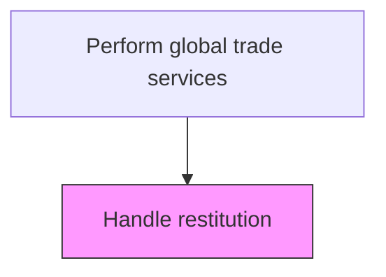
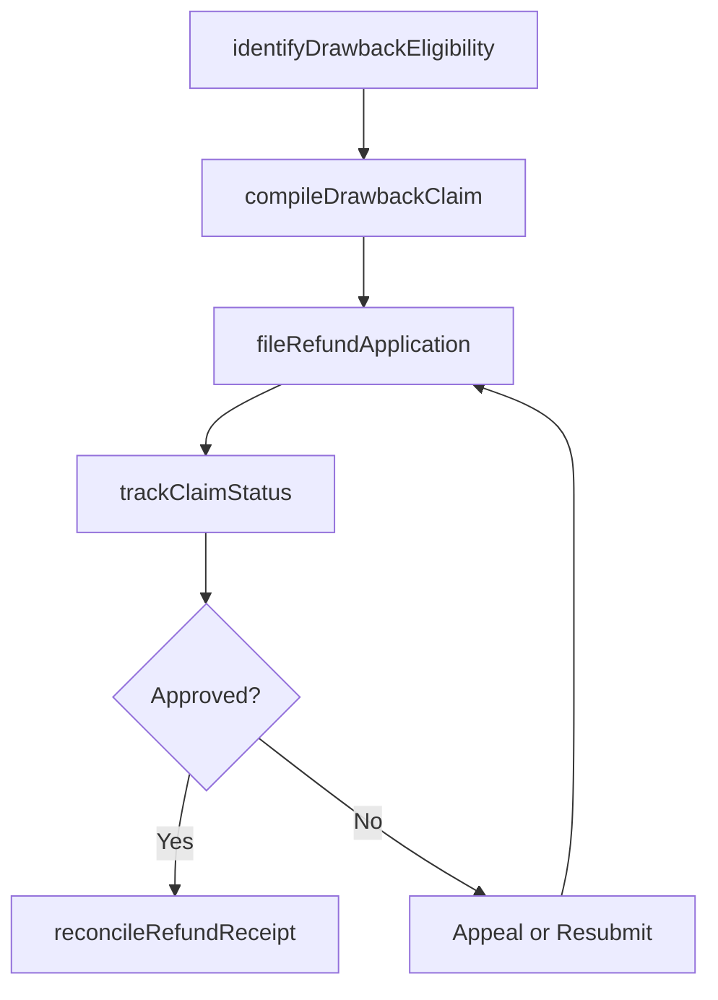

# Handle restitution

> Business-as-Code definition for trade restitution handling. Models the management of duty drawback claims, refund applications, and restitution processes for overpaid customs duties and taxes.

## Overview

Administering and overseeing all restitution activities the organization may be subjected to. Manage compliance with apposite legal frameworks. Make any restitution that may be required by law; comply with authorities over any fines or non-financial measures imposed.

## Process Hierarchy



## GraphDL

```yaml
handle:
  object: Restitution
  actor: DutyDrawbackSpecialist
  result: RestitutionClaim
```

## Actions

| Action | Description |
|--------|-------------|
| identifyDrawbackEligibility | Analyze import and re-export records to determine duty drawback eligibility |
| compileDrawbackClaim | Assemble supporting documentation including import entries, export evidence, and commercial invoices |
| fileRefundApplication | Submit the duty drawback or refund claim to the applicable customs authority |
| trackClaimStatus | Monitor the status of pending drawback and refund claims through resolution |
| reconcileRefundReceipt | Match received refunds against filed claims and post adjustments to the general ledger |

## Events

| Event | Description |
|-------|-------------|
| drawbackEligibilityIdentified | Import and re-export records analyzed to confirm duty drawback eligibility |
| drawbackClaimCompiled | Supporting documentation assembled for the drawback claim |
| refundApplicationFiled | Duty drawback or refund claim submitted to customs authority |
| claimStatusUpdated | Pending drawback or refund claim status updated |
| refundReceiptReconciled | Received refund matched against filed claim and posted to ledger |

## Searches

| Search | Description |
|--------|-------------|
| getDrawbackEligibleEntries | Retrieve import entries eligible for duty drawback based on re-export records |
| getPendingClaims | List duty drawback and refund claims awaiting customs authority decision |
| getRefundHistory | Query refund receipts by period, claim number, or customs authority |
| getDrawbackSavings | Calculate total duty savings recovered through drawback claims per period |

## Process Flow



## RACI Matrix

| Activity | Responsible | Accountable | Consulted | Informed |
|----------|-------------|-------------|-----------|----------|
| identifyDrawbackEligibility | DutyDrawbackSpecialist | TradeComplianceManager | AccountingAnalyst | CFO |
| compileDrawbackClaim | DutyDrawbackSpecialist | TradeComplianceManager | CustomsBroker | InternalAudit |
| fileRefundApplication | CustomsBroker | TradeComplianceManager | LegalCounsel | TreasuryManager |
| reconcileRefundReceipt | AccountingAnalyst | Controller | DutyDrawbackSpecialist | TaxDirector |

## Related Processes

| Process | Relationship |
|---------|-------------|
| 9.11.5 Calculate duty | Upstream - original duty calculations determine drawback amounts |
| 9.11.6 Communicate with customs | Parallel - drawback claims require customs authority communication |
| 9.11.7 Document trade | Upstream - trade documentation supports drawback claim evidence |

## Related Departments

| Department | Role |
|-----------|------|
| Trade Compliance | Manages drawback eligibility analysis and claim preparation |
| Accounting | Reconciles refund receipts and posts ledger adjustments |
| Legal | Advises on appeal rights and customs dispute resolution |
| Treasury | Receives and allocates refund payments |

## Related Occupations

| Occupation | Involvement |
|-----------|-------------|
| Duty Drawback Specialist | Identifies eligible entries and compiles drawback claims |
| Customs Broker | Files refund applications with customs authorities |
| Financial Accountant | Reconciles received refunds against outstanding claims |

## KPIs

| KPI | Description | Unit |
|-----|-------------|------|
| Drawback Recovery Rate | Percentage of eligible duties successfully recovered through drawback claims | % |
| Average Claim Processing Time | Mean days from claim submission to refund receipt | Days |
| Claim Approval Rate | Percentage of drawback claims approved by customs authorities | % |
| Total Duties Recovered | Total value of customs duty refunds received per period | Currency |

## Usage

```typescript
import { handleRestitution } from '@headlessly/handle-restitution'

const restitution = handleRestitution()

// Identify drawback-eligible import entries
const eligible = await restitution.identifyDrawbackEligibility({
  importDateRange: { from: '2024-01-01', to: '2024-12-31' },
  reExportEvidence: true,
  minimumDutyPaid: 5000
})

// File a drawback claim
const claim = await restitution.fileRefundApplication({
  importEntries: eligible.entries.map(e => e.entryNumber),
  exportDocuments: ['EXP-2025-1001', 'EXP-2025-1002'],
  claimAmount: eligible.totalDrawbackAmount,
  customsAuthority: 'US-CBP'
})
```
