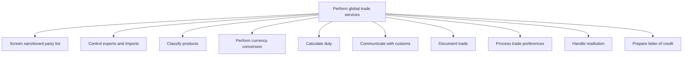
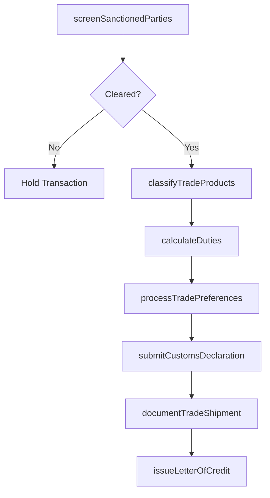

# Perform global trade services

> Business-as-Code definition for global trade services execution. Models the compliance, documentation, and financial processes required for international trade including sanctions screening, customs communication, duty calculation, and trade financing.

## Overview

Making and collecting payments for transactions in products/services, and transporting them to interested markets.

## Process Hierarchy



## GraphDL

```yaml
perform:
  object: Global Trade Services
  actor: TradeComplianceManager
  result: TradeTransaction
```

## Actions

| Action | Description |
|--------|-------------|
| screenSanctionedParties | Verify trading partners against sanctioned party lists and denied entities |
| classifyTradeProducts | Assign harmonized tariff codes and export classification numbers to products |
| calculateDuties | Compute applicable customs duties, tariffs, and excise taxes |
| submitCustomsDeclaration | File import/export declarations with customs authorities |
| issueLetterOfCredit | Prepare and issue trade finance instruments for international transactions |
| documentTradeShipment | Record trade documentation including commercial invoices and bills of lading |
| processTradePreferences | Apply preferential duty rates under applicable trade agreements |

## Events

| Event | Description |
|-------|-------------|
| sanctionedPartiesScreened | Trading partner screening completed with pass or hold result |
| tradeProductsClassified | Products assigned tariff and export control classifications |
| dutiesCalculated | Customs duties and tariffs computed for the shipment |
| customsDeclarationSubmitted | Import/export declaration filed with customs authority |
| letterOfCreditIssued | Trade finance instrument issued and transmitted to beneficiary |
| tradeShipmentDocumented | Complete trade documentation package assembled and recorded |
| tradePreferencesProcessed | Preferential duty treatment applied under trade agreement |

## Searches

| Search | Description |
|--------|-------------|
| getSanctionedPartyStatus | Check a party against current sanctions and denied-party databases |
| getTariffClassification | Retrieve harmonized code and duty rate for a given product |
| getTradeDocuments | List trade documents by shipment, country of origin, or date range |
| getLettersOfCredit | Query outstanding letters of credit by status and beneficiary |
| getCustomsFilings | Retrieve customs declaration history by port of entry and period |

## Process Flow



## RACI Matrix

| Activity | Responsible | Accountable | Consulted | Informed |
|----------|-------------|-------------|-----------|----------|
| screenSanctionedParties | TradeComplianceAnalyst | TradeComplianceManager | LegalCounsel | CFO |
| classifyTradeProducts | CustomsBroker | TradeComplianceManager | ProductManager | Logistics |
| calculateDuties | CustomsBroker | TradeComplianceManager | TaxDirector | Finance |
| submitCustomsDeclaration | CustomsBroker | TradeComplianceManager | FreightForwarder | Procurement |
| issueLetterOfCredit | TradeFin Analyst | Treasurer | BankRelationshipManager | SupplyChain |

## Sub-Processes

| ID | Name | Description |
|----|------|-------------|
| 9.11.1 | Screen sanctioned party list | Evaluating the approved list of parties for engaging in international trade in order to ensure the s |
| 9.11.2 | Control exports and imports | Overseeing and directing the flow of trade to/from the organization in order to ensure financial gai |
| 9.11.3 | Classify products | Systematically categorizing products/services for their suitability to international trade. Create c |
| 9.11.4 | Perform currency conversion | Identifying current exchange rates between two currencies and converting the foreign currency to tha |
| 9.11.5 | Calculate duty | Computing the excise duty to be paid during international trade. |
| 9.11.6 | Communicate with customs | Communicating with the customs department to ensure fluid compliance. Share pertinent information ma |
| 9.11.7 | Document trade | Documenting and recording the trade processes while making transactions, noting the description, qua |
| 9.11.8 | Process trade preferences | Preparing global trade under preference, which allows the organization to import/export products at  |
| 9.11.9 | Handle restitution | Administering and overseeing all restitution activities the organization may be subjected to. Manage |
| 9.11.10 | Prepare letter of credit | Creating a document assuring that a seller will receive payment when certain delivery conditions are |

## Related Processes

| Process | Relationship |
|---------|-------------|
| 9.10 Manage international funds/consolidation | Parallel - trade generates cross-border fund flows |
| 9.9 Manage taxes | Parallel - duties and tariffs affect tax obligations |
| 9.6 Process accounts payable and expense reimbursements | Downstream - duty payments processed through AP |
| 7.4 Manage logistics and warehousing | Upstream - logistics drives customs filing requirements |

## Related Departments

| Department | Role |
|-----------|------|
| Trade Compliance | Primary owner of sanctions screening and export controls |
| Customs Brokerage | Manages product classification and customs filings |
| Treasury | Provides trade finance instruments and currency conversion |
| Legal | Advises on trade regulations and sanctions law |
| Supply Chain | Coordinates logistics and shipment documentation |

## Related Occupations

| Occupation | Involvement |
|-----------|-------------|
| Trade Compliance Manager | Oversees sanctions screening and regulatory adherence |
| Licensed Customs Broker | Classifies products and files customs declarations |
| Trade Finance Analyst | Structures letters of credit and trade financing |
| Export Control Specialist | Manages export licensing and restricted technology controls |

## KPIs

| KPI | Description | Unit |
|-----|-------------|------|
| Sanctions Screening Hit Rate | False positive rate on denied-party screenings | % |
| Customs Filing Accuracy | Percentage of customs declarations filed without errors | % |
| Duty Savings from Preferences | Cost avoided through trade preference programs | Currency |
| Trade Document Cycle Time | Average time to assemble complete trade documentation | Hours |
| Letter of Credit Utilization | Percentage of trade volume covered by letters of credit | % |

## Usage

```typescript
import { performGlobalTradeServices } from '@headlessly/perform-global-trade-services'

const trade = performGlobalTradeServices()

// Screen a trading partner against sanctioned party lists
const screening = await trade.screenSanctionedParties({
  partyName: 'Acme International GmbH',
  country: 'DE',
  lists: ['OFAC-SDN', 'EU-Sanctions', 'UN-Consolidated']
})

// Calculate duties for a shipment
const duties = await trade.calculateDuties({
  hsCode: '8471.30.0100',
  countryOfOrigin: 'CN',
  destinationCountry: 'US',
  declaredValue: 250000,
  currency: 'USD'
})
```
