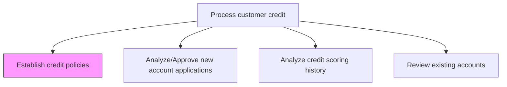
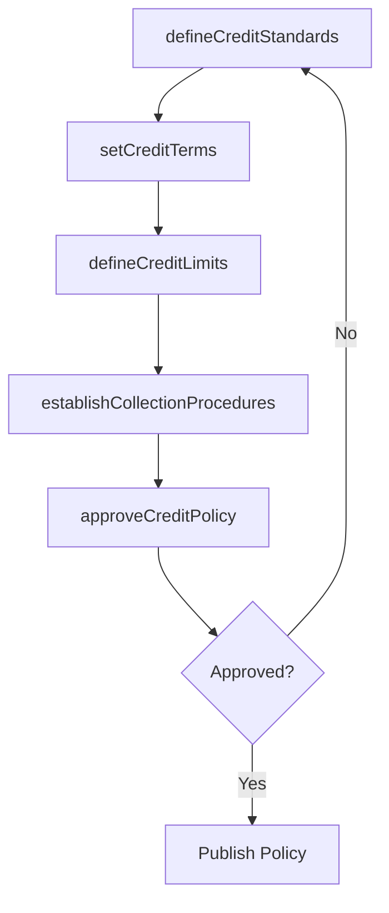

# Establish credit policies

> Business-as-Code definition for credit policy establishment. Models the creation, approval, and maintenance of credit standards, payment terms, credit limits, and collection procedures that govern customer credit extensions.

## Overview

Establishing credit policies creates the foundational framework that governs how an organization extends credit to customers, directly influencing revenue growth and bad debt exposure. This process involves setting credit standards, defining payment terms and discount schedules, establishing tiered credit limits by risk classification, and documenting collection escalation procedures. Well-calibrated credit policies balance the need to drive sales with the imperative to minimize write-offs and protect cash flow. The resulting policy framework ensures consistency across all credit decisions and provides clear criteria for downstream processes such as account approvals, reviews, and suspensions.

## Process Hierarchy



## GraphDL

```yaml
establish:
  object: Credit Policies
  actor: CreditManager
  result: CreditPolicyDocument
```

## Actions

| Action | Description |
|--------|-------------|
| defineCreditStandards | Set minimum creditworthiness criteria for extending credit |
| setCreditTerms | Establish payment terms, discount schedules, and grace periods |
| defineCreditLimits | Create tiered credit limit structures based on risk classification |
| establishCollectionProcedures | Document escalation steps for past-due accounts |
| approveCreditPolicy | Obtain management sign-off on credit policy changes |

## Events

| Event | Description |
|-------|-------------|
| creditStandardsDefined | Minimum creditworthiness criteria established |
| creditTermsSet | Payment terms and discount schedules published |
| creditLimitsDefined | Tiered credit limit structure approved |
| collectionProceduresEstablished | Collection escalation procedures documented |
| creditPolicyApproved | Updated credit policy signed off by management |

## Searches

| Search | Description |
|--------|-------------|
| getCurrentCreditPolicy | Retrieve the active credit policy document and terms |
| getCreditPolicyHistory | Query prior versions and changes to credit policies |
| getCreditTermsByTier | List payment terms and limits by customer risk tier |

## Process Flow



## RACI Matrix

| Activity | Responsible | Accountable | Consulted | Informed |
|----------|-------------|-------------|-----------|----------|
| defineCreditStandards | Credit Manager | Controller | Sales Director | CFO |
| setCreditTerms | Credit Manager | Controller | Treasury | Sales |
| defineCreditLimits | Credit Manager | Controller | Risk Management | Sales Director |
| establishCollectionProcedures | Credit Manager | Controller | Collections Manager | AR Manager |
| approveCreditPolicy | Credit Manager | CFO | Legal | AR Manager |

## Related Processes

| Process | Relationship |
|---------|-------------|
| 9.2.1.2 Analyze/Approve new account applications | Downstream - credit policies govern account approval criteria |
| 9.2.1.4 Forecast credit scoring requirement | Downstream - policies inform scoring threshold planning |
| 9.2.1.7 Reinstate or suspend accounts based on credit policies | Downstream - policies define suspension and reinstatement rules |
| 9.2.4 Manage and process collections | Downstream - collection procedures are defined here |

## Related Departments

| Department | Role |
|-----------|------|
| Credit | Develops and maintains credit policy framework |
| Sales | Provides input on market-competitive credit terms |
| Legal | Reviews policy for regulatory compliance |
| Treasury | Advises on cash flow impact of credit terms |

## Related Occupations

| Occupation | Involvement |
|-----------|-------------|
| Credit Manager | Authors and maintains credit policies |
| Credit Analyst | Provides data analysis to support policy decisions |
| Controller | Approves credit policy changes |

## KPIs

| KPI | Description | Unit |
|-----|-------------|------|
| Policy Review Frequency | How often credit policies are formally reviewed | Per Year |
| Bad Debt Rate | Write-offs as a percentage of total credit sales | % |
| Credit Terms Competitiveness | Comparison of payment terms against industry benchmarks | Days |
| Credit Limit Utilization | Average customer balance as a percentage of assigned credit limit | % |

## Usage

```typescript
import { establishCreditPolicies } from '@headlessly/establish-credit-policies'

const creditPolicy = establishCreditPolicies()

// Get current credit policy
const policy = await creditPolicy.getCurrentCreditPolicy({
  effectiveDate: '2025-12-01'
})

// Define credit limits by tier
const limits = await creditPolicy.defineCreditLimits({
  tiers: [
    { risk: 'low', limit: 500000 },
    { risk: 'medium', limit: 200000 },
    { risk: 'high', limit: 50000 }
  ]
})
```
