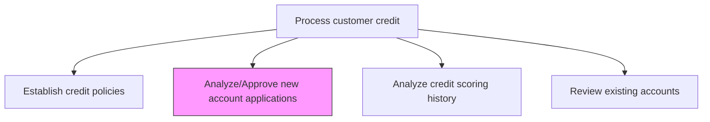
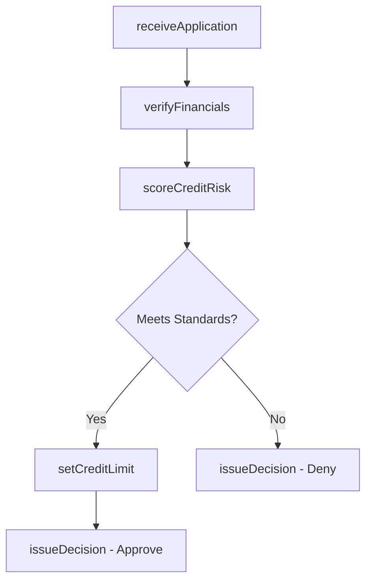

# Analyze/Approve new account applications

> Business-as-Code definition for new account application analysis and approval. Models the evaluation of credit applications including financial review, credit scoring, risk assessment, and approval or denial decisions.

## Overview

Analyzing and approving new account applications is a critical revenue-enabling process that determines which prospective customers receive credit terms, directly affecting sales growth and credit risk exposure. The process involves validating applicant financial statements, calculating credit risk scores using internal models and external bureau data, and issuing approval, denial, or conditional decisions based on established credit policies. Timely and accurate application processing strengthens customer relationships while protecting the organization from excessive default risk. Each approved account generates a credit limit assignment that governs downstream invoicing and receivable management.

## Process Hierarchy



## GraphDL

```yaml
analyze/approve:
  object: New Account Applications
  actor: CreditAnalyst
  result: CreditApprovalDecision
```

## Actions

| Action | Description |
|--------|-------------|
| receiveApplication | Accept and validate a new customer credit application |
| verifyFinancials | Review applicant financial statements and trade references |
| scoreCreditRisk | Calculate credit risk score using scoring models and external data |
| setCreditLimit | Determine appropriate credit limit based on risk assessment |
| issueDecision | Approve, deny, or conditionally approve the credit application |

## Events

| Event | Description |
|-------|-------------|
| applicationReceived | New credit application submitted and validated |
| financialsVerified | Applicant financial information reviewed and confirmed |
| creditRiskScored | Credit risk score calculated for the applicant |
| creditLimitSet | Credit limit determined for the approved account |
| decisionIssued | Credit application decision communicated to applicant |

## Searches

| Search | Description |
|--------|-------------|
| getPendingApplications | Retrieve credit applications awaiting review |
| getApplicationStatus | Query the status of a specific credit application |
| getApprovalHistory | List credit approval decisions by period or analyst |

## Process Flow



## RACI Matrix

| Activity | Responsible | Accountable | Consulted | Informed |
|----------|-------------|-------------|-----------|----------|
| receiveApplication | Credit Analyst | Credit Manager | Sales Rep | Billing |
| verifyFinancials | Credit Analyst | Credit Manager | Sales Rep | AR Manager |
| scoreCreditRisk | Credit Analyst | Credit Manager | Risk Management | Controller |
| setCreditLimit | Credit Manager | Controller | Risk Management | Sales Director |
| issueDecision | Credit Manager | Controller | Sales Director | Customer |

## Related Processes

| Process | Relationship |
|---------|-------------|
| 9.2.1.1 Establish credit policies | Upstream - policies define approval criteria |
| 9.2.1.3 Analyze credit scoring history | Parallel - scoring history informs application review |
| 9.2.2.1 Maintain customer/product master files | Downstream - approved accounts trigger master record creation |
| 9.2.2 Invoice customer | Downstream - approved accounts enable invoicing |

## Related Departments

| Department | Role |
|-----------|------|
| Credit | Reviews applications and issues credit decisions |
| Sales | Submits applications and provides customer context |
| Risk Management | Provides credit scoring models and risk parameters |
| Finance | Monitors credit exposure from new approvals |

## Related Occupations

| Occupation | Involvement |
|-----------|-------------|
| Credit Analyst | Evaluates applications and calculates risk scores |
| Credit Manager | Approves or denies credit applications |
| Sales Representative | Initiates customer credit applications |

## KPIs

| KPI | Description | Unit |
|-----|-------------|------|
| Application Processing Time | Average days from application receipt to decision | Days |
| Approval Rate | Percentage of applications approved | % |
| First-Year Default Rate | Percentage of approved accounts that default within 12 months | % |
| Average Assigned Credit Limit | Mean credit limit assigned to newly approved accounts | USD |

## Usage

```typescript
import { analyzeApproveNewAccountApplications } from '@headlessly/analyze-approve-new-account-applications'

const applications = analyzeApproveNewAccountApplications()

// Score credit risk for an applicant
const score = await applications.scoreCreditRisk({
  applicantId: 'APP-2025-1042',
  includeExternalData: true
})

// Get pending applications
const pending = await applications.getPendingApplications({
  assignee: 'credit-team',
  olderThanDays: 3
})
```
