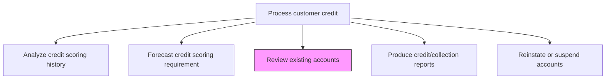
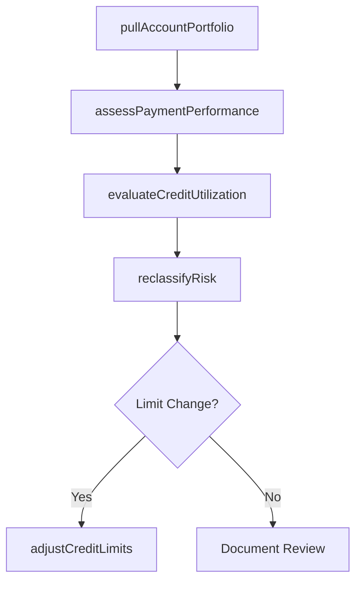

# Review existing accounts

> Business-as-Code definition for existing account review. Models the periodic assessment of customer credit accounts including payment behavior analysis, limit adequacy evaluation, and risk reclassification.

## Overview

Reviewing existing accounts is an ongoing credit risk management process that ensures customer credit limits and risk classifications remain aligned with actual payment behavior and financial condition. This process involves extracting the account portfolio for periodic review, assessing payment timeliness, evaluating credit utilization ratios, and reclassifying risk tiers as needed. Proactive account reviews help prevent unexpected defaults by identifying deteriorating accounts before they become delinquent, and they also enable credit line increases for high-performing customers to support revenue growth. The review cycle typically runs quarterly or annually depending on account risk tier and outstanding balance.

## Process Hierarchy



## GraphDL

```yaml
review:
  object: Existing Accounts
  actor: CreditAnalyst
  result: AccountReviewReport
```

## Actions

| Action | Description |
|--------|-------------|
| pullAccountPortfolio | Extract existing accounts due for periodic credit review |
| assessPaymentPerformance | Evaluate payment timeliness and delinquency patterns |
| evaluateCreditUtilization | Compare outstanding balances against assigned credit limits |
| reclassifyRisk | Update risk tier based on current payment behavior and financial condition |
| adjustCreditLimits | Increase or decrease credit limits based on review findings |

## Events

| Event | Description |
|-------|-------------|
| accountPortfolioPulled | Accounts due for review extracted from the portfolio |
| paymentPerformanceAssessed | Customer payment behavior evaluated |
| creditUtilizationEvaluated | Balance-to-limit ratios analyzed |
| riskReclassified | Customer risk tier updated based on review findings |
| creditLimitsAdjusted | Credit limits modified per review recommendations |

## Searches

| Search | Description |
|--------|-------------|
| getAccountsForReview | Retrieve accounts due for periodic credit review |
| getAccountRiskProfile | Query current risk classification and credit metrics for an account |
| getOverlimitAccounts | List accounts exceeding their assigned credit limits |

## Process Flow



## RACI Matrix

| Activity | Responsible | Accountable | Consulted | Informed |
|----------|-------------|-------------|-----------|----------|
| pullAccountPortfolio | Credit Analyst | Credit Manager | IT | AR Specialist |
| assessPaymentPerformance | Credit Analyst | Credit Manager | AR Specialist | Sales Rep |
| evaluateCreditUtilization | Credit Analyst | Credit Manager | AR Specialist | Treasury |
| reclassifyRisk | Credit Analyst | Credit Manager | Risk Management | Controller |
| adjustCreditLimits | Credit Manager | Controller | Sales Director | Customer |

## Related Processes

| Process | Relationship |
|---------|-------------|
| 9.2.1.3 Analyze credit scoring history | Upstream - scoring history informs account reviews |
| 9.2.1.6 Produce credit/collection reports | Downstream - review findings feed credit reporting |
| 9.2.1.7 Reinstate or suspend accounts based on credit policies | Downstream - reviews may trigger suspension or reinstatement |
| 9.2.3 Process accounts receivable (AR) | Parallel - AR aging data supports account review |

## Related Departments

| Department | Role |
|-----------|------|
| Credit | Performs periodic account reviews and limit adjustments |
| Accounts Receivable | Provides aging and payment history data |
| Sales | Receives notification of credit limit changes |
| Risk Management | Supplies risk classification criteria |

## Related Occupations

| Occupation | Involvement |
|-----------|-------------|
| Credit Analyst | Conducts account reviews and recommends changes |
| Credit Manager | Approves limit adjustments and risk reclassifications |
| AR Specialist | Provides payment history data for reviews |

## KPIs

| KPI | Description | Unit |
|-----|-------------|------|
| Review Coverage | Percentage of accounts reviewed within the scheduled cycle | % |
| Limit Adjustment Rate | Percentage of reviewed accounts with credit limit changes | % |
| Post-Review Default Rate | Default rate for accounts within 12 months of review | % |

## Usage

```typescript
import { reviewExistingAccounts } from '@headlessly/review-existing-accounts'

const review = reviewExistingAccounts()

// Get accounts due for review
const dueForReview = await review.getAccountsForReview({
  reviewCycle: 'quarterly',
  asOfDate: '2025-12-31'
})

// Assess payment performance for an account
const performance = await review.assessPaymentPerformance({
  accountId: 'ACCT-8200',
  lookbackMonths: 12
})
```
