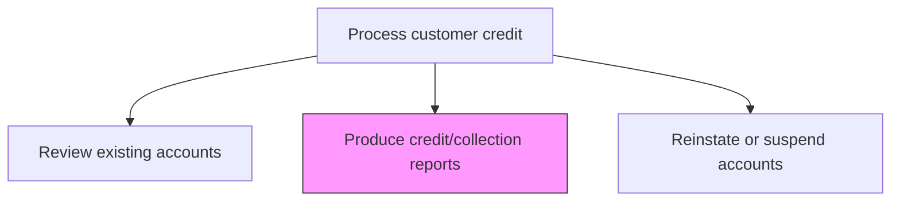
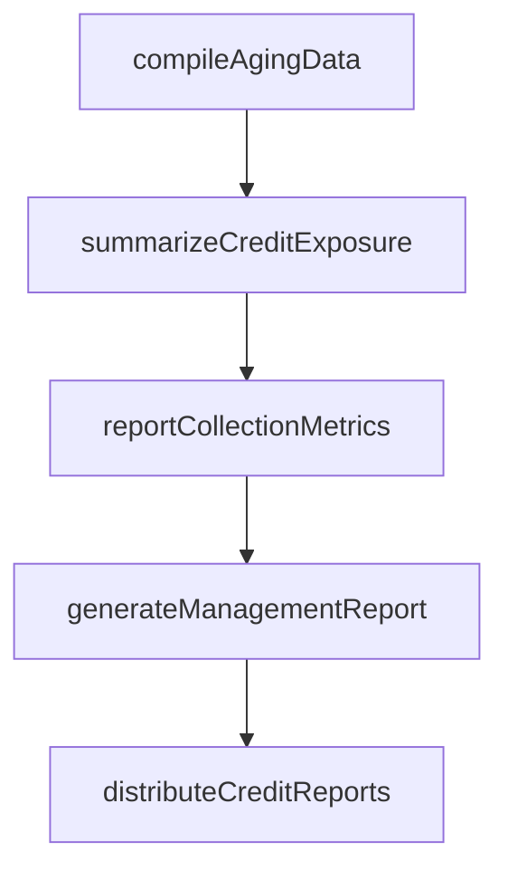

# Produce credit/collection reports

> Business-as-Code definition for credit and collection report production. Models the compilation, formatting, and distribution of credit exposure, aging, and collection performance reports for management decision-making.

## Overview

Producing credit and collection reports provides management with the visibility needed to make informed decisions about credit exposure, collection strategy, and bad debt reserves. This process involves aggregating accounts receivable aging data, summarizing credit exposure by risk tier and customer segment, and computing collection effectiveness metrics such as days sales outstanding (DSO) and recovery rates. Timely and accurate reporting enables finance leadership to identify emerging risk concentrations, evaluate collector performance, and adjust credit policies proactively. These reports are typically produced monthly and serve as key inputs to financial planning, audit reviews, and board-level risk discussions.

## Process Hierarchy



## GraphDL

```yaml
produce:
  object: Credit/collection Reports
  actor: CreditAnalyst
  result: CreditCollectionReport
```

## Actions

| Action | Description |
|--------|-------------|
| compileAgingData | Aggregate accounts receivable aging by customer and aging bucket |
| summarizeCreditExposure | Calculate total credit exposure by risk tier and customer segment |
| reportCollectionMetrics | Compute collection effectiveness, DSO, and recovery rates |
| generateManagementReport | Assemble credit and collection data into formatted management reports |
| distributeCreditReports | Deliver reports to credit management, finance, and sales leadership |

## Events

| Event | Description |
|-------|-------------|
| agingDataCompiled | AR aging data aggregated across accounts |
| creditExposureSummarized | Total credit exposure calculated by tier and segment |
| collectionMetricsReported | Collection effectiveness and DSO metrics computed |
| managementReportGenerated | Credit and collection management report assembled |
| creditReportsDistributed | Reports delivered to stakeholders |

## Searches

| Search | Description |
|--------|-------------|
| getAgingReport | Retrieve accounts receivable aging by customer or segment |
| getCreditExposureSummary | Query total credit exposure by risk tier |
| getCollectionPerformance | List collection metrics by period and collector |

## Process Flow



## RACI Matrix

| Activity | Responsible | Accountable | Consulted | Informed |
|----------|-------------|-------------|-----------|----------|
| compileAgingData | Credit Analyst | Credit Manager | AR Manager | Controller |
| summarizeCreditExposure | Credit Analyst | Credit Manager | Risk Management | CFO |
| reportCollectionMetrics | Credit Analyst | Credit Manager | Collections Supervisor | CFO |
| generateManagementReport | Credit Analyst | Credit Manager | FP&A | Internal Audit |
| distributeCreditReports | Credit Analyst | Credit Manager | Finance Director | Sales Director |

## Related Processes

| Process | Relationship |
|---------|-------------|
| 9.2.1.5 Review existing accounts | Upstream - account reviews generate data for reports |
| 9.2.4 Manage and process collections | Parallel - collection activity data feeds report metrics |
| 9.2.3 Process accounts receivable (AR) | Upstream - AR data provides aging and balance information |
| 9.3.4 Perform financial reporting | Downstream - credit metrics feed into financial statements and disclosures |

## Related Departments

| Department | Role |
|-----------|------|
| Credit | Produces and distributes credit and collection reports |
| Accounts Receivable | Provides aging and balance data |
| Collections | Supplies collection activity and recovery data |
| Finance | Reviews reports for financial planning |

## Related Occupations

| Occupation | Involvement |
|-----------|-------------|
| Credit Analyst | Compiles and formats credit reports |
| AR Specialist | Provides aging and payment data |
| Credit Manager | Reviews and approves report distribution |

## KPIs

| KPI | Description | Unit |
|-----|-------------|------|
| Report Delivery Timeliness | Days from period close to report distribution | Days |
| Days Sales Outstanding | Average number of days to collect receivables | Days |
| Collection Effectiveness Index | Cash collected as a percentage of total receivables available | % |
| Credit Exposure Concentration | Largest single-customer exposure as a percentage of total AR | % |

## Usage

```typescript
import { produceCreditCollectionReports } from '@headlessly/produce-credit-collection-reports'

const reports = produceCreditCollectionReports()

// Generate aging report
const aging = await reports.getAgingReport({
  asOfDate: '2025-12-31',
  groupBy: 'customer-segment'
})

// Get collection performance metrics
const performance = await reports.getCollectionPerformance({
  period: 'Q4-2025',
  metric: 'collection-effectiveness-index'
})
```
