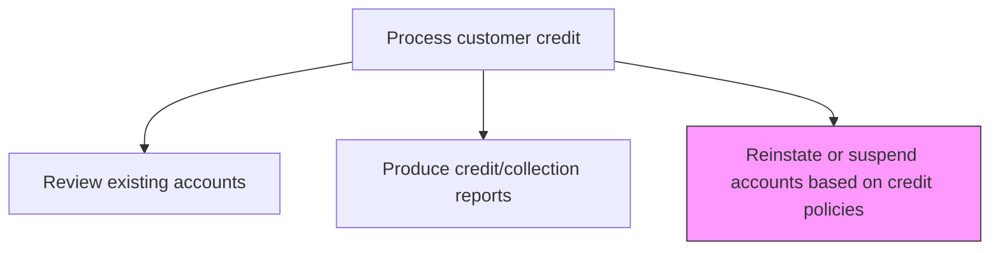
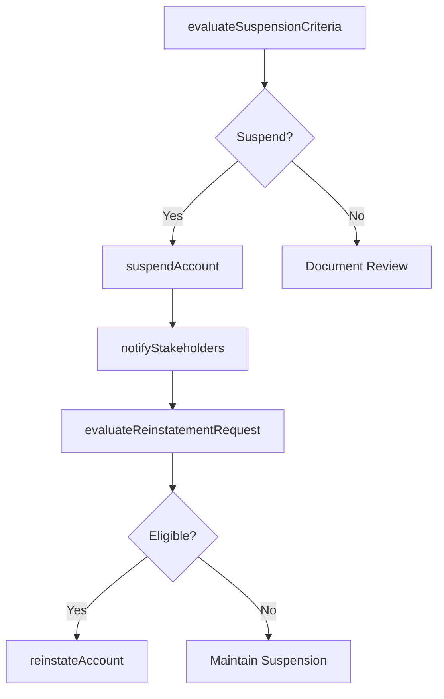

# Reinstate or suspend accounts based on credit policies

> Business-as-Code definition for account reinstatement and suspension management. Models the enforcement of credit policies through account status changes including suspension for policy violations and reinstatement upon compliance.

## Overview

Reinstating or suspending accounts based on credit policies enforces the organization's credit risk framework by controlling which customers can place new orders on credit terms. This process involves evaluating accounts against suspension triggers such as chronic late payment, credit limit breaches, or deteriorating financial condition, and then placing credit holds to prevent further exposure. When suspended accounts demonstrate compliance through payment plan completion or improved financial standing, credit privileges are restored through a formal reinstatement review. Consistent enforcement of these policies protects the organization from escalating bad debt while providing a structured path for customers to regain credit standing.

## Process Hierarchy



## GraphDL

```yaml
reinstate:
  object: Or Suspend Accounts Based On Credit Policies
  actor: CreditManager
  result: AccountStatusChange
```

## Actions

| Action | Description |
|--------|-------------|
| evaluateSuspensionCriteria | Assess whether an account meets the conditions for credit suspension |
| suspendAccount | Place a credit hold on an account preventing further orders |
| notifyStakeholders | Inform the customer, sales team, and AR of the account status change |
| evaluateReinstatementRequest | Review a suspended account for eligibility to restore credit privileges |
| reinstateAccount | Restore credit privileges for a previously suspended account |

## Events

| Event | Description |
|-------|-------------|
| suspensionCriteriaEvaluated | Account assessed against suspension policy triggers |
| accountSuspended | Credit hold placed on the account |
| stakeholdersNotified | Customer and internal teams informed of status change |
| reinstatementRequestEvaluated | Suspended account reviewed for reinstatement eligibility |
| accountReinstated | Credit privileges restored for the account |

## Searches

| Search | Description |
|--------|-------------|
| getSuspendedAccounts | Retrieve accounts currently on credit hold |
| getReinstatementRequests | List pending requests for account reinstatement |
| getAccountStatusHistory | Query status change history for a specific account |

## Process Flow



## RACI Matrix

| Activity | Responsible | Accountable | Consulted | Informed |
|----------|-------------|-------------|-----------|----------|
| evaluateSuspensionCriteria | Credit Analyst | Credit Manager | AR Specialist | Sales Rep |
| suspendAccount | Credit Manager | Controller | Sales Director | Customer |
| notifyStakeholders | Credit Analyst | Credit Manager | Sales | AR Manager |
| evaluateReinstatementRequest | Credit Analyst | Credit Manager | AR Manager | Sales Rep |
| reinstateAccount | Credit Manager | Controller | Legal | Sales Director |

## Related Processes

| Process | Relationship |
|---------|-------------|
| 9.2.1.1 Establish credit policies | Upstream - policies define suspension and reinstatement criteria |
| 9.2.1.5 Review existing accounts | Upstream - account reviews identify suspension candidates |
| 9.2.4 Manage and process collections | Parallel - collection efforts may precede or follow suspension |
| 9.2.4.7 Manage default accounts | Downstream - prolonged suspension may escalate to default management |

## Related Departments

| Department | Role |
|-----------|------|
| Credit | Makes suspension and reinstatement decisions |
| Sales | Receives notification and manages customer relationship impact |
| Accounts Receivable | Updates account status and blocks new orders |
| Legal | Advises on contractual implications of suspension |

## Related Occupations

| Occupation | Involvement |
|-----------|-------------|
| Credit Manager | Authorizes account suspensions and reinstatements |
| Credit Analyst | Evaluates accounts against suspension and reinstatement criteria |
| AR Specialist | Implements account holds and status changes in the system |

## KPIs

| KPI | Description | Unit |
|-----|-------------|------|
| Suspension Rate | Percentage of accounts suspended per review cycle | % |
| Reinstatement Success Rate | Percentage of reinstated accounts that remain current | % |
| Average Suspension Duration | Mean number of days accounts remain suspended | Days |
| Revenue Impact of Suspensions | Estimated lost revenue from suspended account order blocks | USD |

## Usage

```typescript
import { reinstateOrSuspendAccountsBasedOnCreditPolicies } from '@headlessly/reinstate-or-suspend-accounts-based-on-credit-policies'

const accountStatus = reinstateOrSuspendAccountsBasedOnCreditPolicies()

// Get currently suspended accounts
const suspended = await accountStatus.getSuspendedAccounts({
  region: 'North America',
  suspendedAfter: '2025-01-01'
})

// Evaluate a reinstatement request
const eligible = await accountStatus.evaluateReinstatementRequest({
  accountId: 'ACCT-8200',
  paymentPlanCompleted: true
})
```
