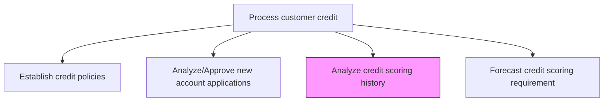
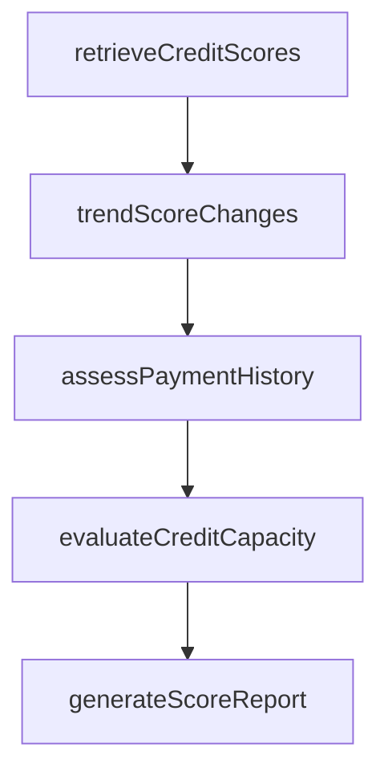

# Analyze credit scoring history

> Business-as-Code definition for credit scoring history analysis. Models the review, trending, and assessment of historical credit scores to evaluate creditworthiness and support credit extension decisions.

## Overview

Analyzing credit scoring history involves reviewing and trending historical credit scores from both internal records and external bureaus to evaluate customer creditworthiness and support credit extension decisions. This process identifies patterns of score improvement or deterioration, assesses payment history and delinquency trends, and determines whether a customer's credit capacity supports additional credit lines. Accurate scoring analysis is essential for both new account applications and existing account reviews, as it provides the empirical basis for risk-based credit decisions. The output of this analysis also feeds forecasting models that project future portfolio risk and inform scoring threshold adjustments.

## Process Hierarchy



## GraphDL

```yaml
analyze:
  object: Credit Scoring History
  actor: CreditAnalyst
  result: CreditScoreAnalysisReport
```

## Actions

| Action | Description |
|--------|-------------|
| retrieveCreditScores | Pull historical credit scores from internal and external sources |
| trendScoreChanges | Analyze credit score movement over time to detect improvement or deterioration |
| assessPaymentHistory | Evaluate past payment behavior and delinquency patterns |
| evaluateCreditCapacity | Determine if customer credit capacity supports additional extensions |
| generateScoreReport | Produce credit scoring analysis summary for decision-making |

## Events

| Event | Description |
|-------|-------------|
| creditScoresRetrieved | Historical credit scores gathered from all sources |
| scoreChangesTrended | Credit score movement patterns identified |
| paymentHistoryAssessed | Past payment behavior and delinquency patterns evaluated |
| creditCapacityEvaluated | Customer credit capacity analysis completed |
| scoreReportGenerated | Credit scoring analysis report published |

## Searches

| Search | Description |
|--------|-------------|
| getCreditScoreHistory | Retrieve historical credit scores for a customer or applicant |
| getScoreTrends | Query credit score movement over specified periods |
| getHighRiskAccounts | List accounts with deteriorating credit scores |

## Process Flow



## RACI Matrix

| Activity | Responsible | Accountable | Consulted | Informed |
|----------|-------------|-------------|-----------|----------|
| retrieveCreditScores | Credit Analyst | Credit Manager | IT | AR Manager |
| trendScoreChanges | Credit Analyst | Credit Manager | Risk Management | Sales |
| assessPaymentHistory | Credit Analyst | Credit Manager | AR Specialist | Collections |
| evaluateCreditCapacity | Credit Analyst | Credit Manager | Sales | Controller |
| generateScoreReport | Credit Analyst | Credit Manager | Controller | CFO |

## Related Processes

| Process | Relationship |
|---------|-------------|
| 9.2.1.2 Analyze/Approve new account applications | Downstream - scoring history informs approval decisions |
| 9.2.1.4 Forecast credit scoring requirement | Downstream - historical analysis feeds scoring forecasts |
| 9.2.1.5 Review existing accounts | Parallel - scoring history is part of account review |
| 9.2.1.7 Reinstate or suspend accounts based on credit policies | Downstream - score deterioration may trigger suspension |

## Related Departments

| Department | Role |
|-----------|------|
| Credit | Performs credit score analysis and trending |
| Risk Management | Provides scoring models and risk parameters |
| Sales | Receives credit capacity insights for customer engagement |
| IT | Maintains credit bureau integrations and data feeds |

## Related Occupations

| Occupation | Involvement |
|-----------|-------------|
| Credit Analyst | Analyzes credit score history and generates reports |
| Risk Analyst | Develops scoring models and validates predictive accuracy |
| Data Analyst | Extracts and processes credit data from external sources |

## KPIs

| KPI | Description | Unit |
|-----|-------------|------|
| Score Data Currency | Average age of credit score data in the system | Days |
| Predictive Accuracy | Correlation between score analysis and actual credit outcomes | % |
| High-Risk Detection Rate | Percentage of defaults preceded by identified score deterioration | % |
| Score Analysis Coverage | Percentage of active accounts with current scoring analysis | % |

## Usage

```typescript
import { analyzeCreditScoringHistory } from '@headlessly/analyze-credit-scoring-history'

const scoring = analyzeCreditScoringHistory()

// Get credit score trends for a customer
const trends = await scoring.getScoreTrends({
  customerId: 'CUST-4200',
  periods: 24,
  granularity: 'monthly'
})

// Find accounts with deteriorating scores
const highRisk = await scoring.getHighRiskAccounts({
  scoreDeclineThreshold: 50,
  lookbackMonths: 6
})
```
