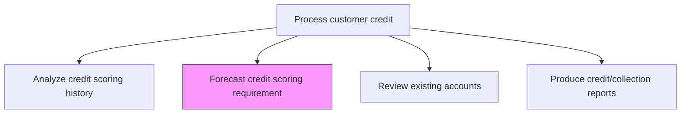
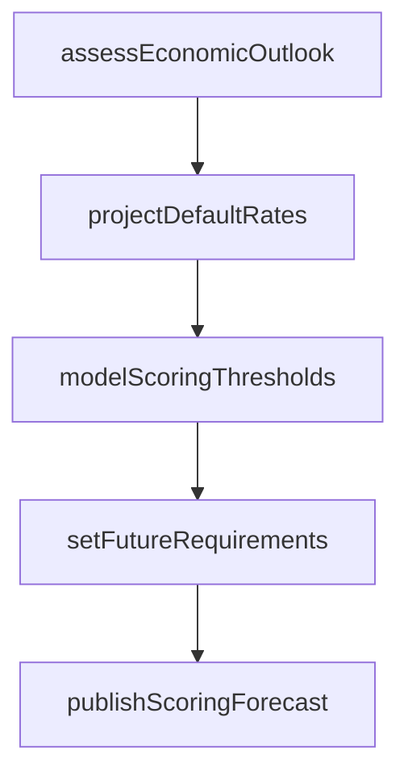

# Forecast credit scoring requirement

> Business-as-Code definition for credit scoring requirement forecasting. Models the projection of future credit scoring thresholds, exposure limits, and portfolio risk parameters based on economic conditions and business strategy.

## Overview

Forecasting credit scoring requirements projects the future credit score thresholds, exposure limits, and portfolio risk parameters that will govern credit decisions in upcoming periods. This process evaluates macroeconomic indicators, models expected default rates under various economic scenarios, and calculates optimal scoring cutoffs that balance revenue growth objectives against acceptable risk levels. Accurate forecasting enables proactive adjustments to credit standards before market conditions shift, preventing sudden spikes in delinquency or unnecessary restriction of sales. The resulting scoring requirements are distributed to credit operations and integrated into financial planning models for cash flow and reserve estimation.

## Process Hierarchy



## GraphDL

```yaml
forecast:
  object: Credit Scoring Requirement
  actor: CreditManager
  result: CreditScoringForecast
```

## Actions

| Action | Description |
|--------|-------------|
| assessEconomicOutlook | Evaluate macroeconomic indicators that affect credit risk |
| projectDefaultRates | Forecast expected default rates based on portfolio composition and economic trends |
| modelScoringThresholds | Calculate optimal credit score cutoffs to balance growth and risk |
| setFutureRequirements | Define forward-looking credit score requirements for each risk tier |
| publishScoringForecast | Distribute updated scoring requirements to credit operations |

## Events

| Event | Description |
|-------|-------------|
| economicOutlookAssessed | Macroeconomic credit risk indicators evaluated |
| defaultRatesProjected | Expected default rates forecasted for the portfolio |
| scoringThresholdsModeled | Optimal credit score cutoffs calculated |
| futureRequirementsSet | Forward-looking scoring requirements defined by tier |
| scoringForecastPublished | Updated scoring requirements distributed |

## Searches

| Search | Description |
|--------|-------------|
| getScoringForecast | Retrieve projected credit scoring requirements by period |
| getDefaultProjections | Query forecasted default rates by risk tier |
| getThresholdScenarios | List scoring threshold scenarios and projected outcomes |

## Process Flow



## RACI Matrix

| Activity | Responsible | Accountable | Consulted | Informed |
|----------|-------------|-------------|-----------|----------|
| assessEconomicOutlook | Credit Manager | Controller | Treasury | Risk Management |
| projectDefaultRates | Credit Manager | Controller | Risk Management | FP&A |
| modelScoringThresholds | Credit Manager | CFO | FP&A | Sales Director |
| setFutureRequirements | Credit Manager | CFO | Risk Management | AR Manager |
| publishScoringForecast | Credit Manager | CFO | Credit Analysts | AR Manager |

## Related Processes

| Process | Relationship |
|---------|-------------|
| 9.2.1.3 Analyze credit scoring history | Upstream - historical scoring data feeds forecasting models |
| 9.2.1.1 Establish credit policies | Upstream - credit policies set the framework for scoring requirements |
| 9.2.1.2 Analyze/Approve new account applications | Downstream - updated thresholds change approval criteria |
| 9.2.1.5 Review existing accounts | Downstream - updated requirements trigger account reviews |

## Related Departments

| Department | Role |
|-----------|------|
| Credit | Develops scoring forecasts and threshold recommendations |
| Risk Management | Provides economic outlook and default probability models |
| Treasury | Advises on liquidity impact of credit exposure changes |
| FP&A | Integrates credit forecasts into financial planning |

## Related Occupations

| Occupation | Involvement |
|-----------|-------------|
| Credit Manager | Leads scoring requirement forecasting |
| Risk Analyst | Models default probabilities and economic scenarios |
| Financial Analyst | Integrates credit forecasts into business planning |

## KPIs

| KPI | Description | Unit |
|-----|-------------|------|
| Forecast Accuracy | Variance between projected and actual default rates | % |
| Portfolio Risk Score | Weighted average credit score across the customer portfolio | Score |
| Threshold Adjustment Frequency | Number of scoring threshold changes per year | Count |
| Scenario Coverage | Number of economic scenarios modeled per forecast cycle | Count |

## Usage

```typescript
import { forecastCreditScoringRequirement } from '@headlessly/forecast-credit-scoring-requirement'

const forecast = forecastCreditScoringRequirement()

// Model scoring threshold scenarios
const scenarios = await forecast.modelScoringThresholds({
  economicScenario: 'moderate-recession',
  targetDefaultRate: 0.02
})

// Get default rate projections
const defaults = await forecast.getDefaultProjections({
  period: '2026',
  granularity: 'quarterly'
})
```
