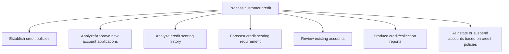
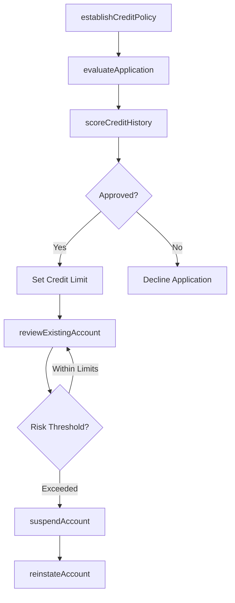

# Process customer credit

> Business-as-Code definition for customer credit management. Models credit policy establishment, application evaluation, credit scoring, account monitoring, and account status management as programmable APIs.

## Overview

Evaluating and processing requests for advances. Evaluate credit requests by customers requiring loans to buy products/services.

## Process Hierarchy



## GraphDL

```yaml
process:
  object: Customer Credit
  actor: CreditAnalyst
  result: CreditDecision
```

## Actions

| Action | Description |
|--------|-------------|
| establishCreditPolicy | Define credit terms, scoring thresholds, and approval limits |
| evaluateApplication | Assess new customer credit applications against eligibility criteria |
| scoreCreditHistory | Analyze applicant payment history and creditworthiness indicators |
| reviewExistingAccount | Periodically reassess credit limits for current customers |
| suspendAccount | Place a credit hold on accounts exceeding risk thresholds |
| reinstateAccount | Restore credit privileges for accounts meeting policy requirements |

## Events

| Event | Description |
|-------|-------------|
| creditPolicyEstablished | Credit policies and terms published for the organization |
| applicationEvaluated | New credit application reviewed and decision rendered |
| creditHistoryScored | Customer credit score calculated and recorded |
| existingAccountReviewed | Periodic credit review completed for an active account |
| accountSuspended | Customer account placed on credit hold |
| accountReinstated | Customer credit privileges restored |

## Searches

| Search | Description |
|--------|-------------|
| getCreditApplications | List credit applications filtered by status, score, or date |
| getCustomerCreditProfile | Retrieve credit score, limit, and payment history for a customer |
| getCreditExposure | Query total outstanding credit exposure by customer or segment |
| getAccountsOnHold | List customer accounts currently under credit suspension |

## Process Flow



## RACI Matrix

| Activity | Responsible | Accountable | Consulted | Informed |
|----------|-------------|-------------|-----------|----------|
| establishCreditPolicy | Credit Manager | CFO | Legal | Sales Director |
| evaluateApplication | Credit Analyst | Credit Manager | Sales Representative | AR Manager |
| reviewExistingAccount | Credit Analyst | Credit Manager | Collections Specialist | Sales |
| suspendAccount | Credit Manager | CFO | Legal | Customer |

## Sub-Processes

| ID | Name | Description |
|----|------|-------------|
| 9.2.1.1 | Establish credit policies | Creating guidelines for providing advances. Set up credit standards, credit terms, and collection po |
| 9.2.1.2 | Analyze/Approve new account applications | Checking and accepting new requests based on eligibility criteria. Analyze the status of applicants  |
| 9.2.1.3 | Analyze credit scoring history | Reviewing past credit scores to determine the if a line of credit will be extended to potential cust |
| 9.2.1.4 | Forecast credit scoring requirement | Planning credit score requirements based on established credit policies. |
| 9.2.1.5 | Review existing accounts | Evaluating existing account holders and their past performance. Regularly review existing accounts t |
| 9.2.1.6 | Produce credit/collection reports | Preparing account payable reports about payments to be made according to accounting rules and princi |
| 9.2.1.7 | Reinstate or suspend accounts based on credit policies | Closing or restarting accounts according to changes made in credit policies. |

## Related Processes

| Process | Relationship |
|---------|-------------|
| 9.2.2 Invoice customer | Downstream - credit approval enables invoicing |
| 9.2.4 Manage and process collections | Downstream - credit defaults trigger collection activity |
| 9.2.3 Process accounts receivable (AR) | Parallel - credit limits govern receivable exposure |

## Related Departments

| Department | Role |
|-----------|------|
| Credit | Primary owner of credit evaluation and policy management |
| Sales | Submits credit applications and provides customer context |
| Finance | Sets risk appetite and monitors credit exposure |
| Legal | Advises on credit agreements and account suspension |

## Related Occupations

| Occupation | Involvement |
|-----------|-------------|
| Credit Analyst | Evaluates applications and performs credit scoring |
| Credit Manager | Establishes policies and approves high-value credit decisions |
| Risk Analyst | Monitors portfolio credit exposure and default trends |

## KPIs

| KPI | Description | Unit |
|-----|-------------|------|
| Credit Approval Rate | Percentage of credit applications approved | % |
| Average Credit Score | Mean credit score of approved customer accounts | Score |
| Credit Review Cycle Time | Days to complete periodic account credit reviews | Days |
| Default Rate | Percentage of credit accounts that enter default status | % |

## Usage

```typescript
import { processCustomerCredit } from '@headlessly/process-customer-credit'

const credit = processCustomerCredit()

// Evaluate a new credit application
const decision = await credit.evaluateApplication({
  customerId: 'CUST-8821',
  requestedLimit: 50000,
  currency: 'USD'
})

// Review existing account credit standing
const review = await credit.reviewExistingAccount({
  customerId: 'CUST-3210',
  includePaymentHistory: true
})
```
