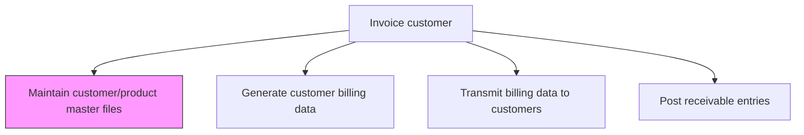
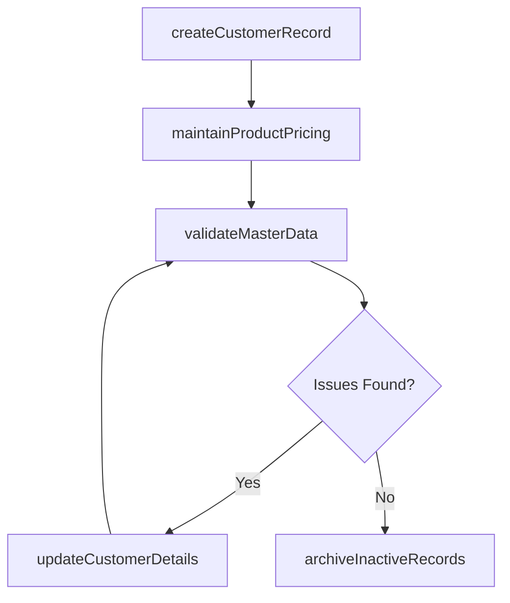

# Maintain customer/product master files

> Business-as-Code definition for customer and product master file maintenance. Models the creation, updating, and governance of customer billing profiles and product pricing records used in the invoicing process.

## Overview

Creating and updating a record of customers and the products being purchased by them in a database. This process element requires the organization to maintain a database of customers and their purchases. Such a master-file can be used to ensure customer touch point, enhance customer satisfaction, explore cross selling opportunities, and identify future trends. This database will include several particulars about the personal details of the organization's customers and a tracking of the products being sold.

## Process Hierarchy



## GraphDL

```yaml
maintain:
  object: Customer/product Master Files
  actor: BillingSpecialist
  result: MasterDataRecord
```

## Actions

| Action | Description |
|--------|-------------|
| createCustomerRecord | Set up new customer billing profile with payment terms and addresses |
| updateCustomerDetails | Modify customer master data including contacts, terms, and tax status |
| maintainProductPricing | Update product catalog with current prices, discounts, and SKU codes |
| validateMasterData | Run data quality checks on customer and product records |
| archiveInactiveRecords | Deactivate and archive customer and product records no longer in use |

## Events

| Event | Description |
|-------|-------------|
| customerRecordCreated | New customer billing profile established |
| customerDetailsUpdated | Customer master data modifications applied |
| productPricingMaintained | Product pricing and catalog records updated |
| masterDataValidated | Data quality checks completed on master files |
| inactiveRecordsArchived | Obsolete records deactivated and archived |

## Searches

| Search | Description |
|--------|-------------|
| getCustomerMaster | Retrieve customer billing profile by ID or name |
| getProductCatalog | Query product pricing and SKU information |
| getDataQualityIssues | List master data records failing validation checks |

## Process Flow



## RACI Matrix

| Activity | Responsible | Accountable | Consulted | Informed |
|----------|-------------|-------------|-----------|----------|
| createCustomerRecord | Billing Specialist | AR Manager | Sales | Credit |
| updateCustomerDetails | Billing Specialist | AR Manager | Sales | Customer Service |
| maintainProductPricing | Billing Specialist | AR Manager | Product Management | Sales |
| validateMasterData | Billing Specialist | AR Manager | IT | Controller |
| archiveInactiveRecords | Billing Specialist | AR Manager | Sales | IT |

## Related Processes

| Process | Relationship |
|---------|-------------|
| 9.2.2.2 Generate customer billing data | Downstream - master files are the source for billing data generation |
| 9.2.1.2 Analyze/Approve new account applications | Upstream - approved accounts trigger customer record creation |
| 9.2.2.3 Transmit billing data to customers | Downstream - delivery preferences and addresses sourced from master data |
| 9.2.3 Process accounts receivable (AR) | Parallel - AR depends on accurate master data |

## Related Departments

| Department | Role |
|-----------|------|
| Billing | Maintains customer and product master files |
| Sales | Provides customer onboarding data and contract terms |
| Product Management | Supplies product pricing and catalog changes |
| IT | Maintains the master data management system |

## Related Occupations

| Occupation | Involvement |
|-----------|-------------|
| Billing Specialist | Creates and updates master data records |
| Data Steward | Ensures master data quality and governance standards |
| AR Specialist | Uses master data for invoicing and collections |

## KPIs

| KPI | Description | Unit |
|-----|-------------|------|
| Master Data Accuracy | Percentage of customer and product records passing validation | % |
| Record Update Timeliness | Average days from change request to master data update | Days |
| Inactive Record Ratio | Percentage of master records that are archived or inactive | % |
| Duplicate Record Rate | Percentage of customer or product records identified as duplicates | % |

## Usage

```typescript
import { maintainCustomerProductMasterFiles } from '@headlessly/maintain-customer-product-master-files'

const masterData = maintainCustomerProductMasterFiles()

// Create a new customer billing profile
const customer = await masterData.createCustomerRecord({
  name: 'Acme Corp',
  paymentTerms: 'Net 30',
  taxExempt: false,
  billingAddress: { city: 'Chicago', state: 'IL' }
})

// Check data quality issues
const issues = await masterData.getDataQualityIssues({
  recordType: 'customer',
  severity: 'high'
})
```
