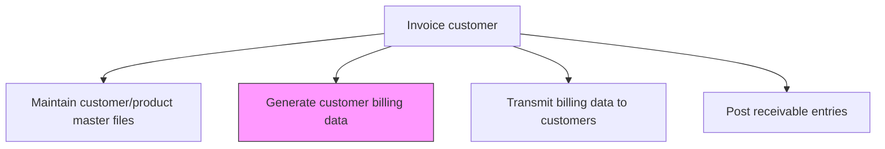
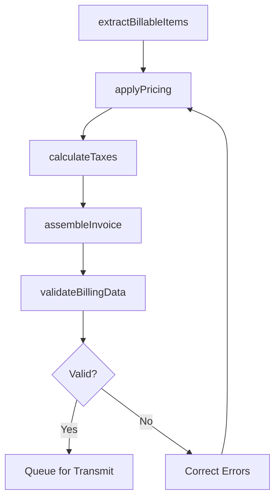

# Generate customer billing data

> Business-as-Code definition for customer billing data generation. Models the creation of invoice line items from orders, contracts, and usage data including pricing calculations, tax application, and discount processing.

## Overview

Generating customer billing data transforms completed orders, delivered services, and usage records into accurate invoice documents ready for customer delivery. This process involves extracting billable items, applying contract-specific pricing and discount structures, calculating applicable taxes, and assembling complete invoices with line-item detail. Accurate and timely billing directly impacts cash flow velocity, customer satisfaction, and revenue recognition compliance under standards such as ASC 606. Billing exceptions and errors identified during validation are corrected before transmission, reducing downstream inquiry volumes and collection delays.

## Process Hierarchy



## GraphDL

```yaml
generate:
  object: Customer Billing Data
  actor: BillingSpecialist
  result: InvoiceData
```

## Actions

| Action | Description |
|--------|-------------|
| extractBillableItems | Pull completed orders, delivered services, and usage data for invoicing |
| applyPricing | Calculate line item amounts using contract prices, discounts, and surcharges |
| calculateTaxes | Determine applicable sales tax, VAT, or other tax obligations per line item |
| assembleInvoice | Combine line items, taxes, and terms into a complete invoice document |
| validateBillingData | Verify invoice accuracy against orders, contracts, and pricing rules |

## Events

| Event | Description |
|-------|-------------|
| billableItemsExtracted | Completed orders and usage data pulled for billing |
| pricingApplied | Invoice line item amounts calculated |
| taxesCalculated | Tax obligations determined for invoice line items |
| invoiceAssembled | Complete invoice document generated |
| billingDataValidated | Invoice accuracy confirmed against source data |

## Searches

| Search | Description |
|--------|-------------|
| getPendingBillableItems | Retrieve orders and services awaiting invoicing |
| getInvoicesByCustomer | Query generated invoices for a specific customer |
| getBillingExceptions | List invoices flagged with pricing or data validation errors |

## Process Flow



## RACI Matrix

| Activity | Responsible | Accountable | Consulted | Informed |
|----------|-------------|-------------|-----------|----------|
| extractBillableItems | Billing Specialist | AR Manager | Order Management | Sales |
| applyPricing | Billing Specialist | AR Manager | Pricing Team | Contract Admin |
| calculateTaxes | Billing Specialist | AR Manager | Tax Department | Controller |
| assembleInvoice | Billing Specialist | AR Manager | Customer Service | Sales |
| validateBillingData | Billing Specialist | AR Manager | Internal Audit | Controller |

## Related Processes

| Process | Relationship |
|---------|-------------|
| 9.2.2.1 Maintain customer/product master files | Upstream - master files provide pricing and customer data |
| 9.2.2.3 Transmit billing data to customers | Downstream - generated invoices are transmitted to customers |
| 9.2.2.4 Post receivable entries | Downstream - billing data creates receivable entries |
| 9.2.2.5 Resolve customer billing inquiries | Downstream - billing errors generate customer inquiries |

## Related Departments

| Department | Role |
|-----------|------|
| Billing | Generates invoices from orders and usage data |
| Sales | Provides contract terms and discount approvals |
| Tax | Ensures correct tax calculations and compliance |
| Order Management | Supplies completed order data for billing |

## Related Occupations

| Occupation | Involvement |
|-----------|-------------|
| Billing Specialist | Generates and validates invoice data |
| Tax Analyst | Verifies tax calculations on invoices |
| AR Specialist | Reviews billing output for posting |

## KPIs

| KPI | Description | Unit |
|-----|-------------|------|
| Invoice Accuracy Rate | Percentage of invoices generated without errors | % |
| Billing Cycle Time | Average days from order completion to invoice generation | Days |
| Billing Exception Rate | Percentage of invoices requiring manual correction | % |
| Revenue Billed per Cycle | Total dollar amount invoiced in the billing period | USD |

## Usage

```typescript
import { generateCustomerBillingData } from '@headlessly/generate-customer-billing-data'

const billing = generateCustomerBillingData()

// Generate invoices for the billing cycle
const invoices = await billing.extractBillableItems({
  billingCycle: '2025-12',
  customerSegment: 'Enterprise'
})

// Check for billing exceptions
const exceptions = await billing.getBillingExceptions({
  period: '2025-12',
  severity: 'high'
})
```
