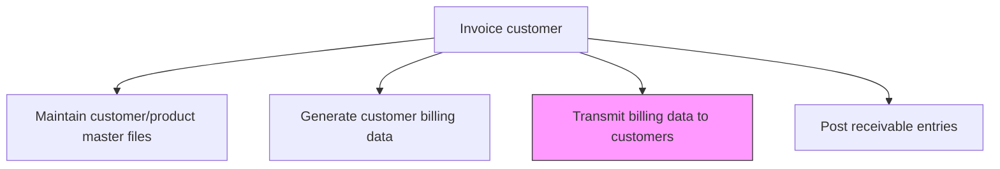
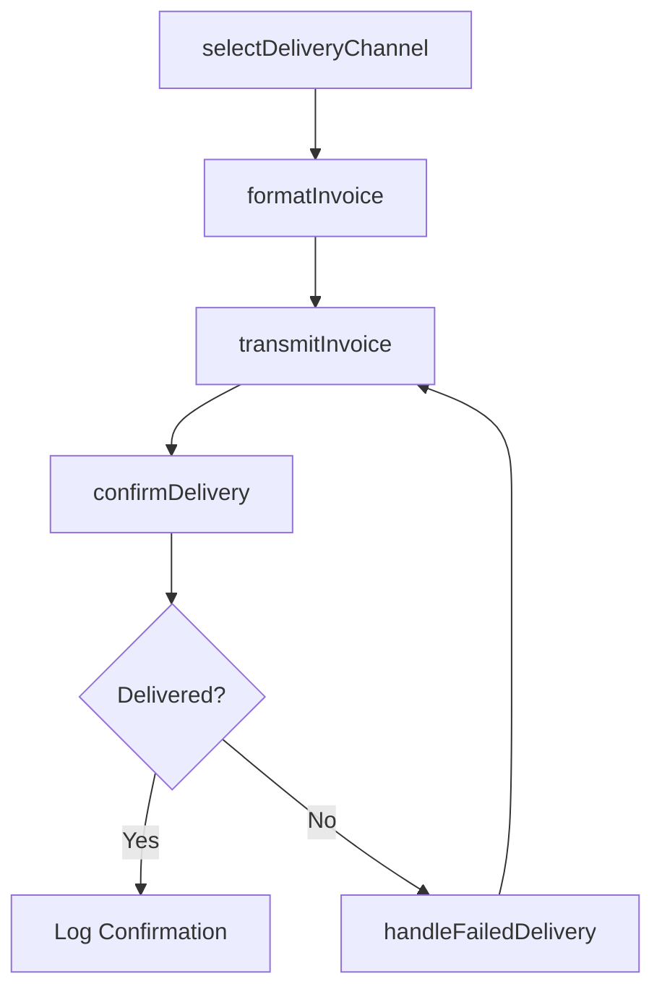

# Transmit billing data to customers

> Business-as-Code definition for billing data transmission. Models the delivery of invoices to customers through electronic, mail, or portal-based channels including format selection, delivery confirmation, and failed delivery handling.

## Overview

Transmitting billing data to customers is the delivery step that gets invoices into customer hands through the appropriate channel, whether electronic (email, EDI, portal) or physical mail. This process involves selecting the correct delivery method based on customer preferences, formatting invoices to meet channel-specific requirements, confirming successful delivery, and handling failed transmissions through retry or alternative channels. Timely and reliable invoice delivery is critical because it starts the payment clock and directly affects days sales outstanding (DSO). Organizations increasingly shift toward electronic delivery to reduce costs, accelerate receipt, and improve delivery tracking visibility.

## Process Hierarchy



## GraphDL

```yaml
transmit:
  object: Billing Data To Customers
  actor: BillingSpecialist
  result: InvoiceDeliveryConfirmation
```

## Actions

| Action | Description |
|--------|-------------|
| selectDeliveryChannel | Determine the appropriate delivery method per customer preferences (email, EDI, mail, portal) |
| formatInvoice | Prepare invoice in the required format for each delivery channel |
| transmitInvoice | Send the invoice to the customer through the selected channel |
| confirmDelivery | Verify successful receipt of the invoice by the customer |
| handleFailedDelivery | Investigate and retry invoices that failed to deliver |

## Events

| Event | Description |
|-------|-------------|
| deliveryChannelSelected | Invoice delivery method determined |
| invoiceFormatted | Invoice prepared in the appropriate format |
| invoiceTransmitted | Invoice sent to the customer |
| deliveryConfirmed | Customer receipt of invoice verified |
| failedDeliveryHandled | Delivery failure investigated and retried |

## Searches

| Search | Description |
|--------|-------------|
| getTransmissionStatus | Retrieve delivery status for transmitted invoices |
| getFailedDeliveries | List invoices that failed to deliver |
| getDeliveryHistory | Query invoice transmission history for a customer |

## Process Flow



## RACI Matrix

| Activity | Responsible | Accountable | Consulted | Informed |
|----------|-------------|-------------|-----------|----------|
| selectDeliveryChannel | Billing Specialist | AR Manager | Sales | Customer Service |
| formatInvoice | Billing Specialist | AR Manager | IT | Sales |
| transmitInvoice | Billing Specialist | AR Manager | IT | Customer |
| confirmDelivery | Billing Specialist | AR Manager | Customer Service | Sales |
| handleFailedDelivery | Billing Specialist | AR Manager | IT | Credit Manager |

## Related Processes

| Process | Relationship |
|---------|-------------|
| 9.2.2.2 Generate customer billing data | Upstream - generated invoices are transmitted here |
| 9.2.2.4 Post receivable entries | Parallel - delivery confirmation validates receivable posting |
| 9.2.2.5 Resolve customer billing inquiries | Downstream - transmitted invoices may generate inquiries |
| 9.2.3 Process accounts receivable (AR) | Parallel - invoice delivery starts the receivable collection clock |

## Related Departments

| Department | Role |
|-----------|------|
| Billing | Manages invoice formatting and transmission |
| IT | Maintains electronic delivery infrastructure and EDI connections |
| Customer Service | Handles customer inquiries about invoice delivery |
| Sales | Ensures customer delivery preferences are current |

## Related Occupations

| Occupation | Involvement |
|-----------|-------------|
| Billing Specialist | Manages invoice formatting and delivery |
| IT Analyst | Maintains electronic invoicing infrastructure |
| Customer Service Representative | Responds to delivery-related inquiries |

## KPIs

| KPI | Description | Unit |
|-----|-------------|------|
| Delivery Success Rate | Percentage of invoices successfully delivered on first attempt | % |
| Electronic Delivery Rate | Percentage of invoices delivered electronically versus mail | % |
| Average Delivery Time | Mean time from invoice generation to customer receipt | Hours |
| Failed Delivery Rate | Percentage of invoices requiring re-delivery attempts | % |

## Usage

```typescript
import { transmitBillingDataToCustomers } from '@headlessly/transmit-billing-data-to-customers'

const transmission = transmitBillingDataToCustomers()

// Transmit invoices for the billing cycle
const results = await transmission.transmitInvoice({
  billingCycle: '2025-12',
  batchSize: 500
})

// Get failed deliveries
const failed = await transmission.getFailedDeliveries({
  period: '2025-12',
  retryAttempts: { max: 3 }
})
```
