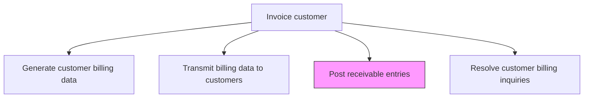
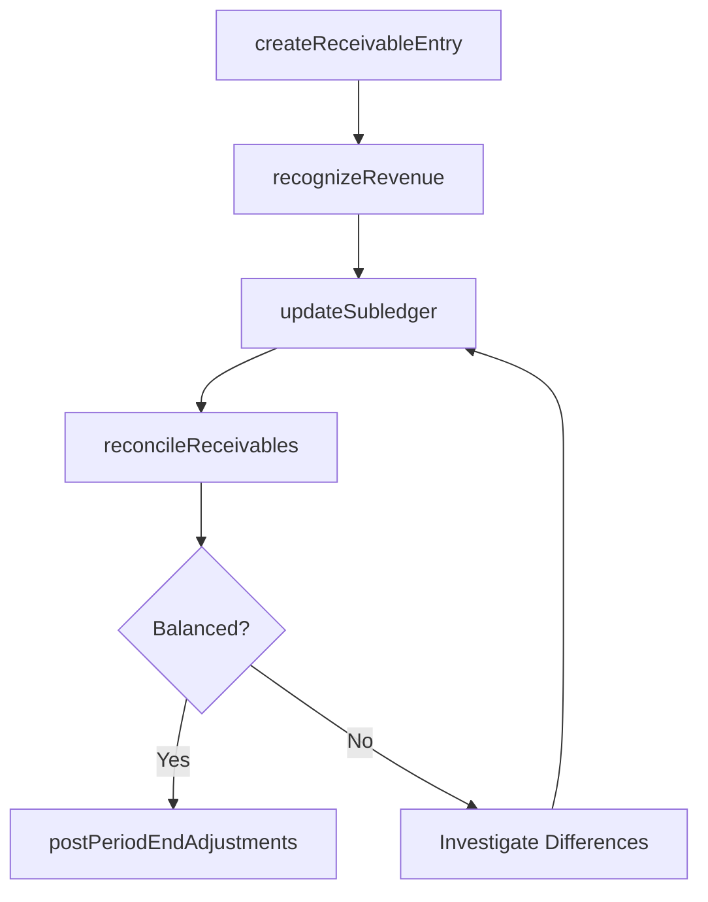

# Post receivable entries

> Business-as-Code definition for receivable entry posting. Models the recording of invoice amounts as accounts receivable in the general ledger, including revenue recognition, subledger updates, and period-end receivable reconciliation.

## Overview

Posting receivable entries records invoice amounts as accounts receivable in the general ledger, establishing the formal financial claim against each customer. This process includes creating subledger entries for each invoice, recognizing revenue per applicable standards such as ASC 606, synchronizing the AR subledger with the GL control account, and recording period-end adjustments for allowance for doubtful accounts. Accurate and timely posting ensures that revenue and receivable balances are correctly stated for financial reporting and supports reliable cash flow forecasting. Reconciliation between the subledger and general ledger at each period close is essential for audit readiness and internal control compliance.

## Process Hierarchy



## GraphDL

```yaml
post:
  object: Receivable Entries
  actor: ARSpecialist
  result: ReceivableLedgerEntry
```

## Actions

| Action | Description |
|--------|-------------|
| createReceivableEntry | Record invoice amounts as accounts receivable in the subledger |
| recognizeRevenue | Post revenue recognition entries according to ASC 606 or applicable standards |
| updateSubledger | Synchronize receivable subledger with general ledger control account |
| reconcileReceivables | Verify subledger balances match general ledger and resolve differences |
| postPeriodEndAdjustments | Record allowance for doubtful accounts and other period-end adjustments |

## Events

| Event | Description |
|-------|-------------|
| receivableEntryCreated | Invoice amounts recorded as accounts receivable |
| revenueRecognized | Revenue recognition entries posted per applicable standards |
| subledgerUpdated | Receivable subledger synchronized with general ledger |
| receivablesReconciled | Subledger to general ledger reconciliation completed |
| periodEndAdjustmentsPosted | Allowance and adjustment entries recorded |

## Searches

| Search | Description |
|--------|-------------|
| getReceivableEntries | Retrieve posted receivable entries by customer or period |
| getUnreconciledItems | List receivable entries with subledger-to-GL differences |
| getRevenuePostings | Query revenue recognition entries by period and category |

## Process Flow



## RACI Matrix

| Activity | Responsible | Accountable | Consulted | Informed |
|----------|-------------|-------------|-----------|----------|
| createReceivableEntry | AR Specialist | AR Manager | Billing | Controller |
| recognizeRevenue | AR Specialist | Controller | Revenue Accountant | CFO |
| updateSubledger | AR Specialist | AR Manager | IT | GL Accountant |
| reconcileReceivables | AR Specialist | AR Manager | GL Accountant | Internal Audit |
| postPeriodEndAdjustments | AR Specialist | Controller | Internal Audit | CFO |

## Related Processes

| Process | Relationship |
|---------|-------------|
| 9.2.2.2 Generate customer billing data | Upstream - billing data creates receivable entries |
| 9.2.3 Process accounts receivable (AR) | Downstream - posted receivables are collected |
| 9.2.3.5 Post AR activity to the general ledger | Parallel - receivable postings are part of AR-to-GL transfer |
| 9.3.2 Perform general accounting | Parallel - receivable entries feed the general ledger |

## Related Departments

| Department | Role |
|-----------|------|
| Accounts Receivable | Posts and reconciles receivable entries |
| General Accounting | Maintains GL control accounts and period-end close |
| Revenue Accounting | Ensures proper revenue recognition treatment |
| Internal Audit | Reviews receivable posting accuracy |

## Related Occupations

| Occupation | Involvement |
|-----------|-------------|
| AR Specialist | Posts receivable entries and performs reconciliation |
| Revenue Accountant | Ensures revenue recognition compliance |
| GL Accountant | Reconciles receivable control accounts |

## KPIs

| KPI | Description | Unit |
|-----|-------------|------|
| Posting Timeliness | Average hours from invoice generation to receivable posting | Hours |
| Reconciliation Accuracy | Percentage of periods with no subledger-to-GL differences | % |
| Unreconciled Items | Number of outstanding reconciliation differences at period end | Count |
| Revenue Recognition Accuracy | Percentage of revenue entries posted without subsequent restatement | % |

## Usage

```typescript
import { postReceivableEntries } from '@headlessly/post-receivable-entries'

const receivables = postReceivableEntries()

// Post receivable entries for the billing cycle
const posted = await receivables.createReceivableEntry({
  invoiceId: 'INV-2025-8842',
  amount: 42500.00,
  dueDate: '2026-01-30'
})

// Get unreconciled items
const unreconciled = await receivables.getUnreconciledItems({
  period: '2025-12',
  threshold: 100
})
```
