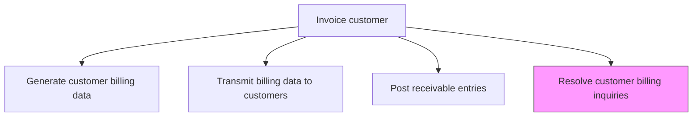
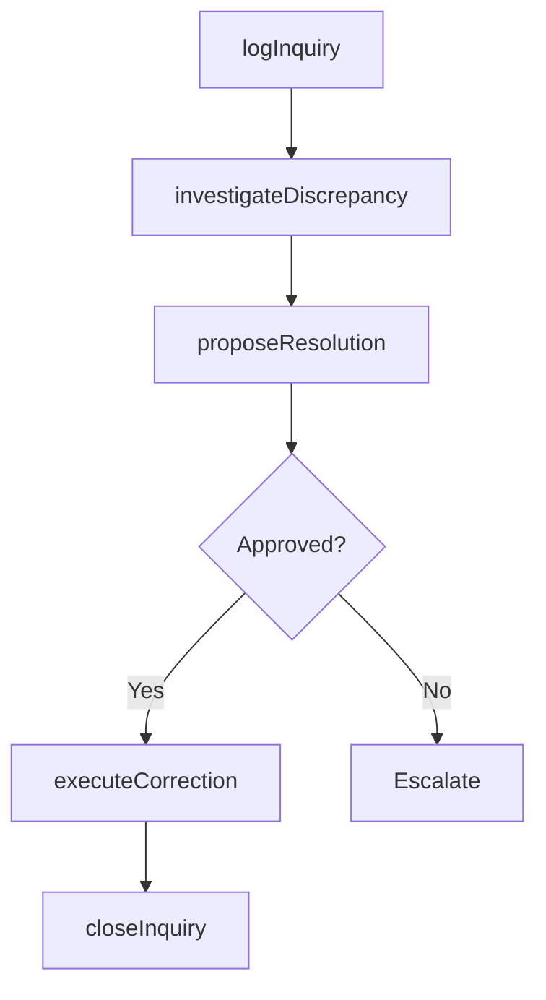

# Resolve customer billing inquiries

> Business-as-Code definition for customer billing inquiry resolution. Models the intake, investigation, and resolution of customer questions and disputes related to invoices, pricing, and payment terms.

## Overview

Resolving customer billing inquiries handles the investigation and correction of customer questions and disputes related to invoices, pricing, and payment terms. This process involves logging each inquiry with category and priority, researching the underlying invoice, order, and contract data to identify the root cause, proposing a corrective action such as a credit memo, rebilling, or explanation, and executing the approved resolution. Efficient inquiry resolution directly protects customer relationships and accelerates cash collection by removing payment blockers. High inquiry volumes often signal upstream billing accuracy problems, making root cause analysis a valuable byproduct of this process.

## Process Hierarchy



## GraphDL

```yaml
resolve:
  object: Customer Billing Inquiries
  actor: BillingSpecialist
  result: InquiryResolution
```

## Actions

| Action | Description |
|--------|-------------|
| logInquiry | Record the customer billing inquiry with category and priority |
| investigateDiscrepancy | Research the invoice, order, and contract data to identify the issue |
| proposeResolution | Determine the appropriate corrective action (credit, rebill, explanation) |
| executeCorrection | Apply credits, adjustments, or rebilling as approved |
| closeInquiry | Confirm resolution with the customer and close the inquiry record |

## Events

| Event | Description |
|-------|-------------|
| inquiryLogged | Customer billing inquiry recorded and categorized |
| discrepancyInvestigated | Invoice and order data researched to identify the issue |
| resolutionProposed | Corrective action determined and approved |
| correctionExecuted | Credits, adjustments, or rebilling applied |
| inquiryClosed | Resolution confirmed with customer and inquiry closed |

## Searches

| Search | Description |
|--------|-------------|
| getOpenInquiries | Retrieve unresolved billing inquiries by customer or age |
| getInquiryHistory | Query billing inquiry history for a specific customer |
| getInquiryMetrics | List inquiry volumes, categories, and resolution times |

## Process Flow



## RACI Matrix

| Activity | Responsible | Accountable | Consulted | Informed |
|----------|-------------|-------------|-----------|----------|
| logInquiry | Customer Service Rep | AR Manager | Billing | Sales Rep |
| investigateDiscrepancy | Billing Specialist | AR Manager | Sales Rep | Customer |
| proposeResolution | Billing Specialist | AR Manager | Credit Manager | Controller |
| executeCorrection | Billing Specialist | AR Manager | GL Accountant | Customer |
| closeInquiry | Billing Specialist | AR Manager | Customer Service | Sales |

## Related Processes

| Process | Relationship |
|---------|-------------|
| 9.2.2.2 Generate customer billing data | Upstream - billing errors generate inquiries |
| 9.2.2.3 Transmit billing data to customers | Upstream - transmitted invoices generate inquiries |
| 9.2.5 Manage and process adjustments/deductions | Downstream - resolved inquiries may require formal adjustments |
| 9.2.4 Manage and process collections | Parallel - inquiry resolution may affect collection activities |

## Related Departments

| Department | Role |
|-----------|------|
| Billing | Investigates and resolves billing inquiries |
| Customer Service | Routes customer inquiries to billing |
| Sales | Provides contract and pricing context for dispute resolution |
| Accounts Receivable | Applies credits and adjustments from resolved inquiries |

## Related Occupations

| Occupation | Involvement |
|-----------|-------------|
| Billing Specialist | Investigates and resolves billing inquiries |
| Customer Service Representative | Receives and routes initial customer complaints |
| AR Specialist | Processes credits and adjustments from resolutions |

## KPIs

| KPI | Description | Unit |
|-----|-------------|------|
| Inquiry Resolution Time | Average days from inquiry receipt to resolution | Days |
| First-Contact Resolution Rate | Percentage of inquiries resolved on first interaction | % |
| Inquiry Volume per Invoice | Number of billing inquiries per 1,000 invoices issued | Count |
| Credit Memo Value from Inquiries | Total dollar amount of credits issued through inquiry resolution | USD |

## Usage

```typescript
import { resolveCustomerBillingInquiries } from '@headlessly/resolve-customer-billing-inquiries'

const inquiries = resolveCustomerBillingInquiries()

// Get open billing inquiries
const open = await inquiries.getOpenInquiries({
  olderThanDays: 5,
  priority: 'high'
})

// Investigate a specific inquiry
const investigation = await inquiries.investigateDiscrepancy({
  inquiryId: 'INQ-2025-3042',
  invoiceId: 'INV-2025-8842'
})
```
