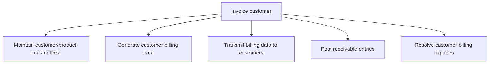
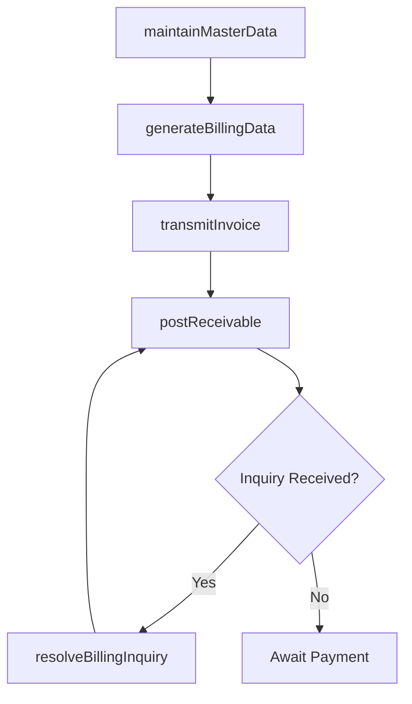

# Invoice customer

> Business-as-Code definition for customer invoicing. Models master data maintenance, billing data generation, invoice transmission, receivable posting, and billing inquiry resolution as programmable APIs.

## Overview

Preparing detailed reports of customer purchases. Prepare a commercial document between the seller and customer with details about transaction. Detail the quantity purchased, price of products/services, date, parties involved, unique invoice number, and tax information.

## Process Hierarchy



## GraphDL

```yaml
invoice:
  object: Customer
  actor: BillingSpecialist
  result: CustomerInvoice
```

## Actions

| Action | Description |
|--------|-------------|
| maintainMasterData | Create and update customer and product records in the billing system |
| generateBillingData | Compile billing details from orders, contracts, and delivery records |
| transmitInvoice | Send invoices to customers via electronic or physical channels |
| postReceivable | Record invoice amounts as accounts receivable entries |
| resolveBillingInquiry | Investigate and resolve customer questions about invoices |

## Events

| Event | Description |
|-------|-------------|
| masterDataMaintained | Customer or product master record created or updated |
| billingDataGenerated | Invoice line items compiled from source transactions |
| invoiceTransmitted | Invoice delivered to the customer |
| receivablePosted | Accounts receivable entry recorded for the invoice |
| billingInquiryResolved | Customer billing question investigated and resolved |

## Searches

| Search | Description |
|--------|-------------|
| getInvoices | List invoices by customer, date, status, or amount range |
| getCustomerMasterData | Retrieve customer billing profile and contact details |
| getBillingInquiries | Query open billing inquiries by customer or invoice |
| getInvoiceSummary | Get invoice totals and counts by period or customer segment |

## Process Flow



## RACI Matrix

| Activity | Responsible | Accountable | Consulted | Informed |
|----------|-------------|-------------|-----------|----------|
| maintainMasterData | Billing Clerk | AR Manager | Sales Operations | IT |
| generateBillingData | Billing Specialist | AR Manager | Sales | Controller |
| transmitInvoice | Billing Specialist | AR Manager | Customer | IT |
| resolveBillingInquiry | Billing Specialist | AR Manager | Sales | Customer |

## Sub-Processes

| ID | Name | Description |
|----|------|-------------|
| 9.2.2.1 | Maintain customer/product master files | Creating and updating a record of customers and the products being purchased by them in a database.  |
| 9.2.2.2 | Generate customer billing data | Preparing detailed reports about products purchased by customers. Record and generate a detail accou |
| 9.2.2.3 | Transmit billing data to customers | Providing information to customers about purchases made by them. Communicate the details of purchase |
| 9.2.2.4 | Post receivable entries | Registering transactions and their scheduled payments. |
| 9.2.2.5 | Resolve customer billing inquiries | Checking and solving billing queries raised by customers. |

## Related Processes

| Process | Relationship |
|---------|-------------|
| 9.2.1 Process customer credit | Upstream - credit approval required before invoicing |
| 9.2.3 Process accounts receivable (AR) | Downstream - posted invoices become receivables |
| 3.5 Invoice and service customers | Parallel - order fulfillment triggers billing |

## Related Departments

| Department | Role |
|-----------|------|
| Billing | Primary owner of invoice generation and transmission |
| Sales Operations | Provides order and contract data for billing |
| Accounts Receivable | Receives posted receivable entries |
| Customer Service | Handles billing inquiries from customers |

## Related Occupations

| Occupation | Involvement |
|-----------|-------------|
| Billing Specialist | Generates and transmits customer invoices |
| AR Clerk | Posts receivable entries and reconciles billing data |
| Customer Service Representative | Resolves billing inquiries |

## KPIs

| KPI | Description | Unit |
|-----|-------------|------|
| Invoice Accuracy Rate | Percentage of invoices issued without errors | % |
| Invoice Cycle Time | Days from order delivery to invoice issuance | Days |
| Electronic Invoice Adoption | Percentage of invoices transmitted electronically | % |
| Billing Inquiry Resolution Time | Average days to resolve a customer billing inquiry | Days |

## Usage

```typescript
import { invoiceCustomer } from '@headlessly/invoice-customer'

const billing = invoiceCustomer()

// Generate an invoice from an order
const invoice = await billing.generateBillingData({
  orderId: 'ORD-2025-7834',
  billingDate: '2025-12-01',
  paymentTerms: 'Net30'
})

// Transmit the invoice to the customer
await billing.transmitInvoice({
  invoiceId: invoice.id,
  channel: 'email',
  format: 'pdf'
})
```
