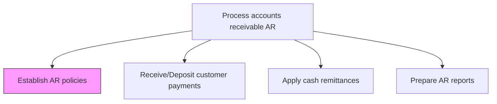
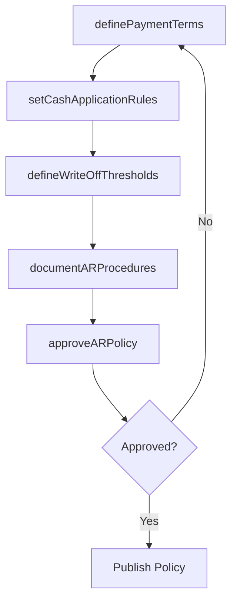

# Establish AR policies

> Business-as-Code definition for accounts receivable policy establishment. Models the creation and maintenance of AR processing rules including payment acceptance methods, cash application procedures, write-off thresholds, and installment terms.

## Overview

Establishing AR policies creates the governing framework for how the organization processes customer payments, applies cash to invoices, handles write-offs, and manages installment terms. This process involves defining standard payment terms and early payment discounts, setting cash application rules for matching payments to invoices, establishing write-off authorization thresholds by dollar amount and role, and compiling these procedures into a formal policy manual. Well-defined AR policies ensure consistency across the receivables function, reduce processing errors, and provide the internal controls required for audit compliance. These policies also serve as the foundation for downstream processes including payment receipt, cash application, and AR reporting.

## Process Hierarchy



## GraphDL

```yaml
establish:
  object: AR Policies
  actor: ARManager
  result: ARPolicyDocument
```

## Actions

| Action | Description |
|--------|-------------|
| definePaymentTerms | Set standard payment terms, installment options, and early payment discounts |
| setCashApplicationRules | Establish rules for matching payments to invoices and handling overpayments |
| defineWriteOffThresholds | Set dollar and aging thresholds for bad debt write-off authorization |
| documentARProcedures | Compile AR processing procedures into a policy manual |
| approveARPolicy | Obtain management approval for AR policy changes |

## Events

| Event | Description |
|-------|-------------|
| paymentTermsDefined | Standard payment terms and discount schedules established |
| cashApplicationRulesSet | Payment-to-invoice matching rules documented |
| writeOffThresholdsDefined | Bad debt write-off authorization levels set |
| arProceduresDocumented | AR processing procedures compiled into policy manual |
| arPolicyApproved | AR policy changes approved by management |

## Searches

| Search | Description |
|--------|-------------|
| getCurrentARPolicy | Retrieve the active AR policy and procedures |
| getARPolicyHistory | Query prior versions of AR policies |
| getWriteOffAuthority | List write-off thresholds by role and dollar amount |

## Process Flow



## RACI Matrix

| Activity | Responsible | Accountable | Consulted | Informed |
|----------|-------------|-------------|-----------|----------|
| definePaymentTerms | AR Manager | Controller | Treasury | Sales |
| setCashApplicationRules | AR Manager | Controller | IT | Billing |
| defineWriteOffThresholds | AR Manager | CFO | Internal Audit | Collections |
| documentARProcedures | AR Manager | Controller | Legal | IT |
| approveARPolicy | AR Manager | CFO | Internal Audit | Credit Manager |

## Related Processes

| Process | Relationship |
|---------|-------------|
| 9.2.3.2 Receive/Deposit customer payments | Downstream - AR policies govern payment processing |
| 9.2.3.3 Apply cash remittances | Downstream - cash application rules defined here |
| 9.2.3.4 Prepare AR reports | Downstream - report requirements defined in policy |
| 9.2.1.1 Establish credit policies | Parallel - credit policies complement AR policies |

## Related Departments

| Department | Role |
|-----------|------|
| Accounts Receivable | Develops and maintains AR policies |
| Treasury | Advises on payment acceptance and banking procedures |
| Internal Audit | Reviews AR policies for control adequacy |
| Legal | Ensures AR terms comply with regulations |

## Related Occupations

| Occupation | Involvement |
|-----------|-------------|
| AR Manager | Authors and maintains AR policies |
| Controller | Approves AR policy framework |
| Internal Auditor | Reviews AR policies for compliance |

## KPIs

| KPI | Description | Unit |
|-----|-------------|------|
| Policy Compliance Rate | Percentage of AR transactions processed per policy | % |
| Policy Review Frequency | How often AR policies are formally reviewed | Per Year |
| Write-Off Ratio | Bad debt write-offs as a percentage of total receivables | % |
| Early Payment Discount Utilization | Percentage of customers taking advantage of early payment discounts | % |

## Usage

```typescript
import { establishArPolicies } from '@headlessly/establish-ar-policies'

const arPolicy = establishArPolicies()

// Get current AR policy
const policy = await arPolicy.getCurrentARPolicy({
  effectiveDate: '2025-12-01'
})

// Define write-off thresholds
const thresholds = await arPolicy.defineWriteOffThresholds({
  levels: [
    { role: 'AR Specialist', maxAmount: 500 },
    { role: 'AR Manager', maxAmount: 5000 },
    { role: 'Controller', maxAmount: 50000 }
  ]
})
```
