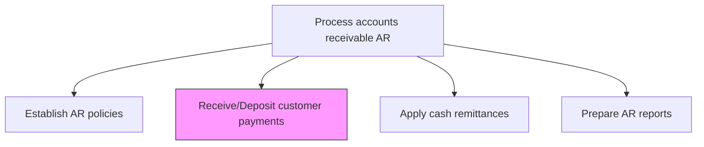
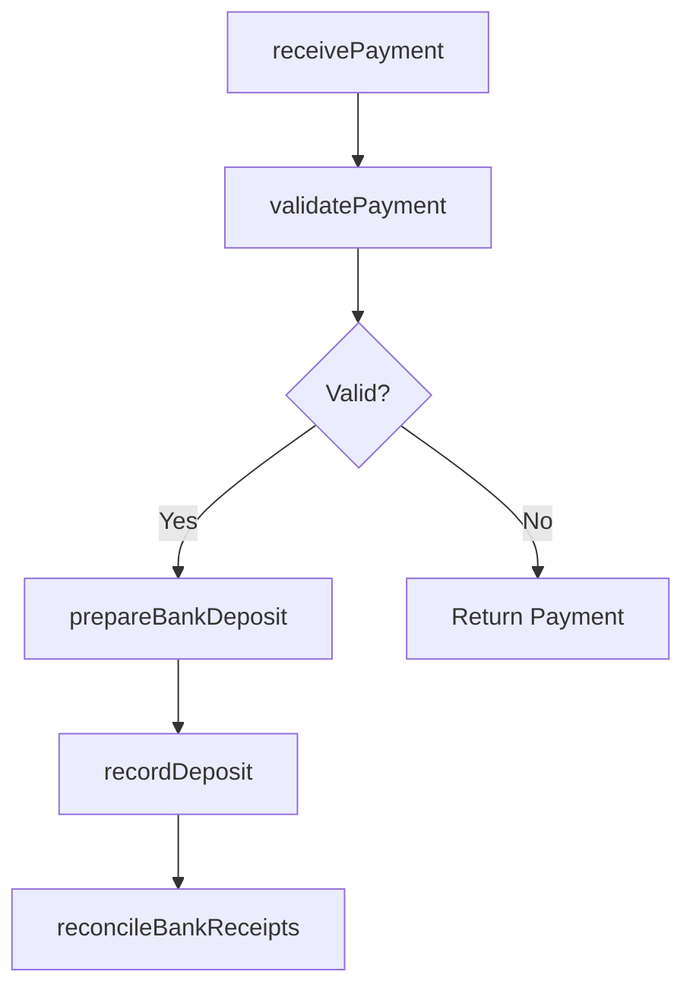

# Receive/Deposit customer payments

> Business-as-Code definition for customer payment receipt and deposit. Models the acceptance, validation, and banking of customer payments across all channels including checks, wire transfers, ACH, and electronic payments.

## Overview

Receiving and depositing customer payments is the cash intake process that converts outstanding receivables into collected funds in the organization's bank accounts. This process covers accepting payments across all channels including checks, wire transfers, ACH, and credit cards, validating payment amounts and remittance details, bundling verified payments into bank deposits, and recording deposit entries in the cash receipts journal. Timely payment processing directly reduces days sales outstanding and improves working capital position. Reconciliation of bank deposit confirmations to internal records ensures completeness and provides the audit trail necessary for financial reporting accuracy.

## Process Hierarchy



## GraphDL

```yaml
receive/deposit:
  object: Customer Payments
  actor: CashierSpecialist
  result: DepositRecord
```

## Actions

| Action | Description |
|--------|-------------|
| receivePayment | Accept customer payment through the designated channel (check, wire, ACH, credit card) |
| validatePayment | Verify payment amount, currency, and remittance details |
| prepareBankDeposit | Bundle validated payments for deposit into the designated bank account |
| recordDeposit | Create deposit records in the cash receipts journal |
| reconcileBankReceipts | Match bank deposit confirmations to internal deposit records |

## Events

| Event | Description |
|-------|-------------|
| paymentReceived | Customer payment accepted through a designated channel |
| paymentValidated | Payment amount and remittance details verified |
| bankDepositPrepared | Payments bundled for bank deposit |
| depositRecorded | Deposit entries created in the cash receipts journal |
| bankReceiptsReconciled | Bank confirmations matched to internal deposit records |

## Searches

| Search | Description |
|--------|-------------|
| getDepositsbyDate | Retrieve deposit records for a specific date or range |
| getUnreconciledDeposits | List deposits not yet matched to bank confirmations |
| getPaymentsByCustomer | Query payment receipts for a specific customer |

## Process Flow



## RACI Matrix

| Activity | Responsible | Accountable | Consulted | Informed |
|----------|-------------|-------------|-----------|----------|
| receivePayment | Cashier Specialist | AR Manager | Treasury | Controller |
| validatePayment | Cashier Specialist | AR Manager | AR Specialist | Billing |
| prepareBankDeposit | Cashier Specialist | AR Manager | Bank | Treasury |
| recordDeposit | AR Specialist | AR Manager | GL Accountant | Controller |
| reconcileBankReceipts | AR Specialist | AR Manager | GL Accountant | Controller |

## Related Processes

| Process | Relationship |
|---------|-------------|
| 9.2.3.3 Apply cash remittances | Downstream - deposited payments are applied to invoices |
| 9.2.3.1 Establish AR policies | Upstream - policies govern payment acceptance methods |
| 9.2.3.5 Post AR activity to the general ledger | Downstream - deposits feed GL postings |

## Related Departments

| Department | Role |
|-----------|------|
| Accounts Receivable | Receives and processes customer payments |
| Treasury | Manages bank accounts and deposit procedures |
| Finance | Reviews cash receipt summaries |
| IT | Maintains electronic payment processing systems |

## Related Occupations

| Occupation | Involvement |
|-----------|-------------|
| Cashier Specialist | Receives, validates, and prepares payments for deposit |
| AR Specialist | Reconciles deposits to bank confirmations |
| Treasury Analyst | Monitors bank account activity and float |

## KPIs

| KPI | Description | Unit |
|-----|-------------|------|
| Payment Processing Time | Average hours from payment receipt to bank deposit | Hours |
| Deposit Reconciliation Rate | Percentage of deposits reconciled within 24 hours | % |
| Electronic Payment Ratio | Percentage of payments received electronically versus paper | % |
| Daily Cash Receipts Volume | Total dollar value of payments received per business day | USD |

## Usage

```typescript
import { receiveDepositCustomerPayments } from '@headlessly/receive-deposit-customer-payments'

const payments = receiveDepositCustomerPayments()

// Record a received payment
const deposit = await payments.receivePayment({
  customerId: 'CUST-4200',
  amount: 15750.00,
  method: 'wire-transfer',
  referenceNumber: 'WT-2025-88421'
})

// Get unreconciled deposits
const unreconciled = await payments.getUnreconciledDeposits({
  asOfDate: '2025-12-31'
})
```
