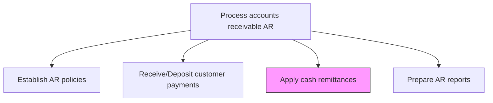
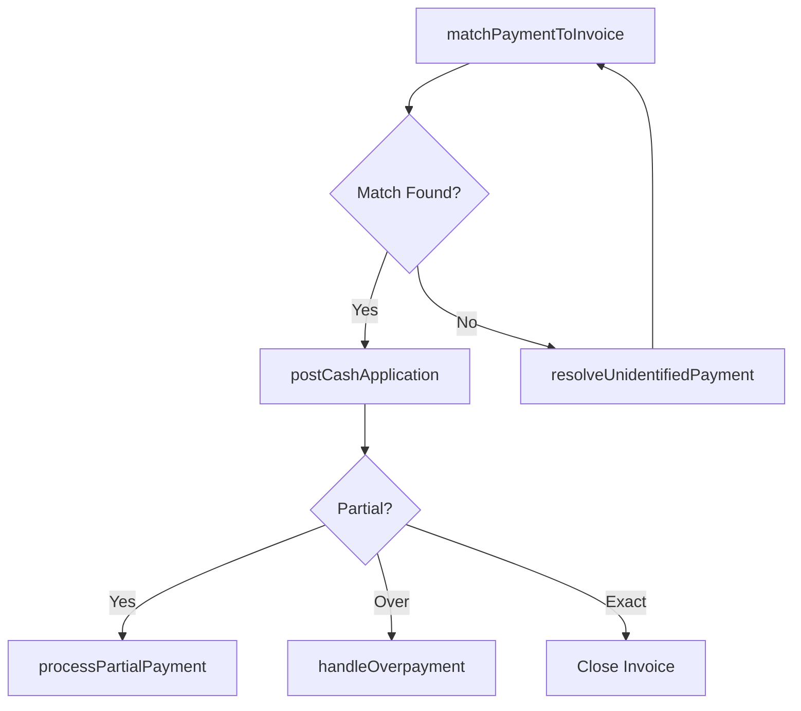

# Apply cash remittances

> Business-as-Code definition for cash remittance application. Models the matching of customer payments to open invoices, handling of partial payments, overpayments, and resolution of unidentified remittances.

## Overview

Applying cash remittances matches incoming customer payments to their corresponding open invoices, ensuring that customer accounts accurately reflect amounts owed and collected. This process handles the full range of payment scenarios including exact matches, partial payments where remaining balances must be tracked, overpayments requiring refunds or credits, and unidentified payments that need research before application. High auto-match rates from automated cash application systems significantly reduce manual effort and accelerate the order-to-cash cycle. Accurate and timely cash application is essential for reliable AR aging reports, customer statement accuracy, and effective collection prioritization.

## Process Hierarchy



## GraphDL

```yaml
apply:
  object: Cash Remittances
  actor: ARSpecialist
  result: CashApplicationRecord
```

## Actions

| Action | Description |
|--------|-------------|
| matchPaymentToInvoice | Pair incoming payments with open invoices using remittance advice |
| processPartialPayment | Apply payments that do not cover the full invoice balance |
| handleOverpayment | Process payments exceeding the invoice amount via refund or credit |
| resolveUnidentifiedPayment | Research and assign payments without clear remittance information |
| postCashApplication | Record the payment application against the customer account |

## Events

| Event | Description |
|-------|-------------|
| paymentMatchedToInvoice | Payment successfully paired with open invoice |
| partialPaymentProcessed | Partial payment applied with remaining balance tracked |
| overpaymentHandled | Excess payment processed as refund or account credit |
| unidentifiedPaymentResolved | Payment without remittance advice identified and applied |
| cashApplicationPosted | Payment application recorded on the customer account |

## Searches

| Search | Description |
|--------|-------------|
| getUnappliedPayments | Retrieve payments not yet matched to invoices |
| getCashApplicationHistory | Query payment application history by customer or invoice |
| getPartialPayments | List invoices with partial payments and remaining balances |

## Process Flow



## RACI Matrix

| Activity | Responsible | Accountable | Consulted | Informed |
|----------|-------------|-------------|-----------|----------|
| matchPaymentToInvoice | AR Specialist | AR Manager | Billing | Treasury |
| processPartialPayment | AR Specialist | AR Manager | Collections | Credit Manager |
| handleOverpayment | AR Specialist | AR Manager | Treasury | Customer Service |
| resolveUnidentifiedPayment | AR Specialist | AR Manager | Sales Rep | Credit Manager |
| postCashApplication | AR Specialist | AR Manager | GL Accountant | Controller |

## Related Processes

| Process | Relationship |
|---------|-------------|
| 9.2.3.2 Receive/Deposit customer payments | Upstream - deposited payments are applied here |
| 9.2.3.4 Prepare AR reports | Downstream - cash application results feed AR aging and DSO reports |
| 9.2.3.5 Post AR activity to the general ledger | Downstream - cash applications feed GL postings |
| 9.2.5 Manage and process adjustments/deductions | Parallel - unresolvable payments may require adjustments |

## Related Departments

| Department | Role |
|-----------|------|
| Accounts Receivable | Performs cash application and resolves exceptions |
| Treasury | Provides bank statement data for payment matching |
| Sales | Assists in identifying unmatched customer payments |
| IT | Maintains automated cash application systems |

## Related Occupations

| Occupation | Involvement |
|-----------|-------------|
| AR Specialist | Matches payments to invoices and resolves exceptions |
| Cash Application Analyst | Processes high-volume automated cash matching |
| AR Manager | Oversees cash application performance and exception handling |

## KPIs

| KPI | Description | Unit |
|-----|-------------|------|
| Auto-Match Rate | Percentage of payments automatically matched to invoices | % |
| Unapplied Cash Ratio | Unapplied payments as a percentage of total cash received | % |
| Cash Application Cycle Time | Average hours from payment receipt to invoice application | Hours |
| Partial Payment Volume | Number of invoices with outstanding partial balances | Count |

## Usage

```typescript
import { applyCashRemittances } from '@headlessly/apply-cash-remittances'

const cashApp = applyCashRemittances()

// Match a payment to invoices
const applied = await cashApp.matchPaymentToInvoice({
  paymentId: 'PMT-2025-44210',
  customerId: 'CUST-4200'
})

// Get unapplied payments
const unapplied = await cashApp.getUnappliedPayments({
  olderThanDays: 3,
  minAmount: 100
})
```
