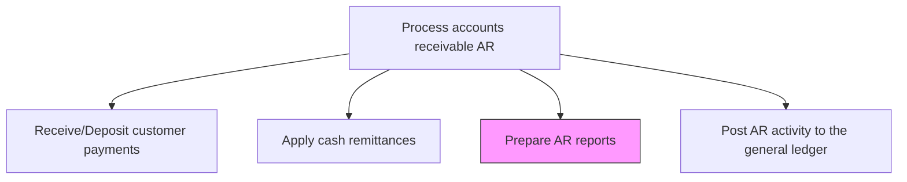
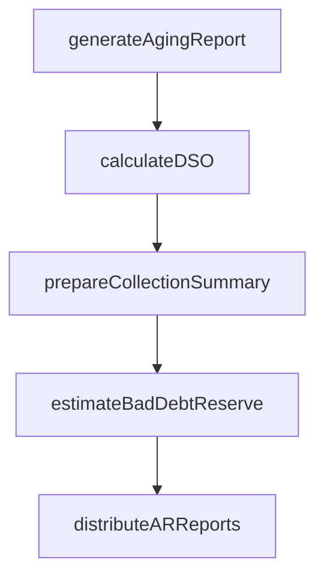

# Prepare AR reports

> Business-as-Code definition for accounts receivable report preparation. Models the compilation, analysis, and distribution of AR aging, DSO, cash collection, and bad debt reserve reports.

## Overview

Preparing AR reports compiles accounts receivable data into actionable reports that inform management decisions on collections strategy, cash flow planning, and bad debt reserve adequacy. This process involves generating aging reports by customer and aging bucket, calculating days sales outstanding, summarizing cash collection trends, and estimating the allowance for doubtful accounts based on historical loss patterns. These reports are essential inputs to monthly close, financial planning cycles, and board-level risk discussions. Accurate and timely AR reporting also supports credit department decisions about which accounts to escalate, adjust, or write off.

## Process Hierarchy



## GraphDL

```yaml
prepare:
  object: AR Reports
  actor: ARSpecialist
  result: ARReportPackage
```

## Actions

| Action | Description |
|--------|-------------|
| generateAgingReport | Produce accounts receivable aging by customer and aging bucket |
| calculateDSO | Compute days sales outstanding for the period |
| prepareCollectionSummary | Summarize cash collection activity and trends |
| estimateBadDebtReserve | Calculate allowance for doubtful accounts based on aging and history |
| distributeARReports | Deliver AR report package to management and stakeholders |

## Events

| Event | Description |
|-------|-------------|
| agingReportGenerated | AR aging report produced |
| dsoCalculated | Days sales outstanding computed |
| collectionSummaryPrepared | Cash collection activity summarized |
| badDebtReserveEstimated | Allowance for doubtful accounts calculated |
| arReportsDistributed | AR report package delivered to stakeholders |

## Searches

| Search | Description |
|--------|-------------|
| getAgingByCustomer | Retrieve AR aging breakdown for a specific customer |
| getDSOTrends | Query DSO trends over multiple periods |
| getBadDebtReserve | Retrieve current and historical bad debt reserve estimates |

## Process Flow



## RACI Matrix

| Activity | Responsible | Accountable | Consulted | Informed |
|----------|-------------|-------------|-----------|----------|
| generateAgingReport | AR Specialist | AR Manager | Credit Manager | Controller |
| calculateDSO | AR Specialist | AR Manager | FP&A | Treasury |
| prepareCollectionSummary | AR Specialist | AR Manager | Collections Manager | Sales Director |
| estimateBadDebtReserve | AR Specialist | Controller | Internal Audit | CFO |
| distributeARReports | AR Specialist | AR Manager | FP&A | Sales Director |

## Related Processes

| Process | Relationship |
|---------|-------------|
| 9.2.3.3 Apply cash remittances | Upstream - cash application data feeds AR reports |
| 9.2.4 Manage and process collections | Downstream - AR aging drives collection prioritization |
| 9.2.1.6 Produce credit/collection reports | Parallel - credit reports complement AR reports |
| 9.3.4 Perform financial reporting | Downstream - AR data feeds financial statements |

## Related Departments

| Department | Role |
|-----------|------|
| Accounts Receivable | Produces AR reports and aging analysis |
| Finance | Reviews AR reports for financial planning |
| Credit | Uses AR aging for credit risk assessment |
| Internal Audit | Reviews bad debt reserve estimates |

## Related Occupations

| Occupation | Involvement |
|-----------|-------------|
| AR Specialist | Generates AR aging and collection reports |
| Financial Analyst | Analyzes AR trends and DSO performance |
| Controller | Reviews and approves bad debt reserve estimates |

## KPIs

| KPI | Description | Unit |
|-----|-------------|------|
| Days Sales Outstanding | Average number of days to collect receivables | Days |
| AR Report Timeliness | Days from period close to AR report distribution | Days |
| Bad Debt Reserve Accuracy | Variance between estimated and actual write-offs | % |
| Past-Due Receivables Ratio | Percentage of total AR past due beyond standard terms | % |

## Usage

```typescript
import { prepareArReports } from '@headlessly/prepare-ar-reports'

const arReports = prepareArReports()

// Generate aging report
const aging = await arReports.generateAgingReport({
  asOfDate: '2025-12-31',
  buckets: [30, 60, 90, 120]
})

// Get DSO trends
const dso = await arReports.getDSOTrends({
  periods: 12,
  granularity: 'monthly'
})
```
