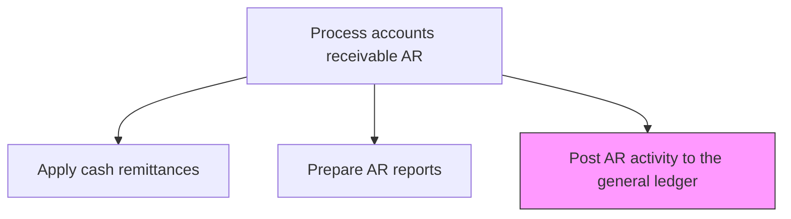
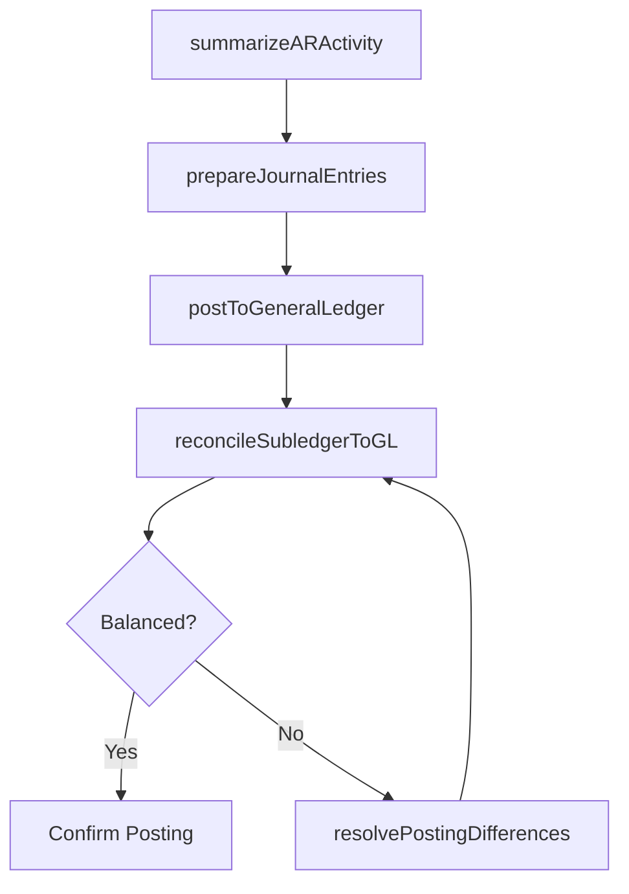

# Post AR activity to the general ledger

> Business-as-Code definition for AR general ledger posting. Models the transfer of accounts receivable subledger transactions to the general ledger including invoices, cash receipts, adjustments, and write-offs.

## Overview

Posting AR activity to the general ledger transfers all accounts receivable subledger transactions -- invoices, cash receipts, adjustments, and write-offs -- into the general ledger control accounts. This process involves summarizing AR activity for the posting period, preparing balanced journal entries, posting them to the GL, and reconciling the AR subledger to the GL control account to verify completeness. Accurate and timely GL posting is essential for financial statement integrity, as the AR balance on the balance sheet must tie precisely to the subledger detail. Posting exceptions and discrepancies are investigated and corrected before period-end close to maintain audit readiness.

## Process Hierarchy



## GraphDL

```yaml
post:
  object: AR Activity To General Ledger
  actor: ARSpecialist
  result: GLPostingConfirmation
```

## Actions

| Action | Description |
|--------|-------------|
| summarizeARActivity | Aggregate AR subledger transactions for the posting period |
| prepareJournalEntries | Create journal entries for invoices, cash receipts, and adjustments |
| postToGeneralLedger | Transfer AR journal entries to the general ledger |
| reconcileSubledgerToGL | Verify AR subledger balances match GL control account |
| resolvePostingDifferences | Investigate and correct any subledger-to-GL discrepancies |

## Events

| Event | Description |
|-------|-------------|
| arActivitySummarized | AR subledger transactions aggregated for posting |
| journalEntriesPrepared | Journal entries created for GL posting |
| postedToGeneralLedger | AR journal entries transferred to the general ledger |
| subledgerReconciled | AR subledger balanced to GL control account |
| postingDifferencesResolved | Subledger-to-GL discrepancies corrected |

## Searches

| Search | Description |
|--------|-------------|
| getARPostings | Retrieve AR journal entries posted to the GL by period |
| getReconciliationStatus | Query subledger-to-GL reconciliation results |
| getPostingExceptions | List AR transactions that failed to post to the GL |

## Process Flow



## RACI Matrix

| Activity | Responsible | Accountable | Consulted | Informed |
|----------|-------------|-------------|-----------|----------|
| summarizeARActivity | AR Specialist | AR Manager | Billing | GL Accountant |
| prepareJournalEntries | AR Specialist | AR Manager | GL Accountant | Controller |
| postToGeneralLedger | AR Specialist | AR Manager | IT | Internal Audit |
| reconcileSubledgerToGL | AR Specialist | Controller | GL Accountant | CFO |
| resolvePostingDifferences | AR Specialist | Controller | Internal Audit | CFO |

## Related Processes

| Process | Relationship |
|---------|-------------|
| 9.2.3.3 Apply cash remittances | Upstream - cash applications generate AR postings |
| 9.2.2.4 Post receivable entries | Upstream - receivable entries are part of AR GL activity |
| 9.3.2 Perform general accounting | Downstream - AR postings feed general ledger close |
| 9.2.3.4 Prepare AR reports | Parallel - AR reports and GL postings use the same data |

## Related Departments

| Department | Role |
|-----------|------|
| Accounts Receivable | Prepares and posts AR entries to the general ledger |
| General Accounting | Maintains GL control accounts and period-end close |
| Internal Audit | Reviews AR posting accuracy and reconciliation |
| IT | Maintains subledger-to-GL integration |

## Related Occupations

| Occupation | Involvement |
|-----------|-------------|
| AR Specialist | Prepares journal entries and performs reconciliation |
| GL Accountant | Validates AR postings in the general ledger |
| Controller | Approves reconciliation results at period end |

## KPIs

| KPI | Description | Unit |
|-----|-------------|------|
| Posting Timeliness | Days from period close to AR GL posting completion | Days |
| Reconciliation Pass Rate | Percentage of periods with no subledger-to-GL differences | % |
| Posting Exception Rate | Percentage of AR transactions requiring manual GL posting | % |
| Subledger-to-GL Variance | Dollar amount of unresolved differences at period end | USD |

## Usage

```typescript
import { postArActivityToTheGeneralLedger } from '@headlessly/post-ar-activity-to-general-ledger'

const glPosting = postArActivityToTheGeneralLedger()

// Post AR activity for the period
const posting = await glPosting.postToGeneralLedger({
  period: '2025-12',
  postingDate: '2026-01-05'
})

// Check reconciliation status
const reconciliation = await glPosting.getReconciliationStatus({
  period: '2025-12'
})
```
