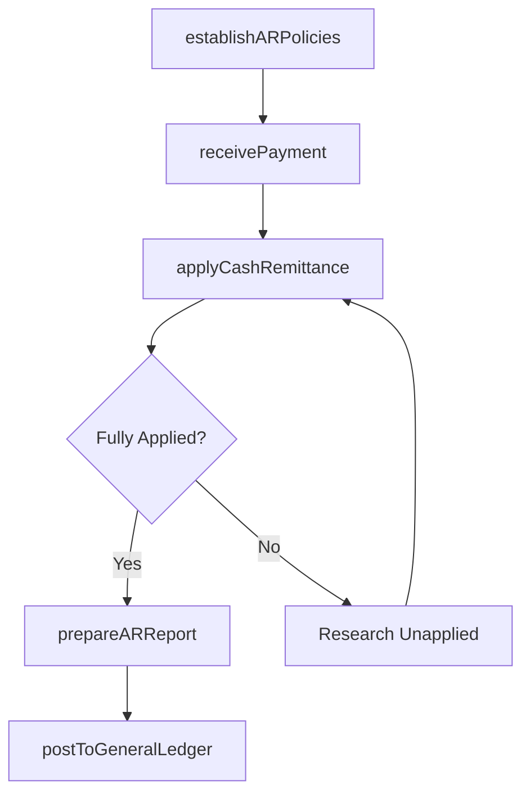

# Process accounts receivable (AR)

> Business-as-Code definition for accounts receivable processing. Models AR policy management, payment receipt, cash application, AR reporting, and general ledger posting as programmable APIs.

## Overview

Processing payments due from customers. This includes all processing of funds received, whether by check or electronically. This does not include the generation of invoices.

## Process Hierarchy

```mermaid
graph TD
    A[Process accounts receivable (AR)]
    A --> B[Establish AR policies]
    A --> C[Receive/Deposit customer payments]
    A --> D[Apply cash remittances]
    A --> E[Prepare AR reports]
    A --> F[Post AR activity to the general ledger]
```

## GraphDL

```yaml
process:
  object: Accounts Receivable (AR)
  actor: ARSpecialist
  result: CashApplicationRecord
```

## Actions

| Action | Description |
|--------|-------------|
| establishARPolicies | Define payment terms, discount rules, and AR processing standards |
| receivePayment | Record incoming customer payments from all channels |
| applyCashRemittance | Match customer payments to open invoices |
| prepareARReport | Generate accounts receivable aging and summary reports |
| postToGeneralLedger | Transfer AR subledger activity to general ledger accounts |

## Events

| Event | Description |
|-------|-------------|
| arPoliciesEstablished | AR processing policies published and effective |
| paymentReceived | Customer payment received and deposited |
| cashRemittanceApplied | Payment matched to open invoices and balances updated |
| arReportPrepared | AR aging or summary report generated |
| postedToGeneralLedger | AR activity transferred to the general ledger |

## Searches

| Search | Description |
|--------|-------------|
| getOpenReceivables | List unpaid customer balances by age, customer, or amount |
| getPaymentHistory | Retrieve payment records for a customer or invoice |
| getARAgingReport | Get AR aging summary by bucket and customer segment |
| getUnappliedCash | List payments received but not yet matched to invoices |

## Process Flow



## RACI Matrix

| Activity | Responsible | Accountable | Consulted | Informed |
|----------|-------------|-------------|-----------|----------|
| establishARPolicies | AR Manager | Controller | Credit Manager | CFO |
| receivePayment | Cash Applications Clerk | AR Manager | Treasury | Controller |
| applyCashRemittance | Cash Applications Clerk | AR Manager | Billing Specialist | Sales |
| postToGeneralLedger | AR Accountant | Controller | General Ledger Accountant | CFO |

## Sub-Processes

| ID | Name | Description |
|----|------|-------------|
| 9.2.3.1 | Establish AR policies | Creating rules and regulations to be followed in case of credit sales to customers. Create rules and |
| 9.2.3.2 | Receive/Deposit customer payments | Collecting cash from customers. Deposit it into bank account. Make entries into the books of account |
| 9.2.3.3 | Apply cash remittances | Checking and moving funds between countries for business activities, typically through authorized re |
| 9.2.3.4 | Prepare AR reports | Preparing reports that detail balances due or what to collect from customers at a certain point in t |
| 9.2.3.5 | Post AR activity to the general ledger | Preparing the general ledger for account receivables from journals. Place all journal entries relate |

## Related Processes

| Process | Relationship |
|---------|-------------|
| 9.2.2 Invoice customer | Upstream - invoices create receivable balances |
| 9.2.4 Manage and process collections | Downstream - overdue receivables trigger collections |
| 9.3.2 Perform general accounting | Downstream - AR posts to the general ledger |

## Related Departments

| Department | Role |
|-----------|------|
| Accounts Receivable | Primary owner of payment processing and cash application |
| Treasury | Manages bank deposits and cash position reporting |
| General Accounting | Receives AR postings for general ledger reconciliation |
| Credit | Monitors customer payment behavior and credit standing |

## Related Occupations

| Occupation | Involvement |
|-----------|-------------|
| Cash Applications Specialist | Matches payments to invoices and resolves discrepancies |
| AR Manager | Oversees receivables processing and reporting |
| AR Accountant | Reconciles AR subledger and posts to general ledger |

## KPIs

| KPI | Description | Unit |
|-----|-------------|------|
| Days Sales Outstanding | Average days to collect payment after invoicing | Days |
| Cash Application Rate | Percentage of payments auto-matched to invoices | % |
| Unapplied Cash Ratio | Percentage of received cash not yet applied to invoices | % |
| AR Reconciliation Accuracy | Percentage of AR-to-GL reconciliations completed without exceptions | % |

## Usage

```typescript
import { processAccountsReceivable } from '@headlessly/process-accounts-receivable-ar'

const ar = processAccountsReceivable()

// Apply a customer payment to open invoices
const application = await ar.applyCashRemittance({
  paymentId: 'PMT-2025-4411',
  customerId: 'CUST-3210',
  amount: 15000,
  invoiceIds: ['INV-2025-8001', 'INV-2025-8015']
})

// Get AR aging report
const aging = await ar.getARAgingReport({
  asOfDate: '2025-12-31',
  buckets: ['current', '1-30', '31-60', '61-90', '90+']
})
```
