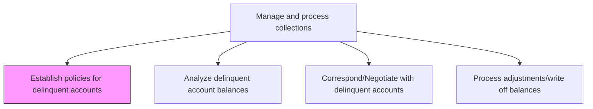
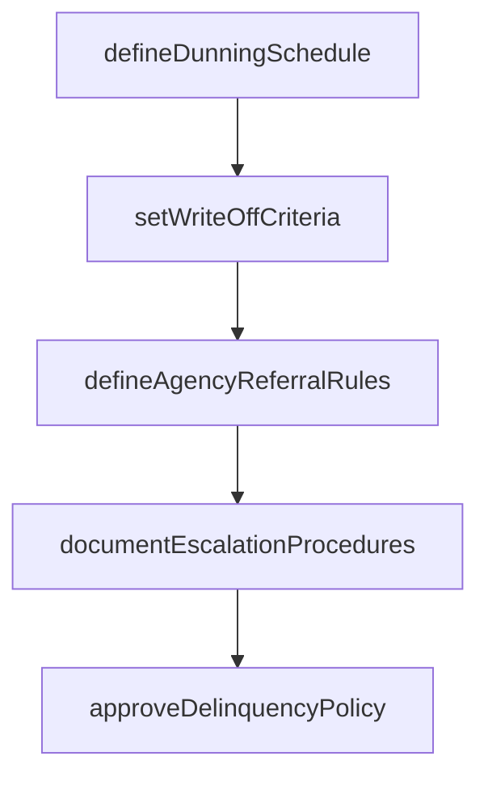

# Establish policies for delinquent accounts

> Business-as-Code definition for delinquent account policy establishment. Models the creation and maintenance of collection escalation procedures, dunning schedules, write-off criteria, and external agency referral thresholds.

## Overview

Establishing policies for delinquent accounts creates the collection framework that governs how the organization responds when customers fail to meet their payment obligations. This process involves defining dunning schedules with escalating notice cadences, setting aging and dollar thresholds for bad debt write-off authorization, establishing criteria for referring accounts to external collection agencies, and documenting the complete escalation workflow from first notice through legal action. Clear and consistently enforced delinquency policies protect the organization's cash position while maintaining compliance with debt collection regulations. These policies also provide collectors with structured guidance that improves recovery rates and reduces inconsistent treatment across accounts.

## Process Hierarchy



## GraphDL

```yaml
establish:
  object: Policies For Delinquent Accounts
  actor: CollectionsManager
  result: DelinquencyPolicyDocument
```

## Actions

| Action | Description |
|--------|-------------|
| defineDunningSchedule | Set the timing and escalation sequence for collection notices |
| setWriteOffCriteria | Establish aging and dollar thresholds for bad debt write-off |
| defineAgencyReferralRules | Set criteria for referring accounts to external collection agencies |
| documentEscalationProcedures | Record the step-by-step collection escalation workflow |
| approveDelinquencyPolicy | Obtain management sign-off on collection policy changes |

## Events

| Event | Description |
|-------|-------------|
| dunningScheduleDefined | Collection notice timing and escalation sequence established |
| writeOffCriteriaSet | Bad debt write-off thresholds approved |
| agencyReferralRulesDefined | External collection agency referral criteria documented |
| escalationProceduresDocumented | Collection escalation workflow compiled |
| delinquencyPolicyApproved | Updated collection policies signed off by management |

## Searches

| Search | Description |
|--------|-------------|
| getCurrentDelinquencyPolicy | Retrieve the active delinquency and collection policy |
| getDunningSchedule | Query the current dunning notice schedule and templates |
| getWriteOffThresholds | List write-off authorization levels and aging thresholds |

## Process Flow



## RACI Matrix

| Activity | Responsible | Accountable | Consulted | Informed |
|----------|-------------|-------------|-----------|----------|
| defineDunningSchedule | Collections Manager | Controller | Credit Manager | AR Manager |
| setWriteOffCriteria | Collections Manager | CFO | Internal Audit | Controller |
| defineAgencyReferralRules | Collections Manager | Controller | Legal | AR Manager |
| documentEscalationProcedures | Collections Manager | Controller | Credit Manager | Sales Director |
| approveDelinquencyPolicy | Collections Manager | CFO | Legal | Sales Director |

## Related Processes

| Process | Relationship |
|---------|-------------|
| 9.2.4.2 Analyze delinquent account balances | Downstream - policies govern how delinquent accounts are analyzed |
| 9.2.4.3 Correspond/Negotiate with delinquent accounts | Downstream - dunning schedule drives collection communications |
| 9.2.4.7 Manage default accounts | Downstream - agency referral rules apply to default accounts |
| 9.2.1.1 Establish credit policies | Parallel - credit policies complement delinquency policies |

## Related Departments

| Department | Role |
|-----------|------|
| Collections | Develops and maintains delinquency management policies |
| Legal | Reviews collection practices for regulatory compliance |
| Credit | Aligns delinquency policies with credit risk framework |
| Finance | Approves write-off authorization levels |

## Related Occupations

| Occupation | Involvement |
|-----------|-------------|
| Collections Manager | Authors and maintains delinquency policies |
| Credit Manager | Provides input on risk-based escalation criteria |
| Legal Counsel | Ensures compliance with debt collection regulations |

## KPIs

| KPI | Description | Unit |
|-----|-------------|------|
| Policy Compliance Rate | Percentage of delinquent accounts processed per policy | % |
| Write-Off Ratio | Bad debt write-offs as a percentage of total receivables | % |
| Policy Review Frequency | How often delinquency policies are formally reviewed | Per Year |
| Agency Referral Rate | Percentage of delinquent accounts referred to external agencies | % |

## Usage

```typescript
import { establishPoliciesForDelinquentAccounts } from '@headlessly/establish-policies-for-delinquent-accounts'

const policy = establishPoliciesForDelinquentAccounts()

// Get current dunning schedule
const dunning = await policy.getDunningSchedule({
  accountType: 'commercial'
})

// Define write-off criteria
const criteria = await policy.setWriteOffCriteria({
  agingDays: 180,
  minAmount: 100,
  requiresApproval: true
})
```
